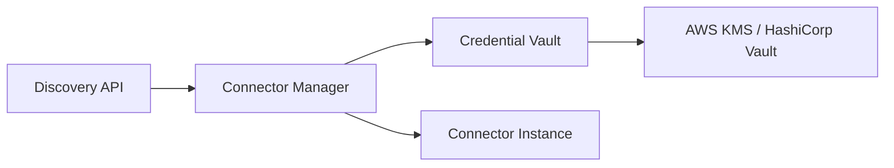

# Security Architecture — Discovery Platform

**Version 2.0** | AI Lead Intelligence Platform — Phase 5

---

## Table of Contents

1. [Security Principles](#1-security-principles)
2. [Authentication & Authorization](#2-authentication--authorization)
3. [Credential Vault](#3-credential-vault)
4. [Tenant Isolation](#4-tenant-isolation)
5. [OAuth Integrations](#5-oauth-integrations)
6. [API Security](#6-api-security)
7. [Data Protection](#7-data-protection)
8. [Audit Logging](#8-audit-logging)
9. [Input Validation & Output Sanitization](#9-input-validation--output-sanitization)
10. [Compliance](#10-compliance)
11. [Threat Model](#11-threat-model)

---

## 1. Security Principles

| Principle | Implementation |
|-----------|----------------|
| Least privilege | RBAC per endpoint; connector credentials scoped to org |
| Defense in depth | WAF → API gateway → app auth → row-level security |
| Zero trust | Every request validated; no implicit tenant trust |
| Secrets never in code | Vault/KMS for all provider credentials |
| Authorized data only | Connector `source_type` enforced at registration |
| Audit everything | Immutable audit trail for discovery and config changes |

---

## 2. Authentication & Authorization

### 2.1 API Authentication

- **JWT Bearer tokens** issued by `/api/v1/auth/login`
- Token claims: `sub` (user_id), `org_id`, `roles`, `permissions`, `exp`
- Short-lived access tokens (15 min) + refresh tokens (7 days, rotated)

### 2.2 RBAC Permissions

| Permission | Scope |
|------------|-------|
| `discovery:execute` | Run discovery searches |
| `discovery:read` | View jobs and results |
| `discovery:import` | Import hits to CRM/companies |
| `connectors:read` | List connectors |
| `connectors:configure` | Manage provider credentials |
| `connectors:admin` | Health checks, DLQ replay |
| `discovery:admin` | Cancel any org job, view all logs |

### 2.3 Service-to-Service

- Internal workers use **service accounts** with mTLS
- Connector health cron uses scoped `service:connector-health` role
- Metrics endpoint requires `X-Internal-Token` header

---

## 3. Credential Vault

### 3.1 Architecture



### 3.2 Storage Model

```text
connector_configs:
  id: UUID
  organization_id: UUID
  connector_type: string
  credentials_encrypted: bytea    # AES-256-GCM
  credentials_key_id: string      # KMS key version
  settings: jsonb                 # non-sensitive config
```

### 3.3 Encryption Flow

1. API receives credentials over TLS
2. App encrypts with org-specific DEK (Data Encryption Key)
3. DEK wrapped by KMS master key
4. Only `ConnectorManager` decrypts at runtime — never logged
5. Credentials zeroed from memory after connector init

### 3.4 Rotation

- API keys rotatable via `PUT /providers/{name}/config` without downtime
- Old key retained 24h for in-flight jobs
- Rotation events audited

---

## 4. Tenant Isolation

### 4.1 Data Isolation

| Layer | Mechanism |
|-------|-----------|
| PostgreSQL | `organization_id` on all tables + RLS policies |
| OpenSearch | Per-tenant index aliases `leads-{org_id}` |
| Redis | Key prefix `org:{org_id}:` |
| S3 | Bucket prefix `tenants/{org_id}/` |
| Celery | `org_id` in task kwargs; workers validate |

### 4.2 Row-Level Security

```sql
ALTER TABLE discovery_jobs ENABLE ROW LEVEL SECURITY;
CREATE POLICY tenant_isolation ON discovery_jobs
  USING (organization_id = current_setting('app.current_org_id')::uuid);
```

### 4.3 Cross-Tenant Prevention

- Middleware sets `app.current_org_id` from JWT on every DB session
- Integration tests assert zero cross-tenant leakage
- Connector results never cached globally — org-scoped cache only

---

## 5. OAuth Integrations

### 5.1 CRM OAuth Flow

```text
1. User initiates connect → redirect to provider (Salesforce, HubSpot)
2. Callback → exchange code for tokens
3. Store refresh_token encrypted in vault
4. Connector uses token; auto-refresh on 401
5. Revoke on disconnect → delete tokens + audit
```

### 5.2 Token Scopes

Request minimum scopes:

| CRM | Scopes |
|-----|--------|
| Salesforce | `api`, `refresh_token`, `offline_access` |
| HubSpot | `crm.objects.contacts.read`, `crm.objects.companies.read` |

### 5.3 Signed Requests

Outbound webhooks use HMAC-SHA256:

```text
X-Signature: sha256=HMAC(secret, timestamp + "." + body)
X-Timestamp: 1719561600
```

Reject if timestamp skew > 5 minutes (replay protection).

---

## 6. API Security

### 6.1 Rate Limiting

| Limit | Default |
|-------|---------|
| Per user | 60 discovery requests/min |
| Per org | 1000 discovery requests/day |
| Per IP (unauthenticated) | 10/min |

Implemented via Redis sliding window; returns `429` with `Retry-After`.

### 6.2 Request Signing (Enterprise)

Optional HMAC request signing for server-to-server:

```text
Authorization: HMAC-SHA256 Credential={api_key}, Signature={sig}
```

### 6.3 CORS

- Production: allowlist tenant domains only
- Credentials: `true` for cookie-based sessions (if enabled)

---

## 7. Data Protection

### 7.1 Classification

| Class | Examples | Handling |
|-------|----------|----------|
| Public | Company names, domains | Standard storage |
| Business | Contact emails, phones | Encrypted at rest, access logged |
| Sensitive | API keys, OAuth tokens | Vault only, never in logs |
| Restricted | Personal data (GDPR) | Consent tracking, deletion support |

### 7.2 PII in Logs

Structured logs redact:

- Email → `j***@acme.com`
- Phone → `+1***4567`
- API keys → `[REDACTED]`

### 7.3 Data Retention

| Data | Retention |
|------|-----------|
| Discovery jobs | 90 days (configurable) |
| Raw connector responses | 30 days |
| Audit logs | 7 years |
| Deleted tenant data | 30-day soft delete, then purge |

### 7.4 Right to Erasure

GDPR deletion workflow:

1. Mark tenant `deletion_requested`
2. Purge discovery jobs, results, connector configs
3. Remove OpenSearch indices
4. Emit `tenant.data_purged` audit event

---

## 8. Audit Logging

### 8.1 Audited Actions

| Action | Fields Logged |
|--------|---------------|
| Discovery executed | user, query hash, connectors, result count |
| Connector configured | user, connector, action (create/update/delete) |
| Credentials accessed | service, connector, org (never credential value) |
| Results imported | user, hit count, target entity |
| Job cancelled | user, job_id, reason |
| DLQ replayed | admin, entry_id |

### 8.2 Audit Store

- Primary: `audit_logs` table (append-only)
- Archive: S3 with Object Lock (WORM)
- SIEM integration via Kafka consumer

---

## 9. Input Validation & Output Sanitization

### 9.1 Input Validation

- Pydantic models on all API inputs (`DiscoveryRequest`, etc.)
- Query length max 2000 chars
- Filter keys allowlisted per entity type
- Connector names validated against registry
- SQL injection prevented via parameterized queries + ORM

### 9.2 Output Sanitization

- HTML escape in API responses displayed in UI
- Strip script tags from provider descriptions
- Validate URLs before storage (block `javascript:` scheme)
- Cap response payload size (10 MB per job results page)

### 9.3 SSRF Prevention

Connector HTTP clients:

- Block private IP ranges (10.x, 172.16.x, 192.168.x, 127.x)
- Allowlist provider base URLs only
- No user-supplied URLs in connector fetch

---

## 10. Compliance

| Regulation | Measures |
|------------|----------|
| GDPR | Consent, erasure, data minimization, DPA with providers |
| CCPA | Opt-out, data inventory |
| SOC 2 | Access controls, audit, encryption, monitoring |
| Provider ToS | `source_type` declaration; scraping forbidden |

### 10.1 Connector Compliance Gate

New connectors require:

1. Legal review of data source
2. `source_type` assignment
3. DPA on file (for licensed providers)
4. Security review checklist

---

## 11. Threat Model

| Threat | Mitigation |
|--------|------------|
| Credential theft | Vault encryption, no logs, short-lived tokens |
| Cross-tenant data leak | RLS, org-scoped indexes, integration tests |
| API abuse | Rate limits, WAF, credit quotas |
| Connector SSRF | URL allowlist, no user URLs |
| Webhook replay | Timestamp + HMAC validation |
| Privilege escalation | RBAC, permission checks per endpoint |
| Data exfiltration via discovery | Export permissions, audit, anomaly detection |
| Supply chain (connector) | Signed connector packages, code review |