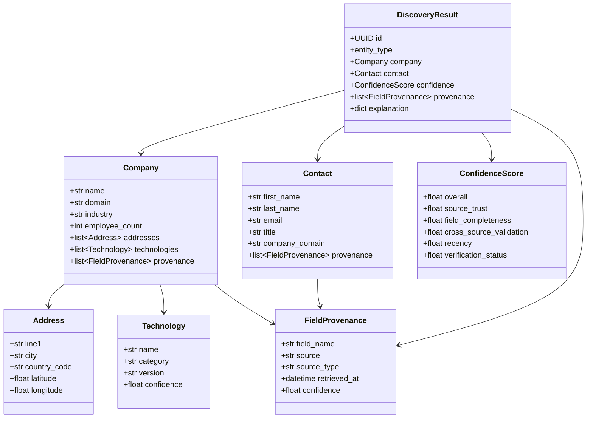
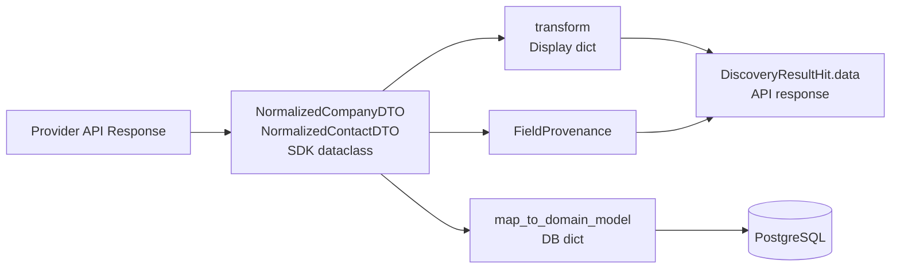
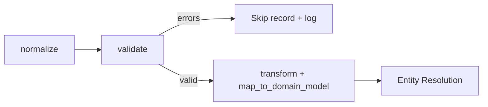

# Standard DTO Models

**Version 2.0** | AI Lead Intelligence Platform — Phase 5

---

## Table of Contents

1. [Overview](#1-overview)
2. [Design Principles](#2-design-principles)
3. [Model Hierarchy](#3-model-hierarchy)
4. [Address](#4-address)
5. [Technology](#5-technology)
6. [Company](#6-company)
7. [Contact](#7-contact)
8. [FieldProvenance](#8-fieldprovenance)
9. [ConfidenceScore](#9-confidencescore)
10. [DiscoveryResult](#10-discoveryresult)
11. [Pydantic API Schemas](#11-pydantic-api-schemas)
12. [Domain Model Mapping](#12-domain-model-mapping)
13. [Validation Rules](#13-validation-rules)
14. [Serialization Conventions](#14-serialization-conventions)

---

## 1. Overview

The Standard DTO (Data Transfer Object) models define the **canonical data vocabulary** for the Discovery Platform. Every connector — regardless of provider — must normalize its output into these models before results enter the orchestrator pipeline, entity resolution engine, or persistence layer.

**Source of truth (code):**
- SDK dataclasses: `backend/connectors/sdk/dto.py`
- API schemas: `backend/app/discovery/schemas.py`
- Frontend types: `frontend/src/types/index.ts` (aligned via mappers)

---

## 2. Design Principles

| Principle | Implementation |
|-----------|----------------|
| **Provider-agnostic** | No Apollo/Clearbit-specific fields in canonical models |
| **Provenance by default** | Every populated field traceable to source |
| **Separation of concerns** | SDK DTOs (internal) vs API schemas (external) |
| **Immutable where possible** | `FieldProvenance` and `ConfidenceScore` frozen |
| **Raw preservation** | `raw` dict for audit; never exposed to end users by default |
| **Gradual typing** | Optional fields use `None`, not sentinel strings |

---

## 3. Model Hierarchy



---

## 4. Address

### 4.1 SDK Dataclass

```python
@dataclass
class NormalizedAddressDTO:
    line1: str | None = None
    line2: str | None = None
    city: str | None = None
    state: str | None = None
    postal_code: str | None = None
    country: str | None = None
    country_code: str | None = None      # ISO 3166-1 alpha-2
    latitude: float | None = None
    longitude: float | None = None
```

### 4.2 JSON Example

```json
{
  "line1": "100 Market Street",
  "line2": "Suite 300",
  "city": "San Francisco",
  "state": "CA",
  "postal_code": "94105",
  "country": "United States",
  "country_code": "US",
  "latitude": 37.7936,
  "longitude": -122.3960
}
```

### 4.3 Field Specifications

| Field | Type | Required | Format | Notes |
|-------|------|----------|--------|-------|
| `line1` | string | No | Free text | Primary street address |
| `line2` | string | No | Free text | Suite, floor, building |
| `city` | string | No | Free text | City or locality |
| `state` | string | No | ISO 3166-2 or free text | State/province |
| `postal_code` | string | No | Country-specific | ZIP, postcode, etc. |
| `country` | string | No | Free text | Display name |
| `country_code` | string | No | ISO 3166-1 alpha-2 | **Preferred for filtering** |
| `latitude` | float | No | WGS84 decimal degrees | -90 to 90 |
| `longitude` | float | No | WGS84 decimal degrees | -180 to 180 |

### 4.4 Normalization Rules

- `country_code` always uppercase (`"us"` → `"US"`)
- `state` for US addresses: 2-letter abbreviation preferred
- Coordinates from `GEOCODE` capability connectors only (not guessed)
- Multiple addresses allowed on `Company`; first is primary

---

## 5. Technology

### 5.1 Canonical Model

```python
@dataclass
class TechnologyDTO:
    name: str                              # e.g., "Salesforce"
    category: str | None = None            # e.g., "CRM", "Analytics"
    version: str | None = None             # Detected version if available
    confidence: float = 1.0               # Detection confidence 0.0–1.0
    detected_at: datetime | None = None
    source: str = ""                       # Connector that detected
```

### 5.2 JSON Example

```json
{
  "name": "HubSpot",
  "category": "Marketing Automation",
  "version": null,
  "confidence": 0.92,
  "detected_at": "2026-06-28T10:15:00Z",
  "source": "builtwith"
}
```

### 5.3 Technology List on Company

```json
{
  "technologies": [
    {"name": "React", "category": "JavaScript Framework", "confidence": 0.95},
    {"name": "AWS", "category": "Cloud Hosting", "confidence": 0.88},
    {"name": "Stripe", "category": "Payment", "confidence": 0.91}
  ]
}
```

### 5.4 Normalization Rules

- Technology names canonicalized against internal taxonomy (`technologies` reference table)
- Unknown technologies stored as-is with `confidence < 0.5`
- `DETECT_TECH` capability required for stack data — not inferred from job postings

---

## 6. Company

### 6.1 SDK Dataclass

Source: `backend/connectors/sdk/dto.py`

```python
@dataclass
class NormalizedCompanyDTO:
    external_id: str | None = None
    name: str = ""
    legal_name: str | None = None
    domain: str | None = None
    website: str | None = None
    industry: str | None = None
    sub_industry: str | None = None
    employee_count: int | None = None
    employee_band: str | None = None
    annual_revenue: int | None = None
    revenue_band: str | None = None
    description: str | None = None
    founded_year: int | None = None
    phone: str | None = None
    linkedin_url: str | None = None
    technologies: list[str] = field(default_factory=list)
    addresses: list[NormalizedAddressDTO] = field(default_factory=list)
    source: str = ""
    source_type: str = ""
    provenance: list[FieldProvenance] = field(default_factory=list)
    raw: dict[str, Any] = field(default_factory=dict)
```

### 6.2 JSON Example (Full)

```json
{
  "external_id": "apollo:5f8d2a1b3c4e5f6a7b8c9d0e",
  "name": "Acme Corporation",
  "legal_name": "Acme Corporation Inc.",
  "domain": "acme.com",
  "website": "https://www.acme.com",
  "industry": "Computer Software",
  "sub_industry": "B2B SaaS",
  "employee_count": 250,
  "employee_band": "201-500",
  "annual_revenue": 50000000,
  "revenue_band": "$10M-$50M",
  "description": "Acme provides enterprise workflow automation for mid-market companies.",
  "founded_year": 2012,
  "phone": "+14155550100",
  "linkedin_url": "https://www.linkedin.com/company/acme-corp",
  "technologies": ["Salesforce", "AWS", "React"],
  "addresses": [
    {
      "line1": "100 Market Street",
      "city": "San Francisco",
      "state": "CA",
      "postal_code": "94105",
      "country_code": "US",
      "latitude": 37.7936,
      "longitude": -122.3960
    }
  ],
  "source": "apollo",
  "source_type": "official_api",
  "provenance": [
    {
      "field_name": "name",
      "source": "apollo",
      "source_type": "official_api",
      "retrieved_at": "2026-06-28T10:15:00Z",
      "confidence": 0.95
    },
    {
      "field_name": "domain",
      "source": "apollo",
      "source_type": "official_api",
      "retrieved_at": "2026-06-28T10:15:00Z",
      "confidence": 0.98
    },
    {
      "field_name": "employee_count",
      "source": "clearbit",
      "source_type": "official_api",
      "retrieved_at": "2026-06-28T10:15:01Z",
      "confidence": 0.85
    }
  ]
}
```

### 6.3 Field Specifications

| Field | Type | Required | Validation |
|-------|------|----------|------------|
| `external_id` | string | No | Provider-prefixed: `{source}:{id}` |
| `name` | string | Yes* | Non-empty if no domain |
| `legal_name` | string | No | Official registered name |
| `domain` | string | Yes* | RFC 1035 hostname, lowercase |
| `website` | string | No | Valid URL with protocol |
| `industry` | string | No | Mapped to NAICS/SIC taxonomy |
| `sub_industry` | string | No | Free text |
| `employee_count` | integer | No | ≥ 0 |
| `employee_band` | string | No | Standard bands: `1-10`, `11-50`, etc. |
| `annual_revenue` | integer | No | USD, ≥ 0 |
| `revenue_band` | string | No | Display band |
| `description` | string | No | Max 5000 chars |
| `founded_year` | integer | No | 1800–current year |
| `phone` | string | No | E.164 format |
| `linkedin_url` | string | No | Valid LinkedIn company URL |
| `technologies` | string[] | No | Canonical tech names |
| `addresses` | Address[] | No | At least 0 |
| `source` | string | Yes | Connector name |
| `source_type` | string | Yes | `DataSourceType` value |

*At least one of `name` or `domain` is required.

### 6.4 Employee Bands

| Band | Range |
|------|-------|
| `1-10` | 1–10 |
| `11-50` | 11–50 |
| `51-200` | 51–200 |
| `201-500` | 201–500 |
| `501-1000` | 501–1000 |
| `1001-5000` | 1001–5000 |
| `5001-10000` | 5001–10000 |
| `10001+` | 10001+ |

---

## 7. Contact

### 7.1 SDK Dataclass

```python
@dataclass
class NormalizedContactDTO:
    external_id: str | None = None
    first_name: str = ""
    last_name: str = ""
    email: str | None = None
    phone: str | None = None
    title: str | None = None
    department: str | None = None
    seniority: str | None = None
    linkedin_url: str | None = None
    company_domain: str | None = None
    company_name: str | None = None
    email_verified: bool | None = None
    phone_verified: bool | None = None
    source: str = ""
    source_type: str = ""
    provenance: list[FieldProvenance] = field(default_factory=list)
    raw: dict[str, Any] = field(default_factory=dict)
```

### 7.2 JSON Example (Full)

```json
{
  "external_id": "apollo:person_abc123",
  "first_name": "Jane",
  "last_name": "Smith",
  "email": "jane.smith@acme.com",
  "phone": "+14155550200",
  "title": "VP of Sales",
  "department": "Sales",
  "seniority": "vp",
  "linkedin_url": "https://www.linkedin.com/in/janesmith",
  "company_domain": "acme.com",
  "company_name": "Acme Corporation",
  "email_verified": true,
  "phone_verified": null,
  "source": "apollo",
  "source_type": "official_api",
  "provenance": [
    {
      "field_name": "email",
      "source": "hunter",
      "source_type": "official_api",
      "retrieved_at": "2026-06-28T10:15:02Z",
      "confidence": 0.92
    },
    {
      "field_name": "title",
      "source": "apollo",
      "source_type": "official_api",
      "retrieved_at": "2026-06-28T10:15:00Z",
      "confidence": 0.88
    }
  ]
}
```

### 7.3 Field Specifications

| Field | Type | Required | Validation |
|-------|------|----------|------------|
| `external_id` | string | No | Provider-prefixed |
| `first_name` | string | Yes* | Non-empty |
| `last_name` | string | Yes* | Non-empty |
| `email` | string | Yes* | RFC 5322 email format |
| `phone` | string | No | E.164 format |
| `title` | string | No | Job title |
| `department` | string | No | Department name |
| `seniority` | string | No | Enum: `c_suite`, `vp`, `director`, `manager`, `individual` |
| `linkedin_url` | string | No | Valid LinkedIn profile URL |
| `company_domain` | string | No | RFC 1035 hostname |
| `company_name` | string | No | Associated company |
| `email_verified` | boolean | No | From `VERIFY_EMAIL` capability |
| `phone_verified` | boolean | No | From `VERIFY_PHONE` capability |

*At least one of: `email`, or (`first_name` + `last_name`).

### 7.4 Seniority Enum

```json
["c_suite", "founder", "vp", "director", "manager", "senior", "individual", "intern"]
```

---

## 8. FieldProvenance

### 8.1 SDK Dataclass

```python
@dataclass
class FieldProvenance:
    field_name: str
    source: str
    source_type: str
    retrieved_at: datetime
    confidence: float = 1.0
```

### 8.2 JSON Example

```json
{
  "field_name": "annual_revenue",
  "source": "clearbit",
  "source_type": "official_api",
  "retrieved_at": "2026-06-28T10:15:01Z",
  "confidence": 0.85
}
```

### 8.3 Field Specifications

| Field | Type | Required | Description |
|-------|------|----------|-------------|
| `field_name` | string | Yes | Canonical DTO field name (e.g., `"employee_count"`) |
| `source` | string | Yes | Connector name (e.g., `"apollo"`) |
| `source_type` | string | Yes | `DataSourceType` value |
| `retrieved_at` | datetime | Yes | UTC ISO 8601 timestamp |
| `confidence` | float | Yes | 0.0–1.0, provider-reported or platform-computed |

### 8.4 Provenance Rules

1. **One provenance entry per field per source** — if Apollo and Clearbit both provide `employee_count`, two entries exist
2. **Entity resolution** selects winning value by highest `confidence × source_trust`
3. **Audit storage** — persisted in `field_provenance` table (Phase 2 extension)
4. **Never omit** — if a field is populated, provenance must exist
5. **User import** — `source_type: "user_import"`, `source: "csv_import"`

### 8.5 Database Schema (proposed)

```sql
CREATE TABLE field_provenance (
    id              UUID PRIMARY KEY DEFAULT gen_random_uuid(),
    organization_id UUID NOT NULL REFERENCES organizations(id),
    entity_type     VARCHAR(20) NOT NULL,
    entity_id       UUID NOT NULL,
    field_name      VARCHAR(100) NOT NULL,
    source          VARCHAR(100) NOT NULL,
    source_type     VARCHAR(50) NOT NULL,
    confidence      NUMERIC(4,3) NOT NULL DEFAULT 1.0,
    retrieved_at    TIMESTAMPTZ NOT NULL,
    created_at      TIMESTAMPTZ NOT NULL DEFAULT NOW()
);

CREATE INDEX idx_provenance_entity
    ON field_provenance (entity_type, entity_id, field_name);
```

---

## 9. ConfidenceScore

### 9.1 Model Definition

```python
@dataclass(frozen=True)
class ConfidenceScore:
    overall: float                          # 0.0–1.0 composite score
    source_trust: float                     # Provider historical accuracy
    field_completeness: float               # % of expected fields populated
    cross_source_validation: float          # Agreement across providers
    recency: float                          # Data freshness
    verification_status: float              # Email/phone verified
    normalization_quality: float = 1.0      # Clean mapping, no validation errors
    duplicate_resolution: float = 1.0       # Entity resolution certainty
```

### 9.2 JSON Example

```json
{
  "overall": 0.87,
  "source_trust": 0.92,
  "field_completeness": 0.78,
  "cross_source_validation": 0.85,
  "recency": 0.95,
  "verification_status": 1.0,
  "normalization_quality": 1.0,
  "duplicate_resolution": 0.90,
  "factors": [
    {
      "factor": "cross_source_validation",
      "detail": "employee_count confirmed by apollo and clearbit",
      "impact": 0.05
    },
    {
      "factor": "verification_status",
      "detail": "email verified by hunter",
      "impact": 0.10
    }
  ]
}
```

### 9.3 Scoring Formula

```python
overall = (
    source_trust           * 0.25 +
    field_completeness     * 0.20 +
    cross_source_validation * 0.20 +
    recency                * 0.15 +
    verification_status    * 0.10 +
    normalization_quality  * 0.05 +
    duplicate_resolution   * 0.05
)
```

### 9.4 Factor Definitions

| Factor | Range | Calculation |
|--------|-------|-------------|
| `source_trust` | 0–1 | Historical accuracy per connector (admin-configurable) |
| `field_completeness` | 0–1 | `populated_fields / expected_fields_for_entity_type` |
| `cross_source_validation` | 0–1 | % of fields confirmed by ≥ 2 sources |
| `recency` | 0–1 | `max(0, 1 - days_since_retrieval / 365)` |
| `verification_status` | 0–1 | 1.0 if email verified, 0.5 if unverified, 0.0 if invalid |
| `normalization_quality` | 0–1 | 1.0 minus validation error penalty |
| `duplicate_resolution` | 0–1 | Match certainty from entity resolution algorithm |

### 9.5 API Explanation Schema

From `backend/app/discovery/schemas.py`:

```python
class ConfidenceExplanation(BaseModel):
    overall: float
    source_trust: float
    field_completeness: float
    cross_source_validation: float
    recency: float
    verification_status: float
    normalization_quality: float
    duplicate_resolution: float
    factors: list[dict[str, Any]] = Field(default_factory=list)
```

---

## 10. DiscoveryResult

### 10.1 API Schema (DiscoveryResultHit)

Source: `backend/app/discovery/schemas.py`

```python
class DiscoveryResultHit(BaseModel):
    id: UUID
    entity_type: Literal["company", "contact"]
    confidence: float
    source_trust: float
    field_completeness: float
    verification_status: str | None = None
    data: dict[str, Any]
    provenance: list[dict[str, Any]] = Field(default_factory=list)
    explanation: dict[str, Any] = Field(default_factory=dict)
```

### 10.2 JSON Example — Company Hit

```json
{
  "id": "a1b2c3d4-e5f6-7890-abcd-ef1234567890",
  "entity_type": "company",
  "confidence": 0.87,
  "source_trust": 0.92,
  "field_completeness": 0.78,
  "verification_status": null,
  "data": {
    "name": "Acme Corporation",
    "domain": "acme.com",
    "industry": "Computer Software",
    "employee_count": 250,
    "employee_band": "201-500",
    "annual_revenue": 50000000,
    "country_code": "US",
    "city": "San Francisco",
    "technologies": ["Salesforce", "AWS", "React"],
    "linkedin_url": "https://www.linkedin.com/company/acme-corp"
  },
  "provenance": [
    {
      "field_name": "name",
      "source": "apollo",
      "source_type": "official_api",
      "retrieved_at": "2026-06-28T10:15:00Z",
      "confidence": 0.95
    }
  ],
  "explanation": {
    "connectors": ["apollo", "clearbit"],
    "entity_resolution": "merged by domain match",
    "confidence_breakdown": {
      "overall": 0.87,
      "cross_source_validation": 0.85
    }
  }
}
```

### 10.3 JSON Example — Contact Hit

```json
{
  "id": "b2c3d4e5-f6a7-8901-bcde-f12345678901",
  "entity_type": "contact",
  "confidence": 0.91,
  "source_trust": 0.90,
  "field_completeness": 0.82,
  "verification_status": "verified",
  "data": {
    "first_name": "Jane",
    "last_name": "Smith",
    "email": "jane.smith@acme.com",
    "title": "VP of Sales",
    "seniority": "vp",
    "company_domain": "acme.com",
    "company_name": "Acme Corporation",
    "linkedin_url": "https://www.linkedin.com/in/janesmith"
  },
  "provenance": [
    {
      "field_name": "email",
      "source": "hunter",
      "source_type": "official_api",
      "retrieved_at": "2026-06-28T10:15:02Z",
      "confidence": 0.92
    }
  ],
  "explanation": {
    "connectors": ["apollo", "hunter"],
    "verification": {"email": "valid", "provider": "hunter"}
  }
}
```

### 10.4 Full Discovery Response

```python
class DiscoveryResultResponse(BaseModel):
    job_id: UUID
    total: int
    hits: list[DiscoveryResultHit]
    took_ms: int
    connectors: list[dict[str, Any]] = Field(default_factory=list)
```

```json
{
  "job_id": "c3d4e5f6-a7b8-9012-cdef-123456789012",
  "total": 31,
  "took_ms": 2450,
  "hits": [
    { "id": "...", "entity_type": "company", "confidence": 0.87, "data": {} },
    { "id": "...", "entity_type": "contact", "confidence": 0.91, "data": {} }
  ],
  "connectors": [
    {"name": "apollo", "success": true, "latency_ms": 1200, "records": 25},
    {"name": "clearbit", "success": true, "latency_ms": 890, "records": 18}
  ]
}
```

### 10.5 Connector Record DTO (internal)

Bridge between connector SDK and discovery result:

```python
@dataclass
class ConnectorRecordDTO:
    entity_type: Literal["company", "contact"]
    external_id: str | None
    company: NormalizedCompanyDTO | None = None
    contact: NormalizedContactDTO | None = None
    match_confidence: float = 0.0
```

---

## 11. Pydantic API Schemas

### 11.1 Request Models

```python
class DiscoveryRequest(BaseModel):
    query: str | None = None
    entity_type: Literal["company", "contact", "both"] = "both"
    filters: dict[str, Any] = Field(default_factory=dict)
    connectors: list[str] | None = None
    enrich: bool = True
    verify_contacts: bool = False
    schedule_id: UUID | None = None
```

### 11.2 Job Models

```python
class DiscoveryJobResponse(BaseModel):
    id: UUID
    status: Literal["pending", "running", "completed", "failed", "partial"]
    query: str | None
    entity_type: str
    connectors_used: list[str]
    result_count: int | None = None
    credits_used: int = 0
    started_at: datetime | None = None
    completed_at: datetime | None = None
    error_message: str | None = None
```

### 11.3 SDK vs API Layer



---

## 12. Domain Model Mapping

### 12.1 Company DTO → `companies` Table

| DTO Field | DB Column | Transform |
|-----------|-----------|-----------|
| `name` | `name` | Direct |
| `legal_name` | `legal_name` | Direct |
| `domain` | `domain` | Lowercase, strip www |
| `website` | `website` | Direct |
| `industry` | `industry` | Taxonomy lookup |
| `employee_count` | `employee_count` | Direct |
| `annual_revenue` | `annual_revenue` | Direct |
| `description` | `description` | Truncate 5000 |
| `founded_year` | `founded_year` | Direct |
| `phone` | `phone` | E.164 |
| `linkedin_url` | `linkedin_url` | Direct |
| `addresses[0]` | `city`, `state`, `country_code` | Flatten primary |
| `technologies` | `company_technologies` | Junction table |
| `external_id` | `metadata.external_id` | JSONB |
| `source` | `metadata.source` | JSONB |

### 12.2 Contact DTO → `contacts` Table

| DTO Field | DB Column | Transform |
|-----------|-----------|-----------|
| `first_name` | `first_name` | Direct |
| `last_name` | `last_name` | Direct |
| `email` | `email` | Lowercase |
| `phone` | `phone` | E.164 |
| `title` | `job_title` | Rename |
| `department` | `department` | Direct |
| `seniority` | `seniority` | Enum validation |
| `linkedin_url` | `linkedin_url` | Direct |
| `company_domain` | `company_id` | FK resolution via domain |
| `email_verified` | `email_verified` | Direct |

---

## 13. Validation Rules

### 13.1 Cross-Model Validation Matrix

| Rule | Models | Severity |
|------|--------|----------|
| `domain` matches RFC 1035 | Company | Error |
| `email` matches RFC 5322 | Contact | Error |
| `phone` is E.164 | Company, Contact | Warning |
| `country_code` is ISO 3166-1 alpha-2 | Address | Error |
| `confidence` ∈ [0, 1] | Provenance, ConfidenceScore | Error |
| `founded_year` ∈ [1800, current_year] | Company | Warning |
| `employee_count` ≥ 0 | Company | Error |
| `seniority` in enum | Contact | Warning |
| `source_type` in DataSourceType enum | All | Error |
| At least `name` or `domain` | Company | Error |
| At least `email` or full name | Contact | Error |

### 13.2 Validation Pipeline



---

## 14. Serialization Conventions

### 14.1 JSON Encoding

| Type | Convention |
|------|------------|
| UUID | String (`"a1b2c3d4-..."`) |
| datetime | ISO 8601 UTC (`"2026-06-28T10:15:00Z"`) |
| None/null | Omitted from API response (Pydantic `exclude_none`) |
| Empty lists | `[]` (not omitted) |
| Confidence | 2 decimal places in API (`0.87`) |
| Revenue | Integer USD cents or whole dollars (document per endpoint) |

### 14.2 Raw Response Handling

| Context | `raw` field exposed? |
|---------|---------------------|
| Connector SDK internal | Yes — stored for audit |
| DiscoveryResultHit API | No — never in `data` |
| Admin debug endpoint | Yes — `GET /discovery/jobs/{id}/debug` (admin only) |
| S3 archive | Yes — encrypted, 30-day retention |

### 14.3 Frontend Type Alignment

Phase 4 frontend mappers (`frontend/src/lib/mappers.ts`) consume `DiscoveryResultHit.data` and map to UI types. Keep API `data` dict keys stable — breaking changes require API version bump.

---

## Related Documents

- [Connector SDK Specification](./connector-sdk-specification.md)
- [Discovery Orchestrator](./discovery-orchestrator.md)
- [Data Pipelines](./data-pipelines.md) *(planned)*
- [Phase 2 Database Design](../phase2/database-design.md)