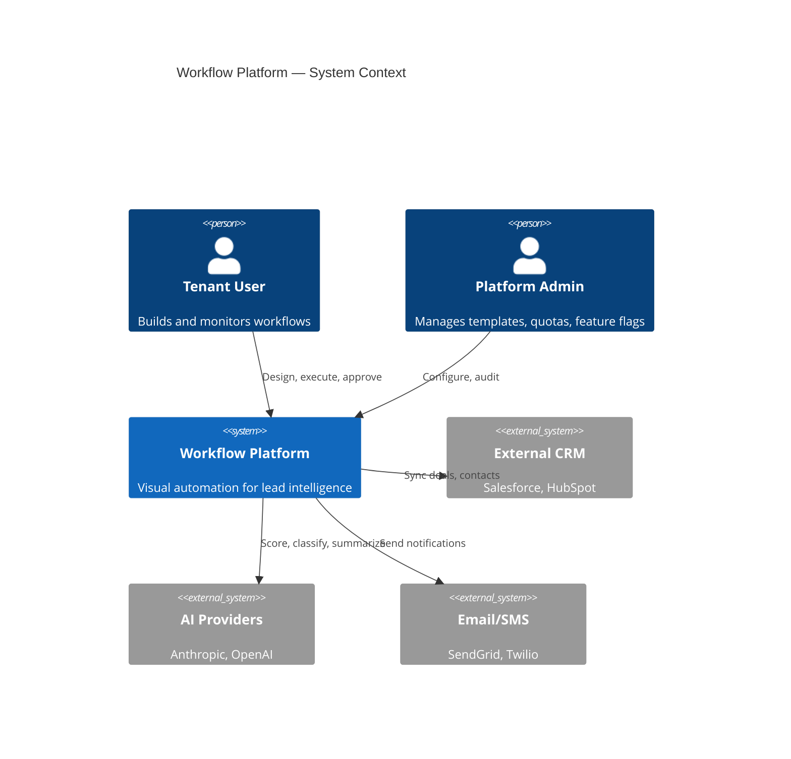
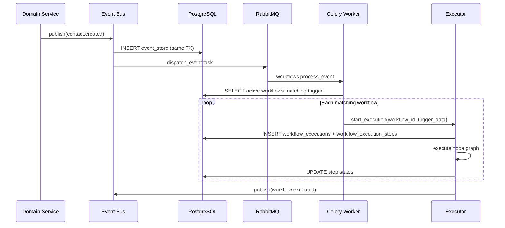
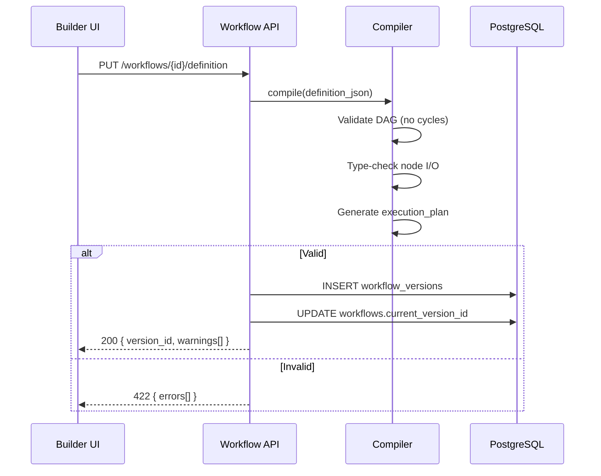
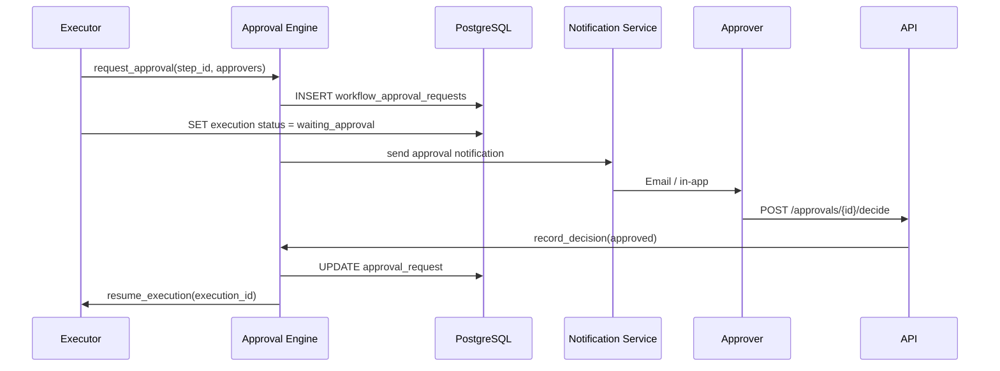
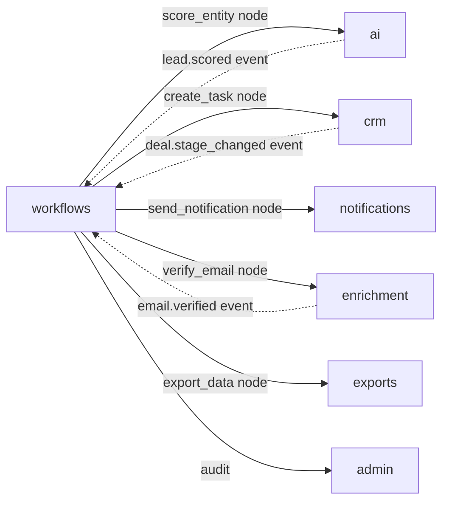

# 01 — Workflow Platform Architecture

**Version 1.0** | Phase 8 | AI Lead Intelligence Platform

---

## Table of Contents

1. [Executive Summary](#1-executive-summary)
2. [System Context](#2-system-context)
3. [Component Architecture](#3-component-architecture)
4. [Data Flow](#4-data-flow)
5. [Bounded Context](#5-bounded-context)
6. [Technology Stack](#6-technology-stack)
7. [Deployment Topology](#7-deployment-topology)
8. [Integration Points](#8-integration-points)
9. [Non-Functional Requirements](#9-non-functional-requirements)

---

## 1. Executive Summary

Phase 8 transforms the Phase 3 **rule-based automation** (`trigger → conditions → actions`) into a full **visual workflow platform** capable of:

- Drag-and-drop workflow design with 40+ node types
- Durable, resumable execution with state machine semantics
- Event-triggered, scheduled, and manual workflow starts
- AI-native nodes (scoring, NL classification, enrichment)
- Human-in-the-loop approval gates
- Multi-tenant isolation with audit-grade execution logs

The platform follows **Clean Architecture** boundaries established in Phase 3, with the workflow engine extracted to `backend/app/workflows/` and integrated via the existing event bus at `backend/infrastructure/messaging/event_bus.py`.

---

## 2. System Context



### Stakeholders

| Stakeholder | Primary Concern |
|-------------|-----------------|
| Sales Ops | Automate lead routing and scoring |
| RevOps | CRM sync and pipeline automation |
| Engineering | Extensible node SDK, reliable execution |
| Security | Tenant isolation, expression sandboxing |
| Platform Ops | Scalable workers, observability, DLQ recovery |

---

## 3. Component Architecture

```mermaid
flowchart TB
    subgraph Presentation Layer
        Builder[Visual Builder<br/>React Flow]
        ExecUI[Execution Monitor]
        ApprovalsUI[Approval Inbox]
    end

    subgraph Application Layer — backend/app/workflows/
        API[REST Router]
        TemplateSvc[Template Service]
        VersionSvc[Version Service]
        QuotaSvc[Quota Service]
    end

    subgraph Domain Layer
        Compiler[Workflow Compiler]
        Executor[Workflow Executor]
        StateMachine[State Machine]
        RuleEngine[Rule Engine]
        ApprovalEngine[Approval Engine]
        Scheduler[Scheduler]
        NodeRegistry[Node Registry]
    end

    subgraph Infrastructure Layer
        EventBus[Event Bus Port<br/>event_bus.py]
        Outbox[Event Store / Outbox]
        CeleryW[Celery Workers]
        Repo[Workflow Repositories]
        Cache[Redis Cache]
        Metrics[Prometheus Metrics]
        Tracer[OpenTelemetry]
    end

    subgraph Persistence
        PG[(PostgreSQL<br/>audit schema)]
        RMQ[(RabbitMQ)]
        S3[(S3 — artifacts)]
    end

    Builder --> API
    ExecUI --> API
    ApprovalsUI --> API
    API --> Compiler
    API --> TemplateSvc
    Compiler --> Repo
    EventBus --> Outbox
    Outbox --> RMQ
    RMQ --> CeleryW
    CeleryW --> Executor
    Executor --> StateMachine
    Executor --> RuleEngine
    Executor --> ApprovalEngine
    Executor --> NodeRegistry
    Scheduler --> CeleryW
    Repo --> PG
    Executor --> PG
    Executor --> Cache
    Executor --> Metrics
    Executor --> Tracer
    NodeRegistry --> S3
```

### Component Responsibilities

| Component | Path | Responsibility |
|-----------|------|----------------|
| **Workflow Router** | `app/workflows/router.py` | REST API, auth, validation |
| **Compiler** | `app/workflows/compiler/` | Validate DAG, type-check nodes, emit execution plan |
| **Executor** | `app/workflows/executor/` | Run nodes, persist state, handle retries |
| **State Machine** | `app/workflows/executor/state_machine.py` | Transitions: `pending → running → waiting → completed/failed` |
| **Rule Engine** | `app/workflows/rules/` | Evaluate conditions, expressions, filters |
| **Approval Engine** | `app/workflows/approvals/` | Sequential/parallel approval, escalation |
| **Scheduler** | `app/workflows/scheduler/` | Cron triggers, timezone, holiday calendars |
| **Node Registry** | `app/workflows/nodes/` | Pluggable node handlers (AI, CRM, notify, etc.) |
| **Event Bus** | `infrastructure/messaging/event_bus.py` | Outbox-backed publish to RabbitMQ |
| **Worker Tasks** | `infrastructure/workers/tasks/workflows.py` | `workflows.execute`, `workflows.resume`, `workflows.schedule_tick` |

---

## 4. Data Flow

### 4.1 Event-Triggered Execution



### 4.2 Visual Builder Save Flow



### 4.3 Approval Gate Flow



---

## 5. Bounded Context

The workflow platform is a **separate bounded context** within the monolith, communicating with other modules only via:

1. **Domain events** (async, preferred)
2. **Service ports** (sync, for node actions like `score_entity`)
3. **Shared kernel** (`RequestContext`, `organization_id`, permissions)

### Module Dependencies



### Anti-Corruption Layer

Node handlers wrap external module APIs behind `NodeHandler` protocol:

```python
class NodeHandler(Protocol):
    node_type: str

    async def validate_config(self, config: dict, ctx: CompileContext) -> list[ValidationError]: ...
    async def execute(self, input: NodeInput, ctx: ExecutionContext) -> NodeOutput: ...
```

---

## 6. Technology Stack

| Concern | Technology | Notes |
|---------|------------|-------|
| API | FastAPI + Pydantic v2 | `/api/v1/workflows/*` |
| Persistence | PostgreSQL 16 (`audit` schema) | Execution state, versions, approvals |
| Message Broker | RabbitMQ 3.13 | Primary broker (Phase 8); Redis fallback in dev |
| Workers | Celery 5.x | Dedicated `workflows` queue |
| Cache | Redis 7 | Compiled plans, idempotency keys |
| Expression Eval | `simpleeval` + custom sandbox | No `eval()`, no imports |
| Visual Builder | React Flow 12 | `frontend/src/features/workflows/` |
| Tracing | OpenTelemetry | `workflow.execution_id` as trace root |
| Metrics | Prometheus | `workflow_*` counters/histograms |

---

## 7. Deployment Topology

### Development (Docker Compose)

```
api:8000 ──┬── db:5432 (PostgreSQL)
           ├── redis:6379
           ├── rabbitmq:5672 / :15672
           └── worker (workflows queue consumer)

frontend:3000 ──► api:8000
```

### Production (Kubernetes)

| Deployment | Replicas | Resources |
|------------|----------|-----------|
| `api` | 2–8 (HPA) | 512Mi–1Gi |
| `worker-workflows` | 2–20 (HPA on queue depth) | 1Gi–2Gi |
| `worker-workflows-priority` | 1–5 | 512Mi (approval timeouts) |
| `beat` | 1 (leader election) | 256Mi |
| `rabbitmq` | 3 (cluster) or managed | — |

See [20-production-deployment-guide.md](./20-production-deployment-guide.md) for full manifests.

---

## 8. Integration Points

### Event Bus (`event_bus.py`)

Phase 8 adds workflow-specific events to `DomainEvent`:

| Event | Direction | Purpose |
|-------|-----------|---------|
| `workflow.started` | Published | Execution began |
| `workflow.executed` | Published | Successful completion |
| `workflow.failed` | Published | Terminal failure |
| `workflow.approval_requested` | Published | Human gate opened |
| `workflow.approval_decided` | Published | Human gate resolved |
| `contact.created` | Consumed | Trigger matching |
| `lead.scored` | Consumed | Trigger matching |
| `deal.stage_changed` | Consumed | Trigger matching |

### Celery Task Inventory (Workflow Queue)

| Task | Priority | Max Retries | Timeout |
|------|----------|-------------|---------|
| `workflows.process_event` | high | 3 | 60s |
| `workflows.execute` | medium | 3 | 300s |
| `workflows.resume` | high | 5 | 300s |
| `workflows.schedule_tick` | low | 1 | 120s |
| `workflows.cleanup_executions` | low | 1 | 600s |

### Feature Flags

| Flag Key | Default | Description |
|----------|---------|-------------|
| `workflow_platform_v2` | `false` | Enable visual builder + compiler |
| `workflow_ai_nodes` | `false` | Enable AI node types |
| `workflow_approvals` | `true` | Enable approval gates |
| `workflow_max_concurrent_per_org` | `10` | Org execution quota |

---

## 9. Non-Functional Requirements

| Requirement | Target | Measurement |
|-------------|--------|-------------|
| API latency (CRUD) | p95 < 200ms | Prometheus `http_request_duration` |
| Execution start latency | p95 < 2s from event | `workflow_start_latency_seconds` |
| Throughput | 500 concurrent executions / cluster | Load test |
| Execution durability | 99.99% state persisted | No in-memory-only state |
| Tenant isolation | Zero cross-tenant data leaks | Integration + chaos tests |
| Execution log retention | 90 days hot, 1 year cold (S3) | `workflows.cleanup_executions` |
| RPO (execution state) | 0 (PostgreSQL synchronous) | — |
| RTO (worker failure) | < 60s (Celery redelivery) | Runbook |

---

## Related Documents

- [03-workflow-engine-design.md](./03-workflow-engine-design.md) — Compiler and executor internals
- [05-event-bus-architecture.md](./05-event-bus-architecture.md) — Pub/sub, DLQ, replay
- [06-database-schema.md](./06-database-schema.md) — Full DDL
- [13-security-model.md](./13-security-model.md) — RBAC and sandboxing