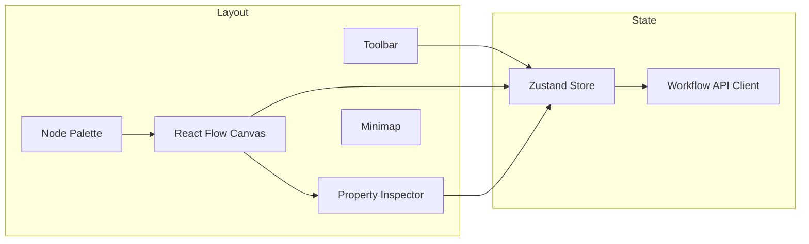

# 02 — Visual Workflow Builder Specification

**Version 1.0** | Phase 8 | AI Lead Intelligence Platform

---

## Table of Contents

1. [Overview](#1-overview)
2. [Canvas Architecture](#2-canvas-architecture)
3. [Node Types & Palette](#3-node-types--palette)
4. [Edges & Connections](#4-edges--connections)
5. [Node Configuration Panel](#5-node-configuration-panel)
6. [UX Features](#6-ux-features)
7. [Validation & Feedback](#7-validation--feedback)
8. [State Management](#8-state-management)
9. [Accessibility](#9-accessibility)
10. [Frontend File Structure](#10-frontend-file-structure)

---

## 1. Overview

The Visual Workflow Builder is a **React Flow**-based canvas at `/workflows/{id}/edit` that allows tenant users with `workflows:write` permission to design automation flows without writing code. Definitions serialize to a canonical JSON schema consumed by the workflow compiler (`backend/app/workflows/compiler/`).

### Design Goals

| Goal | Implementation |
|------|----------------|
| Intuitive | Familiar node-graph UX (similar to n8n, Zapier) |
| Type-safe | Port colors indicate data types; invalid connections blocked |
| Real-time validation | Compile-on-save with inline error badges |
| Collaborative-ready | Optimistic locking via `version` field (Phase 8.2) |
| Responsive | Desktop-first; read-only mobile view |

---

## 2. Canvas Architecture



### Canvas Dimensions

| Property | Value |
|----------|-------|
| Default zoom | 100% |
| Min zoom | 25% |
| Max zoom | 200% |
| Grid snap | 16px |
| Canvas background | Dot grid (`#f8fafc`) |
| Max nodes per workflow | 100 |
| Max edges per workflow | 150 |

### Viewport Persistence

Canvas viewport (`x`, `y`, `zoom`) stored in `workflow_definitions.viewport` JSONB — restored on load.

---

## 3. Node Types & Palette

### Palette Categories

| Category | Icon Color | Node Types |
|----------|------------|------------|
| **Triggers** | Green `#22c55e` | `event_trigger`, `schedule_trigger`, `manual_trigger`, `webhook_trigger` |
| **Logic** | Blue `#3b82f6` | `condition`, `switch`, `loop`, `delay`, `merge`, `split` |
| **Actions** | Orange `#f97316` | `score_entity`, `send_notification`, `create_task`, `add_tag`, `crm_sync`, `export_data` |
| **AI** | Purple `#a855f7` | `ai_score`, `ai_classify`, `ai_summarize`, `ai_extract`, `ai_generate_email` |
| **Approvals** | Yellow `#eab308` | `approval_sequential`, `approval_parallel`, `approval_any` |
| **Utilities** | Gray `#6b7280` | `set_variable`, `http_request`, `transform_data`, `sub_workflow` |

### Node Visual Structure

```
┌─────────────────────────────────┐
│ ● Trigger: contact.created    │  ← Header (type + label)
├─────────────────────────────────┤
│  ○ trigger_data                 │  ← Output port
└─────────────────────────────────┘

┌─────────────────────────────────┐
│ ◆ AI Score Contact              │
├─────────────────────────────────┤
│  ● input          ○ score       │  ← Input / output ports
│                   ○ entity      │
└─────────────────────────────────┘
```

### Node Schema (Canvas Representation)

```typescript
interface WorkflowNode {
  id: string;                    // UUID, stable across saves
  type: string;                  // e.g. "ai_score"
  position: { x: number; y: number };
  data: {
    label: string;
    config: Record<string, unknown>;
    notes?: string;
  };
  width?: number;
  height?: number;
}
```

### Trigger Node Rules

- Exactly **one** trigger node per workflow (compiler enforces)
- Trigger node has **no input ports**
- Multiple workflows may share the same trigger event (fan-out at runtime)

---

## 4. Edges & Connections

### Port Types

| Port Type | Color | Accepts |
|-----------|-------|---------|
| `any` | Gray | Any output |
| `entity` | Teal | `company`, `contact`, `deal` refs |
| `event` | Green | Event payload objects |
| `boolean` | Blue | Condition results |
| `number` | Indigo | Numeric values |
| `string` | Amber | Text values |
| `array` | Pink | Lists |
| `object` | Slate | JSON objects |

### Edge Types

| Edge Type | Description | Visual |
|-----------|-------------|--------|
| `default` | Sequential flow | Solid line |
| `conditional_true` | Condition branch (yes) | Green dashed |
| `conditional_false` | Condition branch (no) | Red dashed |
| `error` | Error handler path | Orange dotted |

```typescript
interface WorkflowEdge {
  id: string;
  source: string;
  sourceHandle: string;   // port id
  target: string;
  targetHandle: string;
  type: 'default' | 'conditional_true' | 'conditional_false' | 'error';
  data?: {
    label?: string;
  };
}
```

### Connection Validation (Client-Side)

1. No self-connections
2. Output port type must be compatible with input port type
3. Trigger nodes cannot have incoming edges
4. `conditional_true` / `conditional_false` edges must originate from `condition` or `switch` nodes
5. No cycles in sequential edges (DAG enforced; `loop` node is the only iteration construct)

---

## 5. Node Configuration Panel

Right-side inspector panel opens on node selection.

### Panel Sections

| Section | Contents |
|---------|----------|
| **General** | Label, description, enabled toggle |
| **Configuration** | Node-specific form fields |
| **Input Mapping** | Map upstream outputs to this node's inputs |
| **Error Handling** | Retry count, fallback edge, continue-on-error |
| **Advanced** | Timeout override, idempotency key expression |

### Expression Input Widget

Fields accepting dynamic values show a toggle: **Static** | **Expression**.

Expression mode uses Monaco editor with:
- Syntax highlighting for `{{ }}` template syntax
- Autocomplete for `trigger.*`, `steps.<node_id>.*`, `vars.*`
- Inline validation against rule engine schema

Example:
```
{{ trigger.payload.contact.seniority in ['vp', 'c_level'] }}
```

### Node Config Examples

**`condition` node:**
```json
{
  "expression": "{{ trigger.payload.lead_score }} >= 70",
  "description": "High-value lead check"
}
```

**`ai_score` node:**
```json
{
  "entity_type": "contact",
  "entity_id": "{{ trigger.payload.contact_id }}",
  "model": "default",
  "include_explanation": true
}
```

**`approval_sequential` node:**
```json
{
  "approvers": [
    { "type": "role", "value": "manager" },
    { "type": "user", "value": "{{ trigger.payload.owner_id }}" }
  ],
  "timeout_hours": 48,
  "escalation": { "type": "role", "value": "admin" },
  "message_template": "approval_high_value_deal"
}
```

---

## 6. UX Features

### Toolbar Actions

| Action | Shortcut | Description |
|--------|----------|-------------|
| Save | `Ctrl+S` | Compile and persist definition |
| Undo | `Ctrl+Z` | Undo canvas change |
| Redo | `Ctrl+Y` | Redo |
| Auto-layout | `Ctrl+L` | Dagre layout algorithm |
| Fit view | `Ctrl+0` | Zoom to fit all nodes |
| Validate | `Ctrl+Shift+V` | Run compiler without save |
| Test run | `Ctrl+Enter` | Execute with sample payload |
| Export | — | Download JSON/YAML |
| Import | — | Upload definition file |

### Test Run Panel

Bottom drawer for dry-run execution:

1. Select trigger payload (JSON editor or entity picker)
2. Click **Run Test**
3. Step-by-step highlight on canvas (green = success, red = failed, yellow = waiting)
4. View input/output per node

### Version History Sidebar

- List of compiled versions with timestamp, author, change summary
- Diff view (node additions/removals highlighted)
- **Restore** action creates new version from historical snapshot

### Template Gallery

Accessible from `/workflows/new`:
- Filter by category (Lead Scoring, CRM, Enrichment, Approvals)
- Preview read-only canvas
- **Use Template** → creates new workflow with pre-populated definition

---

## 7. Validation & Feedback

### Validation Levels

| Level | Source | UI Treatment |
|-------|--------|--------------|
| `error` | Compiler | Red badge on node; save blocked |
| `warning` | Compiler | Yellow badge; save allowed |
| `info` | Linter | Blue tooltip (e.g., unused node) |

### Common Validation Errors

| Code | Message |
|------|---------|
| `WF001` | Workflow must have exactly one trigger node |
| `WF002` | Cycle detected in node graph |
| `WF003` | Node `{id}` has unconnected required input `{port}` |
| `WF004` | Expression syntax error in node `{id}` |
| `WF005` | Unknown node type `{type}` |
| `WF006` | Exceeds maximum node count (100) |
| `WF007` | Approval node requires at least one approver |

### Save Response

```json
{
  "data": {
    "version_id": "uuid",
    "version_number": 3,
    "compiled_at": "2026-06-29T10:00:00Z",
    "warnings": [
      { "code": "WF010", "node_id": "abc", "message": "Node has no outgoing edges" }
    ]
  }
}
```

---

## 8. State Management

### Zustand Store Shape

```typescript
interface WorkflowBuilderState {
  workflowId: string;
  definition: WorkflowDefinition;
  viewport: Viewport;
  selectedNodeId: string | null;
  isDirty: boolean;
  isSaving: boolean;
  validationErrors: ValidationError[];
  executionPreview: ExecutionPreview | null;

  // Actions
  addNode: (type: string, position: XYPosition) => void;
  updateNodeConfig: (nodeId: string, config: object) => void;
  connect: (connection: Connection) => void;
  save: () => Promise<SaveResult>;
  runTest: (payload: object) => Promise<void>;
}
```

### Autosave

- Debounced autosave every 30 seconds when `isDirty` (configurable per org)
- Autosave performs compile; on failure, shows toast without discarding canvas state
- Manual save required to **activate** workflow (`is_active: true`)

---

## 9. Accessibility

| Requirement | Implementation |
|-------------|----------------|
| Keyboard navigation | Tab through nodes; Enter to select |
| Screen reader | `aria-label` on nodes with type + label |
| Color contrast | WCAG AA for port colors and badges |
| Focus indicators | Visible ring on selected node |
| Reduced motion | Respect `prefers-reduced-motion` for layout animations |

---

## 10. Frontend File Structure

```text
frontend/src/features/workflows/
├── pages/
│   ├── WorkflowListPage.tsx
│   ├── WorkflowBuilderPage.tsx
│   ├── WorkflowExecutionPage.tsx
│   └── WorkflowTemplatesPage.tsx
├── components/
│   ├── canvas/
│   │   ├── WorkflowCanvas.tsx
│   │   ├── WorkflowToolbar.tsx
│   │   ├── NodePalette.tsx
│   │   └── Minimap.tsx
│   ├── nodes/
│   │   ├── TriggerNode.tsx
│   │   ├── ActionNode.tsx
│   │   ├── AINode.tsx
│   │   ├── ConditionNode.tsx
│   │   └── ApprovalNode.tsx
│   ├── inspector/
│   │   ├── NodeInspector.tsx
│   │   ├── ExpressionEditor.tsx
│   │   └── ErrorHandlingForm.tsx
│   └── execution/
│       ├── ExecutionTimeline.tsx
│       └── TestRunPanel.tsx
├── hooks/
│   ├── useWorkflowDefinition.ts
│   ├── useWorkflowCompiler.ts
│   └── useExecutionPreview.ts
├── store/
│   └── workflowBuilderStore.ts
├── types/
│   └── workflow.ts
└── api/
    └── workflowsApi.ts
```

---

## Related Documents

- [03-workflow-engine-design.md](./03-workflow-engine-design.md) — Compiler consumes builder output
- [07-api-specification.md](./07-api-specification.md) — Definition CRUD endpoints
- [16-sample-workflow-definitions.md](./16-sample-workflow-definitions.md) — Example JSON