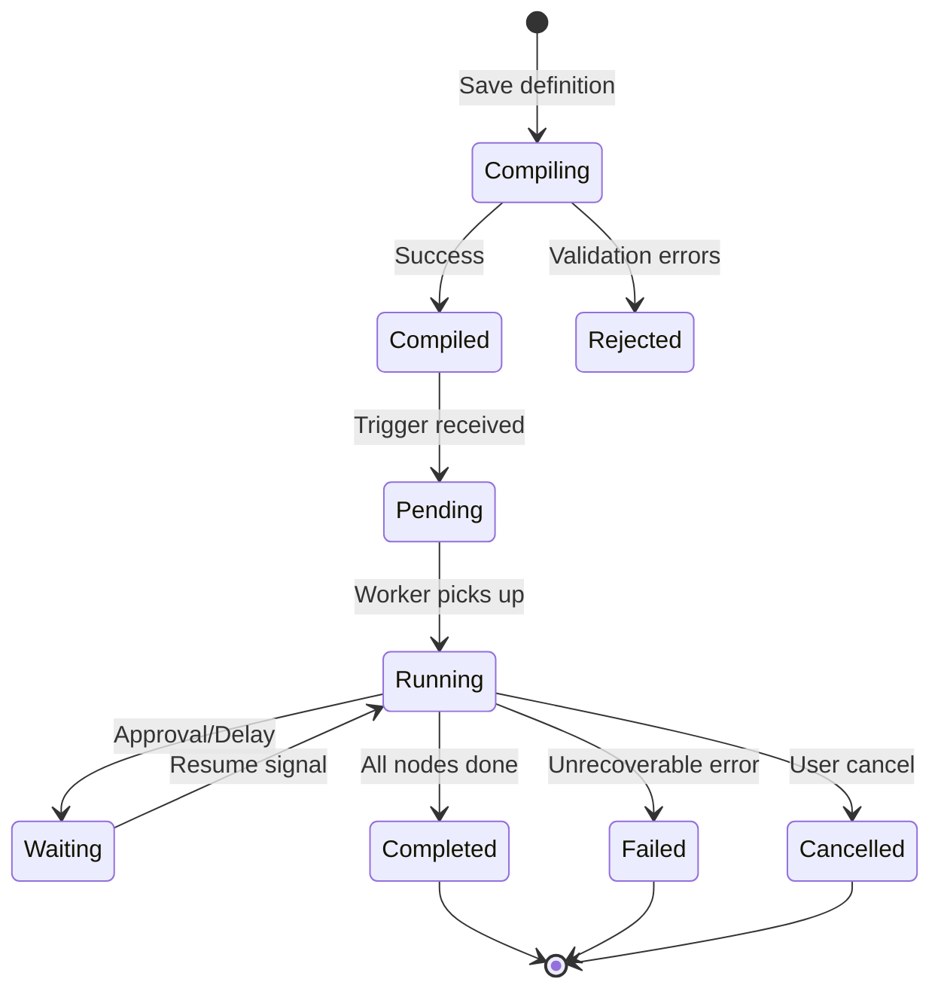
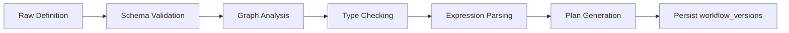
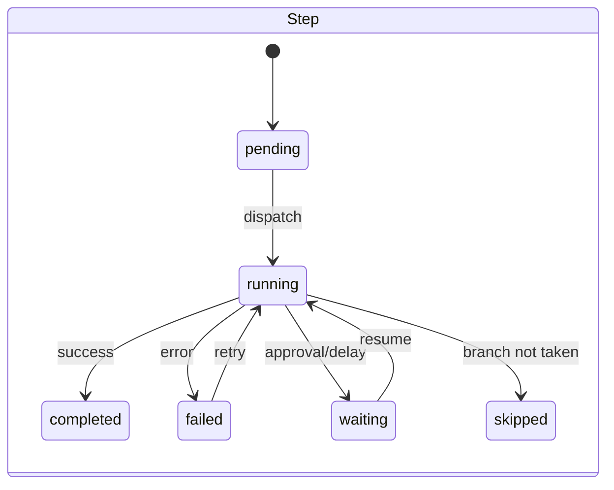
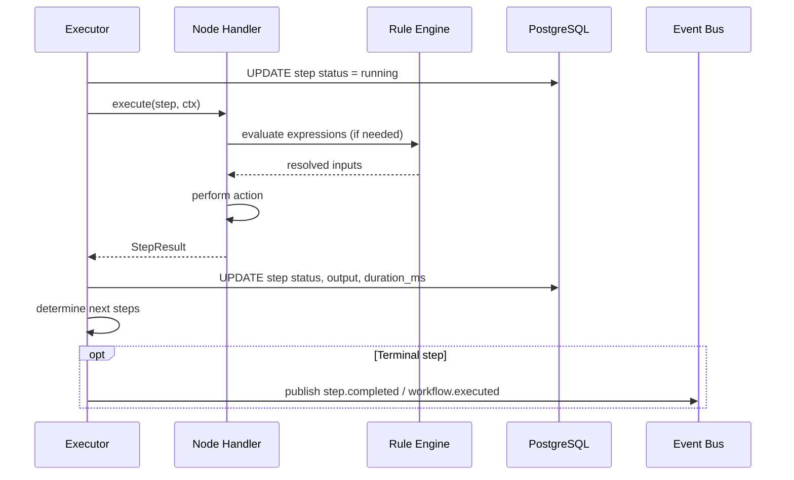

# 03 — Workflow Engine Design

**Version 1.0** | Phase 8 | AI Lead Intelligence Platform

---

## Table of Contents

1. [Overview](#1-overview)
2. [Workflow Definition Model](#2-workflow-definition-model)
3. [Compiler](#3-compiler)
4. [Execution Plan](#4-execution-plan)
5. [Executor](#5-executor)
6. [State Machine](#6-state-machine)
7. [Node Execution Lifecycle](#7-node-execution-lifecycle)
8. [Error Handling & Retries](#8-error-handling--retries)
9. [Idempotency](#9-idempotency)
10. [Concurrency Model](#10-concurrency-model)

---

## 1. Overview

The workflow engine consists of three core components in `backend/app/workflows/`:

| Component | Responsibility |
|-----------|----------------|
| **Compiler** | Validate and transform visual definition → execution plan |
| **Executor** | Run execution plan node-by-node with durable state |
| **State Machine** | Govern execution and step status transitions |



---

## 2. Workflow Definition Model

### Canonical Schema (v2)

```json
{
  "schema_version": "2.0",
  "nodes": [
    {
      "id": "trigger-1",
      "type": "event_trigger",
      "config": { "event": "contact.created" }
    },
    {
      "id": "cond-1",
      "type": "condition",
      "config": { "expression": "{{ trigger.payload.seniority }} in ['vp','c_level']" }
    },
    {
      "id": "score-1",
      "type": "ai_score",
      "config": { "entity_type": "contact", "entity_id": "{{ trigger.payload.id }}" }
    }
  ],
  "edges": [
    { "id": "e1", "source": "trigger-1", "target": "cond-1" },
    { "id": "e2", "source": "cond-1", "target": "score-1", "type": "conditional_true" }
  ],
  "variables": {},
  "settings": {
    "timeout_seconds": 300,
    "max_retries": 3,
    "concurrency_key": "{{ trigger.payload.organization_id }}"
  }
}
```

### Backward Compatibility (v1 → v2)

Phase 3 linear workflows (`trigger_type`, `trigger_config`, `steps` JSONB on `audit.workflows`) are **migrated** to v2 on read:

```python
# backend/app/workflows/migrations/v1_adapter.py
def v1_to_v2(workflow: Workflow) -> WorkflowDefinitionV2:
    """Convert trigger + conditions + actions to node graph."""
```

Legacy API requests using `trigger`/`conditions`/`actions` format are accepted and auto-converted.

---

## 3. Compiler

**Path:** `backend/app/workflows/compiler/`

### Compilation Pipeline



### Compilation Stages

| Stage | Module | Output |
|-------|--------|--------|
| Schema validation | `compiler/schema.py` | Pydantic `WorkflowDefinitionV2` |
| Graph analysis | `compiler/graph.py` | DAG, topological order, reachability |
| Type checking | `compiler/types.py` | Port compatibility matrix |
| Expression parsing | `compiler/expressions.py` | AST for each `{{ }}` expression |
| Plan generation | `compiler/plan.py` | `ExecutionPlan` artifact |

### Graph Analysis Rules

```python
@dataclass
class GraphAnalysis:
    trigger_node_id: str
    topological_order: list[str]
    adjacency: dict[str, list[Edge]]
    reachable_nodes: set[str]
    has_cycles: bool
    orphan_nodes: list[str]
```

1. Exactly one `*_trigger` node
2. All non-trigger nodes reachable from trigger
3. No cycles except through `loop` node semantics
4. `condition` nodes must have at least one outgoing `conditional_*` edge
5. `merge` nodes require ≥2 incoming edges

### Compiler Output

```python
@dataclass
class ExecutionPlan:
    workflow_id: UUID
    version_id: UUID
    trigger_node_id: str
    steps: list[PlannedStep]
    expression_registry: dict[str, CompiledExpression]
    checksum: str  # SHA-256 of normalized plan

@dataclass
class PlannedStep:
    node_id: str
    node_type: str
    handler: str  # Celery task or inline
    inputs: dict[str, InputBinding]  # static or expression ref
    outputs: list[str]  # port names
    next_steps: dict[str, str | list[str]]  # edge_type → target node(s)
    retry_policy: RetryPolicy
    timeout_seconds: int
```

### Compilation API

```python
class WorkflowCompiler:
    async def compile(
        self,
        definition: WorkflowDefinitionV2,
        *,
        org_id: UUID,
    ) -> CompileResult:
        """
        Returns CompileResult with plan, errors, warnings.
        Raises WorkflowCompileError only on caller misconfiguration.
        """
```

---

## 4. Execution Plan

The execution plan is **immutable** once stored in `audit.workflow_versions.execution_plan`. At runtime, the executor loads the plan by `version_id` — never re-compiles mid-execution.

### Plan Caching

| Cache Key | TTL | Storage |
|-----------|-----|---------|
| `wf:plan:{version_id}` | 24h | Redis |
| `wf:plan:checksum:{workflow_id}` | 24h | Redis |

Cache invalidated on new version compile.

### Step Ordering

Topological order determines **eligibility**, not strict serial execution:

- Independent branches execute **concurrently** (up to `max_parallel_branches: 5`)
- `merge` nodes block until all required inputs arrive
- `approval` nodes pause branch without blocking unrelated branches (parallel approval)

---

## 5. Executor

**Path:** `backend/app/workflows/executor/`

### Executor Entry Points

| Method | Trigger |
|--------|---------|
| `start(execution_id)` | New execution from event/schedule/manual |
| `resume(execution_id, signal)` | Approval decision, delay elapsed, webhook callback |
| `cancel(execution_id)` | User or admin cancel |
| `retry_step(execution_id, step_id)` | Manual step retry |

### Execution Context

```python
@dataclass
class ExecutionContext:
    execution_id: UUID
    workflow_id: UUID
    version_id: UUID
    organization_id: UUID
    trigger_data: dict[str, Any]
    variables: dict[str, Any]
    step_outputs: dict[str, dict[str, Any]]  # node_id → port outputs
    actor_id: UUID | None
    correlation_id: str
    started_at: datetime
```

### Main Execution Loop

```python
class WorkflowExecutor:
    async def run(self, ctx: ExecutionContext) -> ExecutionResult:
        plan = await self._load_plan(ctx.version_id)
        state = await self._load_state(ctx.execution_id)

        while state.has_runnable_steps():
            runnable = state.get_runnable_steps(plan)
            results = await asyncio.gather(
                *[self._execute_step(step, ctx, state) for step in runnable],
                return_exceptions=True,
            )
            for result in results:
                await self._apply_result(result, state)
                await self._persist_state(state)

            if state.status == ExecutionStatus.WAITING:
                return ExecutionResult.paused(state)

        return ExecutionResult.completed(state)
```

### Node Handler Dispatch

```python
# backend/app/workflows/nodes/registry.py
NODE_HANDLERS: dict[str, type[NodeHandler]] = {
    "event_trigger": EventTriggerHandler,
    "condition": ConditionHandler,
    "ai_score": AIScoreHandler,
    "approval_sequential": ApprovalSequentialHandler,
    # ...
}

async def dispatch_node(step: PlannedStep, ctx: ExecutionContext) -> StepResult:
    handler = NODE_HANDLERS[step.node_type]()
    return await handler.execute(ctx, step)
```

---

## 6. State Machine

**Path:** `backend/app/workflows/executor/state_machine.py`

### Execution Status

```python
class ExecutionStatus(str, Enum):
    PENDING = "pending"
    RUNNING = "running"
    WAITING = "waiting"        # approval, delay, external callback
    COMPLETED = "completed"
    FAILED = "failed"
    CANCELLED = "cancelled"
    TIMED_OUT = "timed_out"
```

### Step Status

```python
class StepStatus(str, Enum):
    PENDING = "pending"
    RUNNING = "running"
    COMPLETED = "completed"
    FAILED = "failed"
    SKIPPED = "skipped"        # condition branch not taken
    WAITING = "waiting"
    CANCELLED = "cancelled"
```

### Transition Table

| From | Event | To | Action |
|------|-------|-----|--------|
| `pending` | `START` | `running` | Load plan, mark started_at |
| `running` | `STEP_WAITING` | `waiting` | Persist wait reason |
| `waiting` | `RESUME` | `running` | Continue loop |
| `running` | `ALL_STEPS_DONE` | `completed` | Publish `workflow.executed` |
| `running` | `STEP_FAILED` | `failed` | Publish `workflow.failed` |
| `running` | `TIMEOUT` | `timed_out` | Cancel pending steps |
| `*` | `CANCEL` | `cancelled` | User-initiated |
| `failed` | `RETRY` | `running` | Reset failed step (manual) |



---

## 7. Node Execution Lifecycle



### Step Result Schema

```python
@dataclass
class StepResult:
    node_id: str
    status: StepStatus
    outputs: dict[str, Any]
    error: StepError | None
    duration_ms: int
    next_edge_type: str | None  # for condition nodes
```

---

## 8. Error Handling & Retries

### Retry Policy (Per Node)

```python
@dataclass
class RetryPolicy:
    max_attempts: int = 3
    backoff_seconds: list[int] = field(default_factory=lambda: [10, 30, 60])
    retryable_errors: list[str] = field(default_factory=lambda: [
        "TIMEOUT", "RATE_LIMITED", "TRANSIENT_DB_ERROR", "CONNECTOR_UNAVAILABLE"
    ])
```

### Error Handling Modes (Per Node)

| Mode | Behavior |
|------|----------|
| `fail_workflow` | Default; execution → `failed` |
| `continue` | Log error, mark step failed, proceed on default edge |
| `error_branch` | Follow `error` edge to fallback node |
| `retry_then_fail` | Retry per policy, then `fail_workflow` |

### Celery Integration

```python
@celery_app.task(
    bind=True,
    name="workflows.execute",
    queue="workflows",
    acks_late=True,
    max_retries=3,
)
def execute_workflow(self, execution_id: str) -> None:
    try:
        asyncio.run(_execute(execution_id))
    except TransientWorkflowError as exc:
        raise self.retry(exc=exc, countdown=60)
```

---

## 9. Idempotency

### Idempotency Key

```
{organization_id}:{workflow_id}:{trigger_event_id}:{node_id}
```

Stored in Redis (`wf:idempotency:{key}`, TTL 24h) and `audit.workflow_execution_steps.idempotency_key`.

If duplicate detected:
- Return cached `StepResult` without re-executing side effects
- Log `idempotency_hit` metric

### Side-Effect Classification

| Class | Idempotency | Examples |
|-------|-------------|----------|
| `read_only` | Not required | `condition`, `transform_data` |
| `idempotent_write` | Key required | `add_tag`, `score_entity` |
| `non_idempotent` | Key + dedup window | `send_notification`, `http_request` |

---

## 10. Concurrency Model

### Per-Organization Limits

| Limit | Default | Config Key |
|-------|---------|------------|
| Concurrent executions | 10 | `workflow_max_concurrent_per_org` |
| Executions per minute | 100 | `workflow_rate_limit_per_org` |
| Max execution duration | 300s | `settings.timeout_seconds` |

Enforced via Redis token bucket (`wf:ratelimit:{org_id}`).

### Worker Pool

| Queue | Workers | Purpose |
|-------|---------|---------|
| `workflows` | 2–20 | Standard execution |
| `workflows.priority` | 1–5 | Resume, approval timeouts |
| `workflows.dlq` | 1 | Dead letter reprocessing |

### Optimistic Locking

Execution state updates use `version` column:

```sql
UPDATE audit.workflow_executions
SET status = $1, state = $2, version = version + 1
WHERE id = $3 AND version = $4;
```

Conflict → reload state and retry (max 3 attempts).

---

## Related Documents

- [04-rule-engine-design.md](./04-rule-engine-design.md) — Expression evaluation
- [06-database-schema.md](./06-database-schema.md) — Execution tables
- [08-ai-node-specifications.md](./08-ai-node-specifications.md) — AI node handlers
- [09-approval-engine-design.md](./09-approval-engine-design.md) — Wait/resume semantics