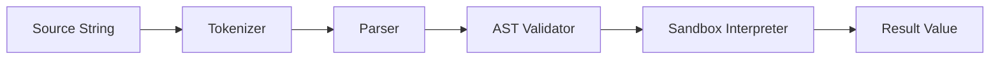

# 04 — Rule Engine Design

**Version 1.0** | Phase 8 | AI Lead Intelligence Platform

---

## Table of Contents

1. [Overview](#1-overview)
2. [Expression Language](#2-expression-language)
3. [Condition Evaluation](#3-condition-evaluation)
4. [Rule Sets](#4-rule-sets)
5. [Sandbox Security](#5-sandbox-security)
6. [Context Model](#6-context-model)
7. [Built-in Functions](#7-built-in-functions)
8. [Performance](#8-performance)
9. [Testing](#9-testing)

---

## 1. Overview

The rule engine (`backend/app/workflows/rules/`) evaluates **conditions**, **expressions**, and **rule sets** at compile time (static analysis) and runtime (dynamic evaluation). It powers:

- `condition` and `switch` nodes
- Input mapping expressions on all nodes
- Event trigger filters
- Approval routing rules
- Scheduler exclusion rules (holidays)

**Design constraint:** No arbitrary Python `eval()`. All expressions compile to a restricted AST executed by a sandboxed interpreter.

---

## 2. Expression Language

### Syntax

Expressions are embedded in `{{ ... }}` template strings or provided as raw strings in `condition` nodes.

```
{{ trigger.payload.lead_score >= 70 }}
{{ steps.score-1.output.score > 80 and trigger.payload.country == 'US' }}
{{ vars.threshold | default(50) }}
```

### AST Pipeline



**Modules:**
- `rules/lexer.py` — Tokenize `{{ }}` templates
- `rules/parser.py` — Build AST (based on `simpleeval` patterns)
- `rules/validator.py` — Reject unsafe constructs at compile time
- `rules/interpreter.py` — Execute against `EvaluationContext`

### Supported Operators

| Category | Operators |
|----------|-----------|
| Comparison | `==`, `!=`, `<`, `<=`, `>`, `>=` |
| Logical | `and`, `or`, `not` |
| Membership | `in`, `not in` |
| Arithmetic | `+`, `-`, `*`, `/`, `%` |
| String | `+` (concat), `contains`, `startswith`, `endswith` |
| Null-safe | `??` (coalesce), `?.` (optional chain) |

### Supported Literals

- Strings (`'US'`, `"hello"`)
- Numbers (int, float)
- Booleans (`true`, `false`)
- Null (`null`)
- Arrays (`[1, 2, 3]`)
- Objects (`{ 'key': 'value' }`) — static keys only at parse time

---

## 3. Condition Evaluation

### Condition Node Evaluation

```python
class ConditionHandler(NodeHandler):
    async def execute(self, ctx: ExecutionContext, step: PlannedStep) -> StepResult:
        expression = step.config["expression"]
        result = await self.rule_engine.evaluate(expression, ctx.to_evaluation_context())
        edge_type = "conditional_true" if result else "conditional_false"
        return StepResult(
            node_id=step.node_id,
            status=StepStatus.COMPLETED,
            outputs={"result": result},
            next_edge_type=edge_type,
        )
```

### Switch Node

Multi-branch evaluation — first matching case wins:

```json
{
  "expression": "{{ trigger.payload.seniority }}",
  "cases": [
    { "value": "c_level", "edge": "c-level-path" },
    { "value": "vp", "edge": "vp-path" },
    { "value": "director", "edge": "director-path" }
  ],
  "default_edge": "other-path"
}
```

### Event Trigger Filters

Triggers may include a filter expression evaluated before workflow matching:

```json
{
  "event": "contact.created",
  "filter": "{{ trigger.payload.source == 'linkedin' and trigger.payload.email != null }}"
}
```

Workflow is matched only if filter evaluates to `true`.

---

## 4. Rule Sets

Reusable named rule collections stored in `audit.workflow_rule_sets`.

### Rule Set Schema

```json
{
  "id": "uuid",
  "name": "High-Value Lead Criteria",
  "rules": [
    {
      "id": "rule-1",
      "name": "Seniority check",
      "expression": "{{ entity.seniority in ['vp', 'c_level', 'director'] }}",
      "priority": 10
    },
    {
      "id": "rule-2",
      "name": "Company size",
      "expression": "{{ entity.company.employee_count >= 500 }}",
      "priority": 20
    }
  ],
  "combinator": "and"
}
```

### Combinators

| Combinator | Behavior |
|------------|----------|
| `and` | All rules must pass |
| `or` | Any rule passes |
| `first_match` | Return first passing rule |
| `weighted` | Score = sum(weights); pass if ≥ threshold |

### Rule Set Node

```json
{
  "type": "rule_set",
  "config": {
    "rule_set_id": "uuid",
    "input_entity": "{{ trigger.payload }}"
  }
}
```

Output ports: `passed` (boolean), `matched_rules` (array), `score` (number for weighted).

---

## 5. Sandbox Security

### Deny List (Compile-Time)

| Construct | Reason |
|-----------|--------|
| `import`, `__import__` | Code execution |
| `exec`, `eval`, `compile` | Code execution |
| `open`, `file` | File system access |
| `getattr`, `setattr`, `delattr` | Reflection |
| `globals`, `locals`, `vars` | Scope escape |
| Dunder attributes (`__class__`) | Introspection |
| Lambda with >1 statement | Complexity limit |
| List comprehensions > depth 2 | DoS prevention |

### Resource Limits

| Limit | Value |
|-------|-------|
| Max expression length | 4,096 chars |
| Max AST depth | 32 |
| Max evaluation time | 100ms |
| Max string operation length | 10,000 chars |
| Max array length in expression | 1,000 elements |

### Violation Handling

```python
class SandboxViolation(Exception):
    code: str  # e.g. "SANDBOX_IMPORT_DENIED"
    message: str
```

Compile-time violations → `422` with `WF004` error code.
Runtime violations → step `failed` with `SANDBOX_VIOLATION`.

---

## 6. Context Model

### Evaluation Context

```python
@dataclass
class EvaluationContext:
    trigger: dict[str, Any]       # trigger.payload, trigger.event, trigger.timestamp
    steps: dict[str, Any]       # steps.<node_id>.output.<port>
    vars: dict[str, Any]        # workflow-level variables
    entity: dict[str, Any]      # current entity (contact, company, deal)
    org: dict[str, Any]         # organization settings snapshot
    env: dict[str, str]         # whitelisted env vars (non-secret)
```

### Path Resolution

```
trigger.payload.contact.email
steps.score-1.output.score
vars.approval_threshold
entity.company.industry
org.settings.timezone
```

Resolved via `rules/resolver.py` with strict typing:

| Path Root | Type |
|-----------|------|
| `trigger` | `object` |
| `steps` | `object` (dynamic keys) |
| `vars` | `object` |
| `entity` | `object` |
| `org` | `object` |

### Type Coercion Rules

| Operation | Coercion |
|-----------|----------|
| `"5" + 3` | Error (no implicit coercion) |
| `"5" == 5` | `false` (strict equality) |
| `null == null` | `true` |
| Missing path `steps.missing.output.x` | `null` (not error) |

---

## 7. Built-in Functions

| Function | Signature | Description |
|----------|-----------|-------------|
| `len` | `len(array\|string)` | Length |
| `upper` | `upper(string)` | Uppercase |
| `lower` | `lower(string)` | Lowercase |
| `trim` | `trim(string)` | Strip whitespace |
| `split` | `split(string, delimiter)` | Split to array |
| `join` | `join(array, delimiter)` | Join array |
| `contains` | `contains(haystack, needle)` | Substring / membership |
| `default` | `default(value, fallback)` | Null coalesce |
| `now` | `now()` | UTC ISO timestamp |
| `days_ago` | `days_ago(n)` | Date n days before now |
| `parse_json` | `parse_json(string)` | Parse JSON string |
| `format` | `format(template, obj)` | Simple template format |
| `hash` | `hash(string)` | SHA-256 (for dedup keys) |
| `uuid` | `uuid()` | Random UUID v7 |

### Function Registration

```python
# backend/app/workflows/rules/functions.py
BUILTIN_FUNCTIONS: dict[str, Callable] = {
    "len": safe_len,
    "upper": safe_upper,
    # ...
}

def register_function(name: str, fn: Callable, *, org_id: UUID | None = None):
    """Org-specific functions require admin approval."""
```

---

## 8. Performance

### Compile-Time Caching

Compiled expressions stored in `workflow_versions.execution_plan.expression_registry`:

```python
expression_registry: {
    "expr:cond-1": {
        "source": "{{ trigger.payload.lead_score >= 70 }}",
        "checksum": "sha256:abc...",
        "ast_hash": "def..."
    }
}
```

### Runtime Caching

| Cache | Key | TTL |
|-------|-----|-----|
| Entity snapshot | `wf:entity:{org}:{type}:{id}` | 5 min |
| Rule set | `wf:ruleset:{id}` | 1 hour |
| Eval result (idempotent) | `wf:eval:{execution_id}:{node_id}` | Execution lifetime |

### Benchmarks (Target)

| Scenario | p95 Latency |
|----------|-------------|
| Simple comparison | < 1ms |
| 5-function chain | < 5ms |
| Rule set (10 rules, `and`) | < 10ms |
| Entity path resolution (cached) | < 2ms |

---

## 9. Testing

### Test Categories

```text
backend/tests/workflows/rules/
├── test_lexer.py
├── test_parser.py
├── test_sandbox_violations.py
├── test_builtins.py
├── test_condition_evaluation.py
├── test_rule_sets.py
└── fixtures/
    └── expressions.json
```

### Property-Based Tests

```python
# Hypothesis: parser never crashes on random strings
@given(st.text(max_size=4096))
def test_parser_never_raises_unhandled(text):
    try:
        parse(text)
    except ParseError:
        pass  # expected
```

### Golden Expression Fixtures

| Expression | Expected |
|------------|----------|
| `{{ 1 + 2 }}` | `3` |
| `{{ 'vp' in ['vp','c_level'] }}` | `true` |
| `{{ steps.missing.output.x ?? 'default' }}` | `'default'` |
| `{{ import os }}` | `SandboxViolation` |

---

## Related Documents

- [03-workflow-engine-design.md](./03-workflow-engine-design.md) — Condition node integration
- [13-security-model.md](./13-security-model.md) — Sandbox policy
- [15-testing-strategy.md](./15-testing-strategy.md) — Full test plan