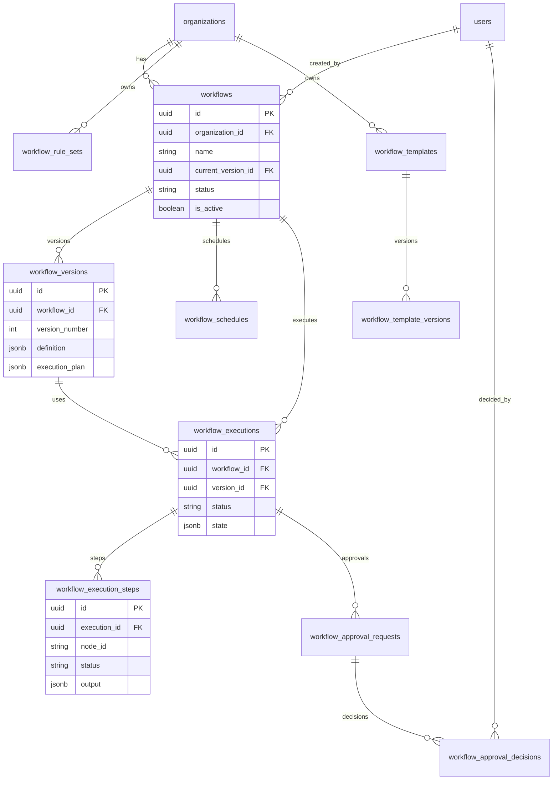

# 06 — Database Schema

**Version 1.0** | Phase 8 | AI Lead Intelligence Platform

---

## Table of Contents

1. [Overview](#1-overview)
2. [Schema Organization](#2-schema-organization)
3. [Entity Relationship Diagram](#3-entity-relationship-diagram)
4. [Table Definitions](#4-table-definitions)
5. [Indexes & Performance](#5-indexes--performance)
6. [Migration Strategy](#6-migration-strategy)
7. [Retention & Archival](#7-retention--archival)

---

## 1. Overview

Phase 8 extends the `audit` schema (per `backend/app/common/db_schemas.py` → `DBSchema.AUDIT`) with tables for visual workflow definitions, versions, step-level execution state, approvals, rule sets, schedules, and templates.

Existing tables (`audit.workflows`, `audit.workflow_executions`) from Phase 3 are **evolved in place** — no data loss.

---

## 2. Schema Organization

| Schema | Workflow Tables |
|--------|-----------------|
| `audit` | All workflow platform tables |
| `system` | `feature_flags` (workflow feature toggles) |
| `core` | `organizations` (FK target) |
| `auth` | `users` (FK target for created_by, approvers) |

---

## 3. Entity Relationship Diagram



---

## 4. Table Definitions

### 4.1 `audit.workflows` (Evolved)

```sql
-- Migration: 0xx_phase8_workflows.sql

ALTER TABLE audit.workflows
    ADD COLUMN IF NOT EXISTS current_version_id UUID,
    ADD COLUMN IF NOT EXISTS status VARCHAR(20) NOT NULL DEFAULT 'draft',
    ADD COLUMN IF NOT EXISTS definition_schema_version VARCHAR(10) NOT NULL DEFAULT '2.0',
    ADD COLUMN IF NOT EXISTS category VARCHAR(50),
    ADD COLUMN IF NOT EXISTS tags JSONB NOT NULL DEFAULT '[]'::jsonb,
    ADD COLUMN IF NOT EXISTS priority INT NOT NULL DEFAULT 0,
    ADD COLUMN IF NOT EXISTS settings JSONB NOT NULL DEFAULT '{}'::jsonb,
    ADD COLUMN IF NOT EXISTS deleted_at TIMESTAMPTZ,
    ADD COLUMN IF NOT EXISTS created_by UUID REFERENCES auth.users(id) ON DELETE SET NULL;

-- status: draft | active | paused | archived
-- Retain legacy columns: trigger_type, trigger_config, steps (deprecated, migrated to versions)

CREATE INDEX IF NOT EXISTS ix_workflows_org_status
    ON audit.workflows (organization_id, status)
    WHERE deleted_at IS NULL;

CREATE INDEX IF NOT EXISTS ix_workflows_org_active
    ON audit.workflows (organization_id, is_active)
    WHERE deleted_at IS NULL AND is_active = true;
```

### 4.2 `audit.workflow_versions`

```sql
CREATE TABLE IF NOT EXISTS audit.workflow_versions (
    id                  UUID PRIMARY KEY DEFAULT gen_random_uuid(),
    workflow_id         UUID NOT NULL REFERENCES audit.workflows(id) ON DELETE CASCADE,
    organization_id     UUID NOT NULL REFERENCES core.organizations(id) ON DELETE CASCADE,
    version_number      INT NOT NULL,
    definition          JSONB NOT NULL,
    execution_plan      JSONB NOT NULL,
    viewport            JSONB NOT NULL DEFAULT '{}'::jsonb,
    checksum            VARCHAR(64) NOT NULL,
    compiled_by         UUID REFERENCES auth.users(id) ON DELETE SET NULL,
    compile_warnings    JSONB NOT NULL DEFAULT '[]'::jsonb,
    change_summary      TEXT,
    created_at          TIMESTAMPTZ NOT NULL DEFAULT now(),

    CONSTRAINT uq_workflow_version_number UNIQUE (workflow_id, version_number)
);

CREATE INDEX ix_workflow_versions_workflow_id ON audit.workflow_versions (workflow_id);
CREATE INDEX ix_workflow_versions_org_id ON audit.workflow_versions (organization_id);

ALTER TABLE audit.workflows
    ADD CONSTRAINT fk_workflows_current_version
    FOREIGN KEY (current_version_id) REFERENCES audit.workflow_versions(id)
    ON DELETE SET NULL;
```

### 4.3 `audit.workflow_executions` (Evolved)

```sql
ALTER TABLE audit.workflow_executions
    ADD COLUMN IF NOT EXISTS version_id UUID REFERENCES audit.workflow_versions(id) ON DELETE SET NULL,
    ADD COLUMN IF NOT EXISTS organization_id UUID NOT NULL REFERENCES core.organizations(id) ON DELETE CASCADE,
    ADD COLUMN IF NOT EXISTS correlation_id VARCHAR(64),
    ADD COLUMN IF NOT EXISTS trigger_type VARCHAR(50) NOT NULL DEFAULT 'event',
    ADD COLUMN IF NOT EXISTS state JSONB NOT NULL DEFAULT '{}'::jsonb,
    ADD COLUMN IF NOT EXISTS variables JSONB NOT NULL DEFAULT '{}'::jsonb,
    ADD COLUMN IF NOT EXISTS started_at TIMESTAMPTZ,
    ADD COLUMN IF NOT EXISTS completed_at TIMESTAMPTZ,
    ADD COLUMN IF NOT EXISTS wait_reason VARCHAR(50),
    ADD COLUMN IF NOT EXISTS wait_until TIMESTAMPTZ,
    ADD COLUMN IF NOT EXISTS version INT NOT NULL DEFAULT 1,
    ADD COLUMN IF NOT EXISTS deleted_at TIMESTAMPTZ;

-- status values: pending, running, waiting, completed, failed, cancelled, timed_out
-- Rename legacy: result → merged into state JSONB via migration

CREATE INDEX ix_workflow_executions_org_status
    ON audit.workflow_executions (organization_id, status, created_at DESC);

CREATE INDEX ix_workflow_executions_workflow_id_created
    ON audit.workflow_executions (workflow_id, created_at DESC);

CREATE INDEX ix_workflow_executions_correlation_id
    ON audit.workflow_executions (correlation_id)
    WHERE correlation_id IS NOT NULL;

CREATE INDEX ix_workflow_executions_waiting
    ON audit.workflow_executions (wait_until)
    WHERE status = 'waiting' AND wait_until IS NOT NULL;
```

### 4.4 `audit.workflow_execution_steps`

```sql
CREATE TABLE IF NOT EXISTS audit.workflow_execution_steps (
    id                  UUID PRIMARY KEY DEFAULT gen_random_uuid(),
    execution_id        UUID NOT NULL REFERENCES audit.workflow_executions(id) ON DELETE CASCADE,
    organization_id     UUID NOT NULL REFERENCES core.organizations(id) ON DELETE CASCADE,
    node_id             VARCHAR(64) NOT NULL,
    node_type           VARCHAR(50) NOT NULL,
    status              VARCHAR(20) NOT NULL DEFAULT 'pending',
    attempt             INT NOT NULL DEFAULT 1,
    input               JSONB NOT NULL DEFAULT '{}'::jsonb,
    output              JSONB NOT NULL DEFAULT '{}'::jsonb,
    error               JSONB,
    idempotency_key     VARCHAR(256),
    started_at          TIMESTAMPTZ,
    completed_at        TIMESTAMPTZ,
    duration_ms         INT,
    created_at          TIMESTAMPTZ NOT NULL DEFAULT now(),
    updated_at          TIMESTAMPTZ NOT NULL DEFAULT now(),

    CONSTRAINT uq_execution_step_node UNIQUE (execution_id, node_id)
);

CREATE INDEX ix_execution_steps_execution_id ON audit.workflow_execution_steps (execution_id);
CREATE INDEX ix_execution_steps_status ON audit.workflow_execution_steps (status);
CREATE INDEX ix_execution_steps_idempotency ON audit.workflow_execution_steps (idempotency_key)
    WHERE idempotency_key IS NOT NULL;

CREATE TRIGGER trg_execution_steps_updated_at
    BEFORE UPDATE ON audit.workflow_execution_steps
    FOR EACH ROW EXECUTE FUNCTION set_updated_at();
```

### 4.5 `audit.workflow_approval_requests`

```sql
CREATE TABLE IF NOT EXISTS audit.workflow_approval_requests (
    id                  UUID PRIMARY KEY DEFAULT gen_random_uuid(),
    execution_id        UUID NOT NULL REFERENCES audit.workflow_executions(id) ON DELETE CASCADE,
    step_id             UUID NOT NULL REFERENCES audit.workflow_execution_steps(id) ON DELETE CASCADE,
    organization_id     UUID NOT NULL REFERENCES core.organizations(id) ON DELETE CASCADE,
    approval_type       VARCHAR(20) NOT NULL,  -- sequential, parallel, any
    status              VARCHAR(20) NOT NULL DEFAULT 'pending',
    title               VARCHAR(255) NOT NULL,
    message             TEXT,
    context_data        JSONB NOT NULL DEFAULT '{}'::jsonb,
    required_approvals  INT NOT NULL DEFAULT 1,
    received_approvals  INT NOT NULL DEFAULT 0,
    timeout_at          TIMESTAMPTZ,
    escalation_target   JSONB,
    created_at          TIMESTAMPTZ NOT NULL DEFAULT now(),
    resolved_at         TIMESTAMPTZ
);

CREATE INDEX ix_approval_requests_org_status
    ON audit.workflow_approval_requests (organization_id, status);
CREATE INDEX ix_approval_requests_timeout
    ON audit.workflow_approval_requests (timeout_at)
    WHERE status = 'pending';
```

### 4.6 `audit.workflow_approval_decisions`

```sql
CREATE TABLE IF NOT EXISTS audit.workflow_approval_decisions (
    id                  UUID PRIMARY KEY DEFAULT gen_random_uuid(),
    request_id          UUID NOT NULL REFERENCES audit.workflow_approval_requests(id) ON DELETE CASCADE,
    organization_id     UUID NOT NULL REFERENCES core.organizations(id) ON DELETE CASCADE,
    approver_id         UUID NOT NULL REFERENCES auth.users(id) ON DELETE CASCADE,
    decision            VARCHAR(20) NOT NULL,  -- approved, rejected, delegated
    comment             TEXT,
    decided_at          TIMESTAMPTZ NOT NULL DEFAULT now(),

    CONSTRAINT uq_approval_decision UNIQUE (request_id, approver_id)
);

CREATE INDEX ix_approval_decisions_request_id ON audit.workflow_approval_decisions (request_id);
```

### 4.7 `audit.workflow_schedules`

```sql
CREATE TABLE IF NOT EXISTS audit.workflow_schedules (
    id                  UUID PRIMARY KEY DEFAULT gen_random_uuid(),
    workflow_id         UUID NOT NULL REFERENCES audit.workflows(id) ON DELETE CASCADE,
    organization_id     UUID NOT NULL REFERENCES core.organizations(id) ON DELETE CASCADE,
    cron_expression     VARCHAR(100) NOT NULL,
    timezone            VARCHAR(50) NOT NULL DEFAULT 'UTC',
    is_active           BOOLEAN NOT NULL DEFAULT true,
    holiday_calendar_id UUID,
    next_run_at         TIMESTAMPTZ,
    last_run_at         TIMESTAMPTZ,
    last_execution_id   UUID REFERENCES audit.workflow_executions(id) ON DELETE SET NULL,
    config              JSONB NOT NULL DEFAULT '{}'::jsonb,
    created_at          TIMESTAMPTZ NOT NULL DEFAULT now(),
    updated_at          TIMESTAMPTZ NOT NULL DEFAULT now()
);

CREATE INDEX ix_workflow_schedules_next_run
    ON audit.workflow_schedules (next_run_at)
    WHERE is_active = true;

CREATE TRIGGER trg_workflow_schedules_updated_at
    BEFORE UPDATE ON audit.workflow_schedules
    FOR EACH ROW EXECUTE FUNCTION set_updated_at();
```

### 4.8 `audit.workflow_holiday_calendars`

```sql
CREATE TABLE IF NOT EXISTS audit.workflow_holiday_calendars (
    id                  UUID PRIMARY KEY DEFAULT gen_random_uuid(),
    organization_id     UUID REFERENCES core.organizations(id) ON DELETE CASCADE,
    name                VARCHAR(100) NOT NULL,
    country_code        VARCHAR(2),
    holidays            JSONB NOT NULL DEFAULT '[]'::jsonb,
    is_system           BOOLEAN NOT NULL DEFAULT false,
    created_at          TIMESTAMPTZ NOT NULL DEFAULT now()
);

-- holidays: [{ "date": "2026-12-25", "name": "Christmas" }]
```

### 4.9 `audit.workflow_rule_sets`

```sql
CREATE TABLE IF NOT EXISTS audit.workflow_rule_sets (
    id                  UUID PRIMARY KEY DEFAULT gen_random_uuid(),
    organization_id     UUID NOT NULL REFERENCES core.organizations(id) ON DELETE CASCADE,
    name                VARCHAR(255) NOT NULL,
    description         TEXT,
    rules               JSONB NOT NULL DEFAULT '[]'::jsonb,
    combinator          VARCHAR(20) NOT NULL DEFAULT 'and',
    is_active           BOOLEAN NOT NULL DEFAULT true,
    created_by          UUID REFERENCES auth.users(id) ON DELETE SET NULL,
    created_at          TIMESTAMPTZ NOT NULL DEFAULT now(),
    updated_at          TIMESTAMPTZ NOT NULL DEFAULT now(),
    deleted_at          TIMESTAMPTZ
);

CREATE INDEX ix_rule_sets_org_id ON audit.workflow_rule_sets (organization_id)
    WHERE deleted_at IS NULL;
```

### 4.10 `audit.workflow_templates`

```sql
CREATE TABLE IF NOT EXISTS audit.workflow_templates (
    id                  UUID PRIMARY KEY DEFAULT gen_random_uuid(),
    organization_id     UUID REFERENCES core.organizations(id) ON DELETE CASCADE,
    slug                VARCHAR(100) NOT NULL,
    name                VARCHAR(255) NOT NULL,
    description         TEXT,
    category            VARCHAR(50) NOT NULL,
    tags                JSONB NOT NULL DEFAULT '[]'::jsonb,
    is_system           BOOLEAN NOT NULL DEFAULT false,
    is_public           BOOLEAN NOT NULL DEFAULT false,
    usage_count         INT NOT NULL DEFAULT 0,
    created_at          TIMESTAMPTZ NOT NULL DEFAULT now(),
    updated_at          TIMESTAMPTZ NOT NULL DEFAULT now()
);

CREATE UNIQUE INDEX uq_workflow_templates_slug
    ON audit.workflow_templates (slug)
    WHERE organization_id IS NULL;

CREATE UNIQUE INDEX uq_workflow_templates_org_slug
    ON audit.workflow_templates (organization_id, slug)
    WHERE organization_id IS NOT NULL;
```

### 4.11 `audit.workflow_template_versions`

```sql
CREATE TABLE IF NOT EXISTS audit.workflow_template_versions (
    id                  UUID PRIMARY KEY DEFAULT gen_random_uuid(),
    template_id         UUID NOT NULL REFERENCES audit.workflow_templates(id) ON DELETE CASCADE,
    version_number      INT NOT NULL,
    definition          JSONB NOT NULL,
    parameters          JSONB NOT NULL DEFAULT '[]'::jsonb,
    created_at          TIMESTAMPTZ NOT NULL DEFAULT now(),

    CONSTRAINT uq_template_version UNIQUE (template_id, version_number)
);

-- parameters: [{ "name": "score_threshold", "type": "number", "default": 70, "required": true }]
```

### 4.12 `audit.event_dlq`

```sql
CREATE TABLE IF NOT EXISTS audit.event_dlq (
    id                  UUID PRIMARY KEY DEFAULT gen_random_uuid(),
    event_id            UUID NOT NULL,
    event_type          VARCHAR(100) NOT NULL,
    organization_id     UUID,
    payload             JSONB NOT NULL,
    failure_reason      VARCHAR(100) NOT NULL,
    failure_count       INT NOT NULL DEFAULT 1,
    last_error          TEXT,
    consumer_queue      VARCHAR(100) NOT NULL,
    status              VARCHAR(20) NOT NULL DEFAULT 'pending',
    replayed_at         TIMESTAMPTZ,
    created_at          TIMESTAMPTZ NOT NULL DEFAULT now()
);

CREATE INDEX ix_event_dlq_status ON audit.event_dlq (status, created_at);
```

### 4.13 `audit.event_replay_jobs`

```sql
CREATE TABLE IF NOT EXISTS audit.event_replay_jobs (
    id                  UUID PRIMARY KEY DEFAULT gen_random_uuid(),
    organization_id     UUID REFERENCES core.organizations(id) ON DELETE CASCADE,
    event_types         JSONB NOT NULL,
    time_range          TSTZRANGE NOT NULL,
    target              VARCHAR(50) NOT NULL,
    dry_run             BOOLEAN NOT NULL DEFAULT true,
    status              VARCHAR(20) NOT NULL DEFAULT 'queued',
    events_matched      INT,
    events_replayed     INT,
    errors              JSONB NOT NULL DEFAULT '[]'::jsonb,
    created_by          UUID REFERENCES auth.users(id) ON DELETE SET NULL,
    created_at          TIMESTAMPTZ NOT NULL DEFAULT now(),
    completed_at        TIMESTAMPTZ
);
```

### 4.14 `audit.workflow_trigger_index` (Denormalized)

```sql
CREATE TABLE IF NOT EXISTS audit.workflow_trigger_index (
    id                  UUID PRIMARY KEY DEFAULT gen_random_uuid(),
    organization_id     UUID NOT NULL REFERENCES core.organizations(id) ON DELETE CASCADE,
    workflow_id         UUID NOT NULL REFERENCES audit.workflows(id) ON DELETE CASCADE,
    event_type          VARCHAR(100) NOT NULL,
    filter_expression   TEXT,
    priority            INT NOT NULL DEFAULT 0,
    is_active           BOOLEAN NOT NULL DEFAULT true,

    CONSTRAINT uq_trigger_index UNIQUE (organization_id, workflow_id, event_type)
);

CREATE INDEX ix_trigger_index_lookup
    ON audit.workflow_trigger_index (organization_id, event_type, is_active);
```

---

## 5. Indexes & Performance

### Query Patterns

| Query | Index Used |
|-------|------------|
| List org workflows | `ix_workflows_org_status` |
| Match event triggers | `ix_trigger_index_lookup` |
| Execution history | `ix_workflow_executions_workflow_id_created` |
| Pending approvals | `ix_approval_requests_org_status` |
| Resume delayed executions | `ix_workflow_executions_waiting` |
| Schedule tick | `ix_workflow_schedules_next_run` |

### Partitioning (Future — Phase 8.3)

`workflow_executions` partitioned by `created_at` monthly when row count exceeds 10M:

```sql
CREATE TABLE audit.workflow_executions_2026_06
    PARTITION OF audit.workflow_executions
    FOR VALUES FROM ('2026-06-01') TO ('2026-07-01');
```

---

## 6. Migration Strategy

### Alembic Migration

**File:** `backend/migrations/versions/0xx_phase8_workflows.py`

```python
def upgrade():
    # 1. Add new columns to existing tables
    # 2. Create new tables
    # 3. Migrate v1 workflows → workflow_versions
    # 4. Build trigger index
    # 5. Add FK for current_version_id
```

### v1 → v2 Data Migration

```sql
INSERT INTO audit.workflow_versions (workflow_id, organization_id, version_number, definition, execution_plan, checksum)
SELECT
    w.id,
    w.organization_id,
    1,
    v1_to_v2_definition(w.trigger_type, w.trigger_config, w.steps),
    '{}'::jsonb,  -- recompiled by background job
    md5(w.id::text)
FROM audit.workflows w
WHERE w.current_version_id IS NULL;
```

Background task `workflows.backfill_execution_plans` compiles all migrated versions.

---

## 7. Retention & Archival

| Table | Hot Retention | Archive |
|-------|---------------|---------|
| `workflow_executions` | 90 days | S3 JSON Lines |
| `workflow_execution_steps` | 90 days | With execution |
| `workflow_versions` | Indefinite | — |
| `event_dlq` | 90 days | S3 |
| `event_replay_jobs` | 1 year | — |

Cleanup task: `workflows.cleanup_executions` (daily 05:00 UTC, Celery Beat).

---

## Related Documents

- [03-workflow-engine-design.md](./03-workflow-engine-design.md) — State stored in these tables
- [07-api-specification.md](./07-api-specification.md) — API maps to schema
- [20-production-deployment-guide.md](./20-production-deployment-guide.md) — DB sizing