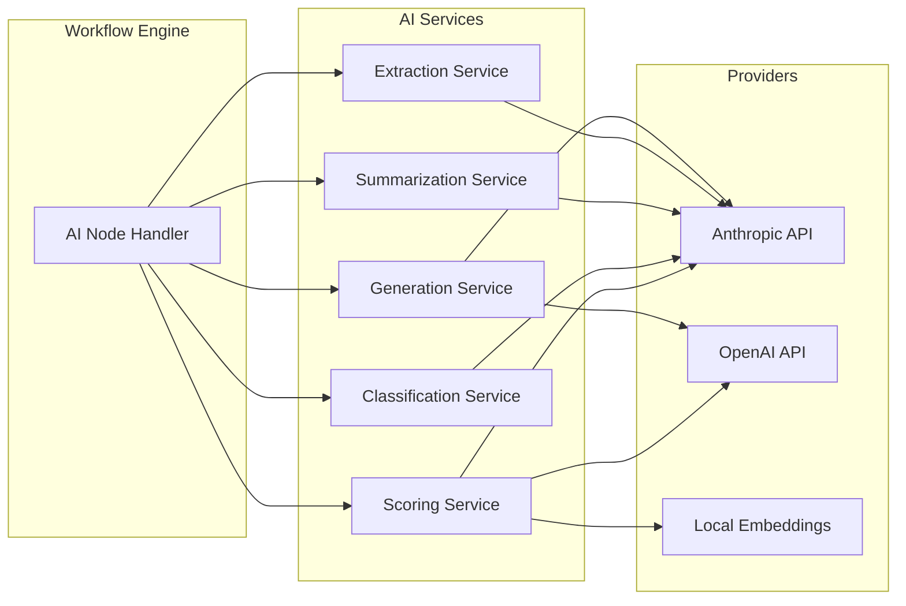
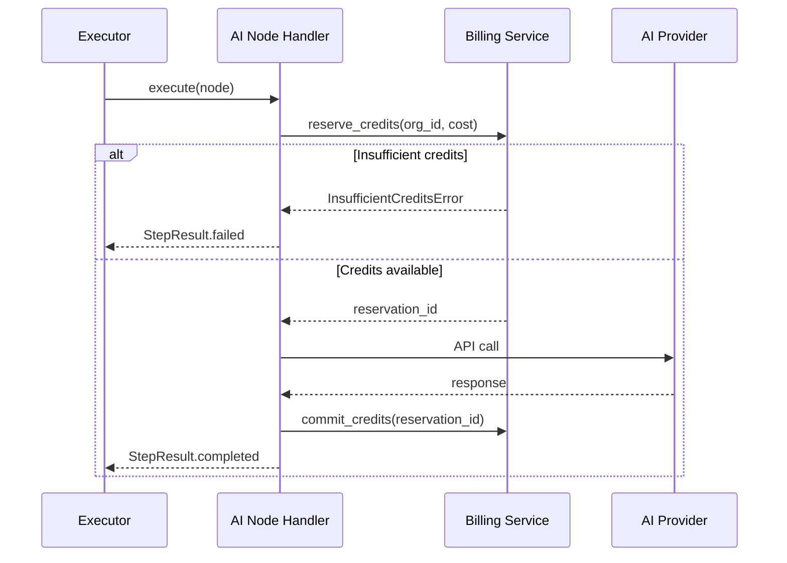

# 08 — AI Node Specifications

**Version 1.0** | Phase 8 | AI Lead Intelligence Platform

---

## Table of Contents

1. [Overview](#1-overview)
2. [AI Node Architecture](#2-ai-node-architecture)
3. [Node Catalog](#3-node-catalog)
4. [Node Specifications](#4-node-specifications)
5. [Model Configuration](#5-model-configuration)
6. [Credit & Billing](#6-credit--billing)
7. [Error Handling](#7-error-handling)
8. [Implementation](#8-implementation)

---

## 1. Overview

AI nodes are first-class workflow blocks in `backend/app/workflows/nodes/ai/` that integrate with the platform's AI services (`backend/app/ai/`). They enable AI-native automation without leaving the visual builder.

**Feature flag:** `workflow_ai_nodes` (default `false` in production until validated)

---

## 2. AI Node Architecture



### Handler Protocol

```python
class AINodeHandler(NodeHandler):
    node_type: str
    credit_cost: int
    max_timeout_seconds: int = 120

    async def validate_config(self, config: dict, ctx: CompileContext) -> list[ValidationError]: ...
    async def execute(self, input: NodeInput, ctx: ExecutionContext) -> NodeOutput: ...
    async def estimate_credits(self, config: dict) -> int: ...
```

---

## 3. Node Catalog

| Node Type | Category | Credit Cost | Timeout |
|-----------|----------|-------------|---------|
| `ai_score` | Scoring | 1 | 60s |
| `ai_classify` | Classification | 2 | 30s |
| `ai_summarize` | Summarization | 3 | 45s |
| `ai_extract` | Extraction | 3 | 45s |
| `ai_generate_email` | Generation | 5 | 60s |
| `ai_sentiment` | Analysis | 1 | 15s |
| `ai_similarity` | Matching | 1 | 20s |
| `ai_recommend` | Recommendations | 2 | 30s |
| `ai_nl_search` | Search | 3 | 45s |
| `ai_enrich` | Enrichment | 4 | 90s |

---

## 4. Node Specifications

### 4.1 `ai_score`

Score a contact or company using the platform scoring engine.

**Input Ports:**

| Port | Type | Required | Description |
|------|------|----------|-------------|
| `entity_type` | string | yes | `contact` or `company` |
| `entity_id` | entity | yes | Entity UUID or expression |
| `model` | string | no | `default`, `aggressive`, `conservative` |
| `criteria` | object | no | Custom scoring criteria override |

**Output Ports:**

| Port | Type | Description |
|------|------|-------------|
| `score` | number | 0–100 lead score |
| `explanation` | string | Human-readable rationale |
| `factors` | array | Scoring factor breakdown |
| `entity` | entity | Updated entity reference |

**Config Example:**
```json
{
  "entity_type": "contact",
  "entity_id": "{{ trigger.payload.id }}",
  "model": "default",
  "include_explanation": true,
  "publish_event": true
}
```

**Side Effects:** Updates `ai.lead_scores`; optionally publishes `lead.scored`.

---

### 4.2 `ai_classify`

Classify text or entity into predefined categories.

**Input Ports:**

| Port | Type | Required |
|------|------|----------|
| `text` | string | yes |
| `categories` | array | yes |
| `multi_label` | boolean | no |

**Output Ports:**

| Port | Type | Description |
|------|------|-------------|
| `classification` | string | Primary category |
| `classifications` | array | All matches (multi-label) |
| `confidence` | number | 0.0–1.0 |

**Config Example:**
```json
{
  "text": "{{ trigger.payload.notes }}",
  "categories": ["hot_lead", "warm_lead", "cold_lead", "not_qualified"],
  "multi_label": false,
  "model": "claude-3-haiku"
}
```

---

### 4.3 `ai_summarize`

Summarize entity data, conversation history, or free text.

**Input Ports:**

| Port | Type | Required |
|------|------|----------|
| `source` | string/object | yes |
| `max_length` | number | no |
| `style` | string | no |

**Output Ports:**

| Port | Type |
|------|------|
| `summary` | string |
| `key_points` | array |
| `token_count` | number |

**Config Example:**
```json
{
  "source": {
    "type": "entity",
    "entity_type": "company",
    "entity_id": "{{ trigger.payload.company_id }}",
    "fields": ["description", "technologies", "recent_news"]
  },
  "max_length": 500,
  "style": "executive_brief"
}
```

---

### 4.4 `ai_extract`

Extract structured fields from unstructured text.

**Input Ports:**

| Port | Type | Required |
|------|------|----------|
| `text` | string | yes |
| `schema` | object | yes |

**Output Ports:**

| Port | Type |
|------|------|
| `extracted` | object |
| `confidence` | object |

**Config Example:**
```json
{
  "text": "{{ trigger.payload.email_body }}",
  "schema": {
    "intent": { "type": "string", "enum": ["demo_request", "pricing", "support", "other"] },
    "urgency": { "type": "string", "enum": ["low", "medium", "high"] },
    "budget_mentioned": { "type": "boolean" },
    "timeline": { "type": "string" }
  }
}
```

---

### 4.5 `ai_generate_email`

Generate personalized outreach email.

**Input Ports:**

| Port | Type | Required |
|------|------|----------|
| `contact_id` | entity | yes |
| `template_type` | string | yes |
| `tone` | string | no |
| `context` | object | no |

**Output Ports:**

| Port | Type |
|------|------|
| `subject` | string |
| `body` | string |
| `body_html` | string |

**Config Example:**
```json
{
  "contact_id": "{{ trigger.payload.id }}",
  "template_type": "cold_outreach",
  "tone": "professional",
  "context": {
    "product": "AI Lead Intelligence",
    "value_prop": "Automated lead scoring and enrichment"
  },
  "max_tokens": 500
}
```

**Side Effects:** Does NOT send email — output feeds into `send_notification` node.

---

### 4.6 `ai_sentiment`

Analyze sentiment of text.

**Config:**
```json
{
  "text": "{{ trigger.payload.message }}",
  "granularity": "document"
}
```

**Output:** `sentiment` (`positive`|`neutral`|`negative`), `score` (-1 to 1)

---

### 4.7 `ai_similarity`

Find similar entities using embeddings.

**Config:**
```json
{
  "entity_type": "company",
  "entity_id": "{{ trigger.payload.company_id }}",
  "limit": 5,
  "min_score": 0.7
}
```

**Output:** `matches` (array of `{ id, name, similarity_score }`)

---

### 4.8 `ai_recommend`

Get AI recommendations (next best action, similar deals).

**Config:**
```json
{
  "recommendation_type": "next_best_action",
  "entity_type": "contact",
  "entity_id": "{{ trigger.payload.id }}"
}
```

---

### 4.9 `ai_nl_search`

Execute natural language search query.

**Config:**
```json
{
  "query": "{{ vars.search_query }}",
  "entity_type": "contact",
  "limit": 50
}
```

**Output:** `results` (array), `total_count`, `parsed_filters`

---

### 4.10 `ai_enrich`

AI-powered data enrichment (infer missing fields).

**Config:**
```json
{
  "entity_type": "contact",
  "entity_id": "{{ trigger.payload.id }}",
  "fields": ["seniority", "department", "linkedin_url"],
  "confidence_threshold": 0.8
}
```

**Side Effects:** Updates entity if `auto_apply: true`.

---

## 5. Model Configuration

### Model Registry

```python
# backend/app/ai/model_registry.py
AI_MODELS = {
    "default": { "provider": "anthropic", "model": "claude-3-5-sonnet-20241022" },
    "fast": { "provider": "anthropic", "model": "claude-3-haiku-20240307" },
    "scoring": { "provider": "openai", "model": "gpt-4o-mini" },
}
```

### Per-Org Overrides

Stored in `system.system_settings` key `ai_model_overrides`:

```json
{
  "org_uuid": {
    "ai_classify": { "model": "fast" },
    "ai_generate_email": { "model": "default", "max_tokens": 800 }
  }
}
```

### Token Limits

| Node | Max Input Tokens | Max Output Tokens |
|------|------------------|-------------------|
| `ai_score` | 4,000 | 500 |
| `ai_classify` | 2,000 | 100 |
| `ai_summarize` | 8,000 | 1,000 |
| `ai_extract` | 4,000 | 1,000 |
| `ai_generate_email` | 4,000 | 1,000 |

---

## 6. Credit & Billing

### Credit Deduction Flow



### Credit Costs

Deducted from `billing.credit_transactions` with `source: workflow_ai_node`.

| Node | Credits |
|------|---------|
| `ai_score` | 1 |
| `ai_classify` | 2 |
| `ai_summarize` | 3 |
| `ai_extract` | 3 |
| `ai_generate_email` | 5 |
| `ai_enrich` | 4 |

### Graceful Degradation

If org credits = 0 and `workflow_ai_fallback` setting is `skip`:
- AI node status → `skipped`
- Workflow continues on default path (if configured)

---

## 7. Error Handling

| Error | Retryable | Action |
|-------|-----------|--------|
| `RATE_LIMITED` | yes | Exponential backoff |
| `PROVIDER_TIMEOUT` | yes | Retry up to 3x |
| `PROVIDER_ERROR` (5xx) | yes | Retry up to 3x |
| `INVALID_INPUT` | no | Fail step |
| `INSUFFICIENT_CREDITS` | no | Fail or skip (config) |
| `CONTENT_FILTERED` | no | Fail with message |
| `TOKEN_LIMIT_EXCEEDED` | no | Fail; suggest truncation |

### Prompt Injection Guard

All user-provided text passed to AI nodes is sanitized:

```python
def sanitize_prompt_input(text: str) -> str:
    """Strip system prompt injection patterns, limit length."""
```

---

## 8. Implementation

### File Structure

```text
backend/app/workflows/nodes/ai/
├── __init__.py
├── base.py              # AINodeHandler base class
├── score.py             # ai_score
├── classify.py          # ai_classify
├── summarize.py         # ai_summarize
├── extract.py           # ai_extract
├── generate_email.py    # ai_generate_email
├── sentiment.py         # ai_sentiment
├── similarity.py        # ai_similarity
├── recommend.py         # ai_recommend
├── nl_search.py         # ai_nl_search
└── enrich.py            # ai_enrich
```

### Celery Task Routing

AI nodes execute inline within `workflows.execute` by default. For long-running nodes (`ai_enrich`, `ai_nl_search`):

```python
task_routes = {
    "workflows.ai.execute_long": {"queue": "workflows.ai"},
}
```

Dedicated `workflows.ai` queue with 120s timeout and concurrency limit of 5 per org.

---

## Related Documents

- [03-workflow-engine-design.md](./03-workflow-engine-design.md) — Node execution lifecycle
- [phase3/backend-architecture.md](../phase3/backend-architecture.md) — AI service design
- [13-security-model.md](./13-security-model.md) — Prompt injection mitigations