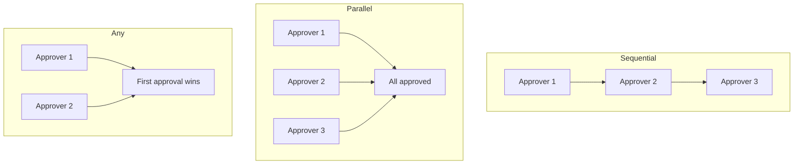
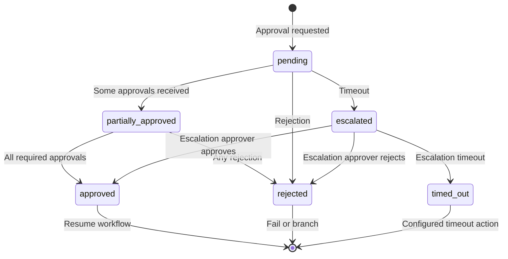

# 09 — Approval Engine Design

**Version 1.0** | Phase 8 | AI Lead Intelligence Platform

---

## Table of Contents

1. [Overview](#1-overview)
2. [Approval Types](#2-approval-types)
3. [Approver Resolution](#3-approver-resolution)
4. [Approval Lifecycle](#4-approval-lifecycle)
5. [Escalation](#5-escalation)
6. [Notifications](#6-notifications)
7. [API Integration](#7-api-integration)
8. [Database Model](#8-database-model)
9. [Edge Cases](#9-edge-cases)

---

## 1. Overview

The approval engine (`backend/app/workflows/approvals/`) implements **human-in-the-loop** gates in workflow execution. When an approval node is reached, execution pauses (`status: waiting`) until all required approvers decide or timeout/escalation occurs.

**Feature flag:** `workflow_approvals` (default `true`)

---

## 2. Approval Types

### Node Types

| Node Type | Behavior | Use Case |
|-----------|----------|----------|
| `approval_sequential` | Approvers decide in order | Manager → Director → VP |
| `approval_parallel` | All approvers must approve | Legal + Finance sign-off |
| `approval_any` | First approval sufficient | Any team lead can approve |
| `approval_majority` | >50% must approve | Committee decisions |
| `approval_quorum` | Configurable N of M | 2 of 3 approvers |



### Configuration Schema

```json
{
  "type": "approval_sequential",
  "config": {
    "title": "Approve high-value deal sync",
    "message": "Deal value exceeds $100K — approve CRM sync?",
    "approvers": [
      { "type": "role", "value": "manager", "order": 1 },
      { "type": "user", "value": "{{ trigger.payload.owner_id }}", "order": 2 },
      { "type": "team", "value": "sales-leadership", "order": 3 }
    ],
    "required_approvals": 1,
    "timeout_hours": 48,
    "timeout_action": "escalate",
    "escalation": {
      "type": "role",
      "value": "admin",
      "notify_original": true
    },
    "rejection_action": "fail_workflow",
    "allow_comments": true,
    "allow_delegation": false,
    "context_fields": ["deal.value", "deal.company_name", "steps.score-1.output.score"]
  }
}
```

---

## 3. Approver Resolution

### Approver Types

| Type | Resolution |
|------|------------|
| `user` | Direct user UUID (static or expression) |
| `role` | All users with role in org (any one for `approval_any`) |
| `team` | Users in team/group |
| `manager` | Entity owner's manager (from org hierarchy) |
| `dynamic` | Expression returning user UUID |

### Resolution at Runtime

```python
class ApproverResolver:
    async def resolve(
        self,
        approver_spec: ApproverSpec,
        ctx: ExecutionContext,
    ) -> list[UUID]:
        match approver_spec.type:
            case "user":
                return [await self._resolve_user(approver_spec.value, ctx)]
            case "role":
                return await self._resolve_role(approver_spec.value, ctx.org_id)
            case "manager":
                return [await self._resolve_manager(ctx)]
            case "dynamic":
                user_id = await self.rule_engine.evaluate(approver_spec.value, ctx)
                return [UUID(user_id)]
```

### Deduplication

Same user resolved from multiple specs → single approval request (not duplicate notifications).

---

## 4. Approval Lifecycle



### Engine Flow

```python
class ApprovalEngine:
    async def request_approval(
        self,
        execution_id: UUID,
        step_id: UUID,
        config: ApprovalConfig,
        ctx: ExecutionContext,
    ) -> ApprovalRequest:
        approvers = await self.resolver.resolve_all(config.approvers, ctx)
        request = await self.repo.create_request(
            execution_id=execution_id,
            step_id=step_id,
            approval_type=config.type,
            approvers=approvers,
            timeout_at=now() + timedelta(hours=config.timeout_hours),
        )
        await self.notifier.notify_approvers(request, approvers)
        await self.executor.pause(execution_id, wait_reason="approval", wait_until=request.timeout_at)
        return request

    async def record_decision(
        self,
        request_id: UUID,
        approver_id: UUID,
        decision: ApprovalDecision,
        comment: str | None,
    ) -> ApprovalResult:
        # Record decision, check if quorum met, resume or fail
```

### Decision Outcomes

| Decision | Sequential | Parallel | Any |
|----------|------------|----------|-----|
| `approved` | Next approver notified | Count toward quorum | Immediate resume |
| `rejected` | Immediate reject | Immediate reject | Immediate reject |
| `delegated` | Reassign to delegate | Reassign | Reassign |

---

## 5. Escalation

### Timeout Actions

| Action | Behavior |
|--------|----------|
| `escalate` | Route to escalation target |
| `auto_approve` | Resume workflow (audit logged) |
| `auto_reject` | Fail workflow |
| `fail_workflow` | Terminal failure |
| `notify_only` | Send reminder, extend timeout once |

### Escalation Chain

```json
{
  "timeout_hours": 24,
  "timeout_action": "escalate",
  "escalation": {
    "type": "role",
    "value": "admin",
    "timeout_hours": 24,
    "timeout_action": "auto_reject"
  }
}
```

Maximum escalation depth: **3 levels** (configurable via `workflow_approval_max_escalation_depth`).

### Escalation Celery Task

```python
@celery_app.task(name="workflows.approval_check_timeouts", queue="workflows.priority")
def check_approval_timeouts():
    """Runs every 5 minutes via Celery Beat."""
    expired = find_expired_approval_requests()
    for request in expired:
        handle_timeout(request)
```

---

## 6. Notifications

### Channels

| Channel | Template | When |
|---------|----------|------|
| In-app | `workflow_approval_pending` | Request created |
| Email | `workflow_approval_request_email` | Request created |
| Email | `workflow_approval_reminder` | 50% of timeout elapsed |
| In-app | `workflow_approval_decided` | Decision recorded (to workflow owner) |
| Slack (if configured) | `workflow_approval_slack` | Request created |

### Notification Payload

```json
{
  "approval_id": "uuid",
  "workflow_name": "High-Value Deal Sync",
  "title": "Approve CRM sync for $150K deal",
  "message": "Deal value exceeds threshold",
  "context": {
    "deal_value": 150000,
    "company_name": "Acme Corp",
    "lead_score": 92
  },
  "action_url": "/workflows/approvals/uuid",
  "expires_at": "2026-07-01T10:00:00Z"
}
```

---

## 7. API Integration

See [07-api-specification.md](./07-api-specification.md) for full API details.

### Key Endpoints

| Method | Path | Description |
|--------|------|-------------|
| GET | `/workflows/approvals` | List pending for current user |
| GET | `/workflows/approvals/{id}` | Approval detail + context |
| POST | `/workflows/approvals/{id}/decide` | Approve/reject |
| POST | `/workflows/approvals/{id}/delegate` | Delegate to another user |

### Permission Check

```python
async def can_decide(ctx: RequestContext, request: ApprovalRequest) -> bool:
    return (
        ctx.user_id in request.pending_approver_ids
        or ctx.has_permission("workflows:admin")
    )
```

---

## 8. Database Model

Tables defined in [06-database-schema.md](./06-database-schema.md):

- `audit.workflow_approval_requests`
- `audit.workflow_approval_decisions`

### Approval Request State in Execution

```json
{
  "wait_reason": "approval",
  "approval_request_id": "uuid",
  "pending_approver_ids": ["uuid1", "uuid2"],
  "received_decisions": [
    { "approver_id": "uuid1", "decision": "approved", "at": "..." }
  ]
}
```

Stored in `audit.workflow_executions.state` JSONB.

---

## 9. Edge Cases

| Scenario | Handling |
|----------|----------|
| Approver user deleted | Skip; log warning; if no valid approvers → `auto_reject` |
| Approver lacks `workflows:approve` | Still receives notification; decision accepted |
| Workflow cancelled during approval | Approval request → `cancelled`; notifications dismissed |
| Duplicate decision | `409 APPROVAL_ALREADY_DECIDED` |
| Approver is workflow trigger actor | Allowed (no self-approval restriction by default; configurable) |
| Org has 0 users with required role | Compile-time warning `WF020`; runtime `auto_escalate` |
| Execution resumed while approval pending | Idempotent — second resume ignored |

### Audit Trail

All approval events logged to `audit.audit_logs`:

```
entity: workflow_approval
action: approval.requested | approval.approved | approval.rejected | approval.escalated | approval.timed_out
```

---

## Related Documents

- [03-workflow-engine-design.md](./03-workflow-engine-design.md) — Wait/resume state machine
- [06-database-schema.md](./06-database-schema.md) — Approval tables
- [07-api-specification.md](./07-api-specification.md) — Approval API