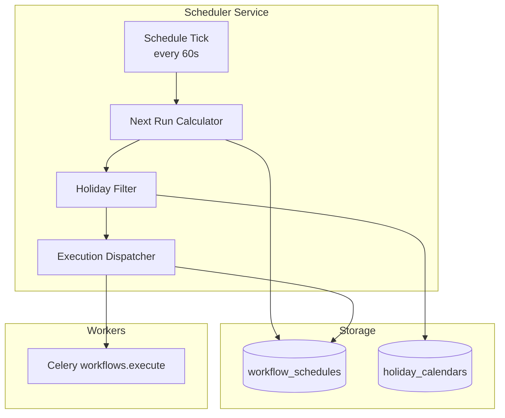

# 10 — Scheduler Design

**Version 1.0** | Phase 8 | AI Lead Intelligence Platform

---

## Table of Contents

1. [Overview](#1-overview)
2. [Architecture](#2-architecture)
3. [Cron Expressions](#3-cron-expressions)
4. [Timezone Handling](#4-timezone-handling)
5. [Holiday Calendars](#5-holiday-calendars)
6. [Schedule Execution](#6-schedule-execution)
7. [Conflict Resolution](#7-conflict-resolution)
8. [Celery Beat Integration](#8-celery-beat-integration)
9. [Monitoring](#9-monitoring)

---

## 1. Overview

The workflow scheduler (`backend/app/workflows/scheduler/`) triggers workflows on **cron schedules** with full **timezone** and **holiday calendar** support. It complements event-driven triggers for batch operations like nightly scoring, weekly reports, and scheduled CRM syncs.

---

## 2. Architecture



### Components

| Component | Path | Responsibility |
|-----------|------|----------------|
| `ScheduleService` | `scheduler/service.py` | CRUD for schedules |
| `CronParser` | `scheduler/cron.py` | Parse and validate cron |
| `NextRunCalculator` | `scheduler/next_run.py` | Compute next fire time |
| `HolidayCalendar` | `scheduler/holidays.py` | Skip holidays |
| `ScheduleTick` | `scheduler/tick.py` | Celery Beat entry point |

---

## 3. Cron Expressions

### Supported Format

Standard 5-field cron (minute hour day month weekday):

```
┌───────────── minute (0-59)
│ ┌───────────── hour (0-23)
│ │ ┌───────────── day of month (1-31)
│ │ │ ┌───────────── month (1-12)
│ │ │ │ ┌───────────── day of week (0-6, Sun=0)
│ │ │ │ │
* * * * *
```

### Common Presets

| Preset | Cron | Description |
|--------|------|-------------|
| `every_15_minutes` | `*/15 * * * *` | Frequent polling |
| `hourly` | `0 * * * *` | Top of every hour |
| `daily_9am_weekdays` | `0 9 * * 1-5` | Business hours start |
| `weekly_monday` | `0 8 * * 1` | Monday morning |
| `monthly_first` | `0 6 1 * *` | First of month |
| `quarterly` | `0 6 1 1,4,7,10 *` | Quarterly reports |

### Validation

```python
class CronParser:
    def parse(self, expression: str) -> CronSchedule:
        """Raises InvalidCronError if malformed."""

    def describe(self, expression: str, timezone: str) -> str:
        """Human-readable: 'At 09:00 AM, Monday through Friday'"""
```

### Limits

| Limit | Value |
|-------|-------|
| Min interval | 5 minutes |
| Max schedules per workflow | 5 |
| Max schedules per org | 100 |

---

## 4. Timezone Handling

### Timezone Storage

Each schedule stores IANA timezone identifier:

```json
{
  "cron_expression": "0 9 * * 1-5",
  "timezone": "America/New_York"
}
```

### Next Run Calculation

```python
from zoneinfo import ZoneInfo

def calculate_next_run(
    cron: CronSchedule,
    timezone: str,
    after: datetime,
    holidays: list[date] | None = None,
) -> datetime:
    """
    1. Convert 'after' to schedule timezone
    2. Find next cron match using croniter
    3. Skip holiday dates (advance to next valid day)
    4. Convert result to UTC for storage
    """
```

### DST Handling

- Uses `zoneinfo` (Python 3.12+) for automatic DST transitions
- Ambiguous times (fall back): prefer **standard time**
- Non-existent times (spring forward): advance to next valid hour
- `next_run_at` always stored in UTC

### Example

| Cron | Timezone | Local Time | UTC (EST) | UTC (EDT) |
|------|----------|------------|-----------|-----------|
| `0 9 * * *` | `America/New_York` | 9:00 AM | 14:00 | 13:00 |

---

## 5. Holiday Calendars

### System Calendars (Pre-loaded)

| Calendar | Country | Holidays |
|----------|---------|----------|
| `us_federal` | US | Federal holidays |
| `uk_bank` | GB | UK bank holidays |
| `eu_common` | — | Christmas, New Year, Easter |

### Custom Org Calendars

```json
{
  "name": "Company Holidays 2026",
  "country_code": "US",
  "holidays": [
    { "date": "2026-11-27", "name": "Day after Thanksgiving", "recurring": false },
    { "date": "12-24", "name": "Christmas Eve", "recurring": true }
  ]
}
```

`recurring: true` → matches every year on that month-day.

### Holiday Skip Behavior

| Config | Behavior |
|--------|----------|
| `skip_holidays: true` (default) | Advance to next non-holiday |
| `skip_holidays: false` | Run on holidays |
| `holiday_action: "run"` | Override skip |

---

## 6. Schedule Execution

### Tick Flow

```python
@celery_app.task(name="workflows.schedule_tick", queue="workflows")
def schedule_tick():
    now = datetime.now(timezone.utc)
    due_schedules = repo.find_due_schedules(now, limit=100)

    for schedule in due_schedules:
        if schedule.config.get("skip_if_running"):
            if repo.has_running_execution(schedule.workflow_id):
                log.info("Skipping — execution already running")
                repo.update_next_run(schedule)
                continue

        execution_id = start_scheduled_execution(schedule)
        repo.update_last_run(schedule, execution_id)
        repo.update_next_run(schedule)
```

### Trigger Data for Scheduled Executions

```json
{
  "trigger_type": "schedule",
  "schedule_id": "uuid",
  "scheduled_at": "2026-06-29T13:00:00Z",
  "cron_expression": "0 9 * * 1-5",
  "timezone": "America/New_York",
  "variables": { "batch_mode": true }
}
```

### `schedule_trigger` Node

Visual workflows use a dedicated trigger node:

```json
{
  "id": "trigger-1",
  "type": "schedule_trigger",
  "config": {
    "cron_expression": "0 6 * * *",
    "timezone": "UTC"
  }
}
```

Schedule CRUD API (`/workflows/{id}/schedules`) syncs with this node config.

---

## 7. Conflict Resolution

### Overlapping Executions

| Policy | Config | Behavior |
|--------|--------|----------|
| Skip | `skip_if_running: true` | Don't start; reschedule |
| Queue | `queue_if_running: true` | Start after current completes |
| Parallel | `allow_parallel: true` | Start regardless (default: false) |

### Missed Executions

If scheduler is down and schedules are missed:

| Policy | Config | Behavior |
|--------|--------|----------|
| `catch_up: false` (default) | — | Run only next scheduled time |
| `catch_up: true` | — | Run all missed (max 3 catch-up) |

### Clock Skew

- Tick task uses DB `now()` as source of truth
- `next_run_at` compared with `<= now()` in SQL
- 60-second tick interval means max 60s fire delay

---

## 8. Celery Beat Integration

### Beat Schedule Entry

```python
# backend/infrastructure/workers/celery_app.py
beat_schedule = {
    "workflows-schedule-tick": {
        "task": "workflows.schedule_tick",
        "schedule": crontab(minute="*"),  # Every minute
        "options": {"queue": "workflows"},
    },
    "workflows-approval-timeouts": {
        "task": "workflows.approval_check_timeouts",
        "schedule": crontab(minute="*/5"),
        "options": {"queue": "workflows.priority"},
    },
    "workflows-cleanup-executions": {
        "task": "workflows.cleanup_executions",
        "schedule": crontab(hour=5, minute=0),
        "options": {"queue": "workflows"},
    },
}
```

### Leader Election (Production)

Only one Beat instance runs schedule tick via Redis lock:

```python
@distributed_lock("workflows:schedule_tick", ttl=55)
def schedule_tick():
    ...
```

---

## 9. Monitoring

### Metrics

| Metric | Description |
|--------|-------------|
| `workflow_schedules_active_total` | Active schedules |
| `workflow_schedule_tick_duration_seconds` | Tick processing time |
| `workflow_schedule_executions_started_total` | Schedules fired |
| `workflow_schedule_skipped_total` | Skipped (overlap/holiday) |
| `workflow_schedule_lag_seconds` | Actual fire time − scheduled time |

### Alerts

| Alert | Condition |
|-------|-----------|
| `WorkflowScheduleLagHigh` | `schedule_lag_seconds` p95 > 300s |
| `WorkflowScheduleTickFailed` | Tick task failed 3 consecutive times |
| `WorkflowSchedulesStale` | `next_run_at` in past by >1 hour |

---

## Related Documents

- [06-database-schema.md](./06-database-schema.md) — `workflow_schedules`, `holiday_calendars`
- [07-api-specification.md](./07-api-specification.md) — Schedule API
- [03-workflow-engine-design.md](./03-workflow-engine-design.md) — Execution engine