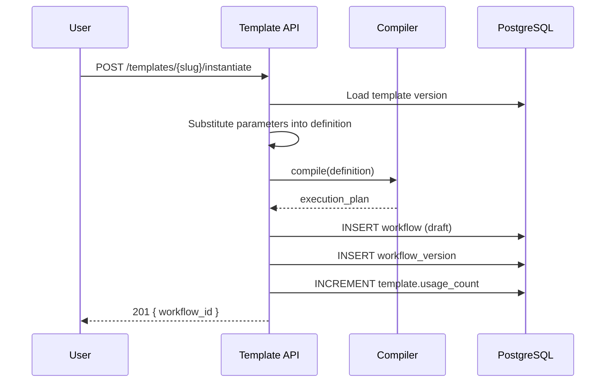

# 11 — Workflow Templates

**Version 1.0** | Phase 8 | AI Lead Intelligence Platform

---

## Table of Contents

1. [Overview](#1-overview)
2. [Template Structure](#2-template-structure)
3. [System Templates](#3-system-templates)
4. [Custom Templates](#4-custom-templates)
5. [Instantiation Flow](#5-instantiation-flow)
6. [Parameter System](#6-parameter-system)
7. [Template Versioning](#7-template-versioning)
8. [Template API](#8-template-api)

---

## 1. Overview

Workflow templates are pre-built, production-tested workflow definitions that tenants can **instantiate** with one click. Templates accelerate onboarding and encode platform best practices for lead scoring, CRM automation, enrichment, and approvals.

**Storage:** `audit.workflow_templates` + `audit.workflow_template_versions`

---

## 2. Template Structure

```json
{
  "slug": "auto-score-contacts",
  "name": "Auto-Score New Contacts",
  "description": "Automatically score contacts when created, notify on high scores",
  "category": "lead_scoring",
  "tags": ["ai", "contacts", "notifications"],
  "is_system": true,
  "parameters": [
    {
      "name": "score_threshold",
      "type": "number",
      "label": "Minimum score for notification",
      "default": 70,
      "required": true,
      "min": 0,
      "max": 100
    },
    {
      "name": "seniority_filter",
      "type": "array",
      "label": "Seniority levels to score",
      "default": ["vp", "c_level", "director"],
      "required": false
    },
    {
      "name": "notification_template",
      "type": "string",
      "label": "Notification template key",
      "default": "high_value_contact",
      "required": true
    }
  ],
  "definition": {
    "schema_version": "2.0",
    "nodes": [...],
    "edges": [...]
  }
}
```

---

## 3. System Templates

### Lead Scoring

| Slug | Name | Trigger | Description |
|------|------|---------|-------------|
| `auto-score-contacts` | Auto-Score New Contacts | `contact.created` | Score + notify on high value |
| `rescore-stale-leads` | Rescore Stale Leads | Schedule (weekly) | Batch rescore contacts older than 30 days |
| `score-on-company-match` | Score on Company Match | `company.created` | Score all contacts when company added |

### CRM Automation

| Slug | Name | Trigger | Description |
|------|------|---------|-------------|
| `create-deal-high-score` | Create Deal for High Scores | `lead.scored` | Auto-create CRM deal when score ≥ threshold |
| `stage-progression` | Auto Stage Progression | `deal.stage_changed` | Trigger tasks on stage changes |
| `won-deal-celebration` | Won Deal Celebration | `deal.won` | Notify team + update analytics |

### Enrichment

| Slug | Name | Trigger | Description |
|------|------|---------|-------------|
| `verify-new-emails` | Verify New Emails | `contact.created` | Email verification pipeline |
| `enrich-company-tech` | Enrich Company Tech Stack | `company.created` | Technology detection |
| `linkedin-enrichment` | LinkedIn Profile Enrichment | `contact.created` | AI enrich from LinkedIn data |

### Approvals

| Slug | Name | Trigger | Description |
|------|------|---------|-------------|
| `approve-high-value-export` | Approve High-Value Export | Manual | Manager approval before large exports |
| `approve-crm-sync` | Approve CRM Sync | `deal.stage_changed` | Approval before syncing high-value deals |
| `approve-bulk-delete` | Approve Bulk Delete | Manual | Admin approval for bulk operations |

### AI Workflows

| Slug | Name | Trigger | Description |
|------|------|---------|-------------|
| `classify-inbound-leads` | Classify Inbound Leads | `contact.created` | AI classify + route to pipeline |
| `generate-outreach` | Generate Outreach Email | Manual | AI email generation + review |
| `summarize-account` | Summarize Account | Manual | AI executive brief for company |

### Notifications

| Slug | Name | Trigger | Description |
|------|------|---------|-------------|
| `daily-pipeline-digest` | Daily Pipeline Digest | Schedule (daily) | Email digest of pipeline changes |
| `sla-breach-alert` | SLA Breach Alert | Schedule (hourly) | Alert on overdue tasks |
| `connector-failure-alert` | Connector Failure Alert | `connector.finished` | Alert on connector job failures |

### Data Operations

| Slug | Name | Trigger | Description |
|------|------|---------|-------------|
| `weekly-export-crm` | Weekly CRM Export | Schedule (weekly) | Export contacts to CSV |
| `dedup-contacts` | Deduplicate Contacts | Schedule (daily) | Find and flag duplicate contacts |
| `archive-old-searches` | Archive Old Searches | Schedule (monthly) | Clean up search history |

---

## 4. Custom Templates

Tenants can save their own workflows as templates:

```
POST /api/v1/workflows/{workflow_id}/save-as-template
```

**Permission:** `workflows:write`

```json
{
  "slug": "my-custom-scoring",
  "name": "Custom Scoring Pipeline",
  "description": "Our team's scoring workflow",
  "is_public": false,
  "parameters": []
}
```

| Scope | `organization_id` | Visibility |
|-------|-------------------|------------|
| System | `NULL` | All tenants (`is_system: true`) |
| Org-private | org UUID | Same org only |
| Org-public | org UUID | `is_public: true` — shareable via slug |

---

## 5. Instantiation Flow



### Parameter Substitution

Parameters referenced in definition as `{{ params.score_threshold }}`:

```json
{
  "config": {
    "expression": "{{ trigger.payload.lead_score >= params.score_threshold }}"
  }
}
```

At instantiation, `params.*` replaced with provided values, then compiled.

---

## 6. Parameter System

### Parameter Types

| Type | Validation | UI Widget |
|------|------------|-----------|
| `string` | `min_length`, `max_length`, `pattern` | Text input |
| `number` | `min`, `max`, `step` | Number input |
| `boolean` | — | Toggle |
| `array` | `items_type`, `min_items`, `max_items` | Multi-select |
| `enum` | `options[]` | Dropdown |
| `entity_ref` | `entity_type` | Entity picker |
| `user_ref` | — | User picker |
| `cron` | cron validation | Cron builder |

### Parameter Schema

```json
{
  "name": "score_threshold",
  "type": "number",
  "label": "Score Threshold",
  "description": "Minimum lead score to trigger notification",
  "default": 70,
  "required": true,
  "min": 0,
  "max": 100,
  "group": "scoring"
}
```

### Instantiation Request

```json
{
  "name": "My Auto-Score Workflow",
  "parameters": {
    "score_threshold": 80,
    "seniority_filter": ["c_level", "vp"],
    "notification_template": "high_value_contact"
  },
  "activate": false
}
```

---

## 7. Template Versioning

Templates follow the same versioning pattern as workflows:

| Field | Description |
|-------|-------------|
| `version_number` | Incrementing integer |
| `definition` | Full workflow definition |
| `parameters` | Parameter schema for this version |
| `changelog` | What changed |

### Upgrade Path

When a system template is updated, existing instantiated workflows are **not** auto-updated. Admins can:

```
POST /api/v1/workflows/{workflow_id}/upgrade-from-template
```

Shows diff between current workflow and latest template version.

---

## 8. Template API

| Method | Path | Permission | Description |
|--------|------|------------|-------------|
| GET | `/workflows/templates` | `workflows:read` | List templates |
| GET | `/workflows/templates/{slug}` | `workflows:read` | Template detail |
| POST | `/workflows/templates/{slug}/instantiate` | `workflows:write` | Create workflow from template |
| POST | `/workflows/{id}/save-as-template` | `workflows:write` | Save workflow as template |
| PATCH | `/workflows/templates/{slug}` | `workflows:admin` | Update system template |
| DELETE | `/workflows/templates/{slug}` | `workflows:admin` | Delete custom template |

### Seed Data

System templates seeded via migration:

```python
# backend/migrations/versions/0xx_phase8_workflow_templates_seed.py
def upgrade():
    seed_system_templates(TEMPLATE_DEFINITIONS)
```

Template JSON files stored in `backend/app/workflows/templates/definitions/`.

---

## Related Documents

- [02-visual-workflow-builder-spec.md](./02-visual-workflow-builder-spec.md) — Template gallery UI
- [07-api-specification.md](./07-api-specification.md) — Template API details
- [16-sample-workflow-definitions.md](./16-sample-workflow-definitions.md) — Full JSON examples