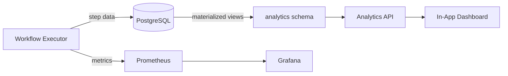

# 12 — Analytics Dashboard

**Version 1.0** | Phase 8 | AI Lead Intelligence Platform

---

## Table of Contents

1. [Overview](#1-overview)
2. [Dashboard Layout](#2-dashboard-layout)
3. [Key Metrics](#3-key-metrics)
4. [Dashboard Panels](#4-dashboard-panels)
5. [Prometheus Metrics](#5-prometheus-metrics)
6. [Grafana Configuration](#6-grafana-configuration)
7. [Data Pipeline](#7-data-pipeline)
8. [API Endpoints](#8-api-endpoints)

---

## 1. Overview

Workflow analytics provide tenant admins and platform operators visibility into automation health, execution performance, approval bottlenecks, and AI node usage. Dashboards are available in:

1. **In-app UI** — `/workflows/analytics` (tenant-scoped)
2. **Grafana** — `infra/monitoring/grafana/dashboards/workflows.json` (ops-scoped)

---

## 2. Dashboard Layout

### In-App Analytics Page

```
┌─────────────────────────────────────────────────────────────┐
│  Workflow Analytics                    [Date Range ▼] [Export]│
├──────────┬──────────┬──────────┬──────────┬─────────────────┤
│ Active   │ Runs 24h │ Success  │ Avg Time │ Pending         │
│ Workflows│          │ Rate     │          │ Approvals       │
│    28    │  1,523   │  97.4%   │  3.2s    │    5            │
├──────────┴──────────┴──────────┴──────────┴─────────────────┤
│  Executions Over Time (line chart)                           │
├────────────────────────────┬────────────────────────────────┤
│  Top Workflows by Volume   │  Failure Breakdown (donut)     │
├────────────────────────────┼────────────────────────────────┤
│  Step Duration Heatmap     │  AI Node Usage (bar)           │
├────────────────────────────┴────────────────────────────────┤
│  Recent Failures (table)                                     │
└─────────────────────────────────────────────────────────────┘
```

---

## 3. Key Metrics

### Tenant Metrics

| Metric | Formula | Target |
|--------|---------|--------|
| **Success Rate** | `completed / (completed + failed)` | ≥ 95% |
| **Avg Duration** | `mean(completed_at - started_at)` | < 5s (non-AI) |
| **P95 Duration** | 95th percentile execution time | < 30s |
| **Approval Turnaround** | `mean(resolved_at - created_at)` for approvals | < 24h |
| **AI Credit Usage** | Sum of AI node credits per period | Budget-dependent |
| **Trigger Match Rate** | `executions_started / events_matched` | — |
| **Queue Lag** | Time from trigger to execution start | < 2s |

### Platform Metrics (Ops)

| Metric | Description |
|--------|-------------|
| **Total Active Workflows** | Across all tenants |
| **Executions per Minute** | Cluster throughput |
| **Worker Utilization** | `busy_workers / total_workers` |
| **DLQ Depth** | Unprocessed dead letters |
| **Schedule Lag** | Delay in scheduled executions |
| **DB Write Rate** | Execution state writes/sec |

---

## 4. Dashboard Panels

### Panel 1: Execution Volume (Time Series)

```sql
SELECT
    date_trunc($granularity, started_at) AS bucket,
    COUNT(*) AS total,
    COUNT(*) FILTER (WHERE status = 'completed') AS completed,
    COUNT(*) FILTER (WHERE status = 'failed') AS failed
FROM audit.workflow_executions
WHERE organization_id = $org_id
  AND started_at BETWEEN $from AND $to
GROUP BY 1
ORDER BY 1;
```

### Panel 2: Top Workflows

| Workflow | Runs | Success % | Avg Duration |
|----------|------|-----------|--------------|
| Auto-Score Contacts | 842 | 98.2% | 3.1s |
| Verify New Emails | 312 | 99.1% | 1.8s |
| Create Deal High Score | 156 | 94.5% | 8.2s |

### Panel 3: Failure Breakdown

| Failure Category | Count | % |
|------------------|-------|---|
| `PROVIDER_TIMEOUT` | 12 | 30.8% |
| `INSUFFICIENT_CREDITS` | 8 | 20.5% |
| `SANDBOX_VIOLATION` | 2 | 5.1% |
| `APPROVAL_TIMEOUT` | 7 | 17.9% |
| `CONNECTOR_UNAVAILABLE` | 10 | 25.6% |

### Panel 4: Step Duration Heatmap

Average duration by `node_type` × hour of day:

| Node Type | 00–06 | 06–12 | 12–18 | 18–24 |
|-----------|-------|-------|-------|-------|
| `ai_score` | 2.1s | 3.8s | 4.2s | 2.5s |
| `crm_sync` | 5.2s | 8.1s | 7.9s | 5.0s |
| `send_notification` | 0.3s | 0.4s | 0.5s | 0.3s |

### Panel 5: Approval Funnel

```
Requested: 145
  → Pending: 5
  → Approved: 120 (82.8%)
  → Rejected: 15 (10.3%)
  → Timed Out: 5 (3.4%)
```

---

## 5. Prometheus Metrics

Defined in `backend/infrastructure/observability/metrics.py`:

```python
# Counters
workflow_executions_total = Counter(
    "workflow_executions_total",
    "Total workflow executions",
    ["organization_id", "workflow_id", "status", "trigger_type"],
)

workflow_steps_total = Counter(
    "workflow_steps_total",
    "Total workflow step executions",
    ["organization_id", "node_type", "status"],
)

workflow_ai_credits_total = Counter(
    "workflow_ai_credits_total",
    "AI credits consumed by workflow nodes",
    ["organization_id", "node_type"],
)

# Histograms
workflow_execution_duration_seconds = Histogram(
    "workflow_execution_duration_seconds",
    "Workflow execution duration",
    ["organization_id", "workflow_id"],
    buckets=[0.1, 0.5, 1, 2, 5, 10, 30, 60, 120, 300],
)

workflow_step_duration_seconds = Histogram(
    "workflow_step_duration_seconds",
    "Step execution duration",
    ["node_type"],
    buckets=[0.01, 0.05, 0.1, 0.5, 1, 5, 10, 30, 60],
)

workflow_start_latency_seconds = Histogram(
    "workflow_start_latency_seconds",
    "Time from trigger event to execution start",
    ["trigger_type"],
    buckets=[0.1, 0.5, 1, 2, 5, 10, 30],
)

# Gauges
workflow_executions_active = Gauge(
    "workflow_executions_active",
    "Currently running executions",
    ["organization_id"],
)

workflow_approvals_pending = Gauge(
    "workflow_approvals_pending",
    "Pending approval requests",
    ["organization_id"],
)
```

---

## 6. Grafana Configuration

**Dashboard file:** `infra/monitoring/grafana/dashboards/workflows.json`

### Dashboard Variables

| Variable | Source | Description |
|----------|--------|-------------|
| `$org_id` | Query | Tenant filter (ops only) |
| `$workflow_id` | Query | Workflow filter |
| `$interval` | Custom | `1h`, `6h`, `24h`, `7d`, `30d` |

### Key Panels (Grafana)

| Panel | Type | PromQL |
|-------|------|--------|
| Execution Rate | Graph | `rate(workflow_executions_total[5m])` |
| Success Rate | Stat | `sum(rate(...{status="completed"}[1h])) / sum(rate(...[1h]))` |
| P95 Duration | Graph | `histogram_quantile(0.95, rate(workflow_execution_duration_seconds_bucket[5m]))` |
| Active Executions | Gauge | `sum(workflow_executions_active)` |
| Queue Depth | Graph | `rabbitmq_queue_depth{queue="workflows.events"}` |
| DLQ Depth | Stat | `rabbitmq_queue_depth{queue="workflows.dlq"}` |
| AI Credits/Hour | Graph | `rate(workflow_ai_credits_total[1h])` |

### Alerts (Grafana)

| Alert | Condition | Severity |
|-------|-----------|----------|
| WorkflowSuccessRateLow | Success rate < 90% for 1h | Warning |
| WorkflowExecutionLagHigh | p95 start latency > 10s | Warning |
| WorkflowDLQGrowing | DLQ depth > 100 | Critical |
| WorkflowApprovalsStale | Pending approvals > 50 | Warning |

---

## 7. Data Pipeline



### Materialized Views

```sql
CREATE MATERIALIZED VIEW analytics.workflow_execution_daily AS
SELECT
    organization_id,
    workflow_id,
    date_trunc('day', started_at) AS day,
    COUNT(*) AS total_executions,
    COUNT(*) FILTER (WHERE status = 'completed') AS completed,
    COUNT(*) FILTER (WHERE status = 'failed') AS failed,
    AVG(EXTRACT(EPOCH FROM (completed_at - started_at))) AS avg_duration_seconds,
    PERCENTILE_CONT(0.95) WITHIN GROUP (
        ORDER BY EXTRACT(EPOCH FROM (completed_at - started_at))
    ) AS p95_duration_seconds
FROM audit.workflow_executions
WHERE started_at IS NOT NULL
GROUP BY 1, 2, 3;

CREATE UNIQUE INDEX ON analytics.workflow_execution_daily
    (organization_id, workflow_id, day);
```

Refreshed by `analytics.refresh_views` Celery task (daily 04:00 UTC).

---

## 8. API Endpoints

See [07-api-specification.md](./07-api-specification.md).

| Endpoint | Description |
|----------|-------------|
| `GET /workflows/analytics/summary` | KPI summary cards |
| `GET /workflows/analytics/executions` | Time-series execution data |
| `GET /workflows/analytics/failures` | Failure breakdown |
| `GET /workflows/analytics/workflows/{id}` | Per-workflow analytics |
| `GET /workflows/analytics/ai-usage` | AI node credit consumption |
| `GET /workflows/analytics/approvals` | Approval turnaround metrics |

### Export

```
GET /workflows/analytics/export?format=csv&from=...&to=...
```

**Permission:** `workflows:read`

---

## Related Documents

- [14-observability-strategy.md](./14-observability-strategy.md) — Tracing and logging
- [phase11/10-monitoring-dashboards.md](../phase11/10-monitoring-dashboards.md) — Platform monitoring
- [07-api-specification.md](./07-api-specification.md) — Analytics API