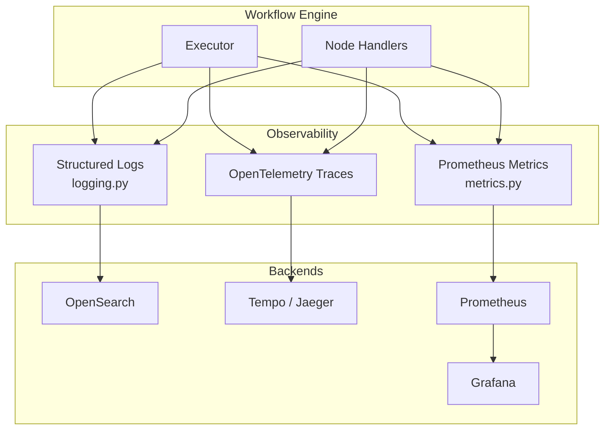
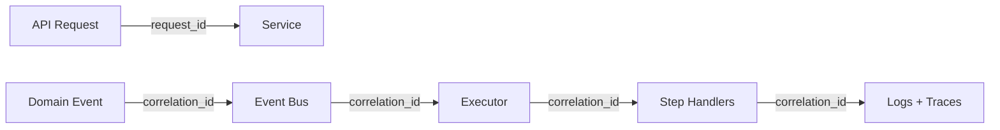

# 14 — Observability Strategy

**Version 1.0** | Phase 8 | AI Lead Intelligence Platform

---

## Table of Contents

1. [Overview](#1-overview)
2. [Three Pillars](#2-three-pillars)
3. [Structured Logging](#3-structured-logging)
4. [Distributed Tracing](#4-distributed-tracing)
5. [Metrics](#5-metrics)
6. [Execution Debugging](#6-execution-debugging)
7. [Alerting](#7-alerting)
8. [Correlation IDs](#8-correlation-ids)

---

## 1. Overview

Workflow observability extends the platform's observability stack (`backend/infrastructure/observability/`) with workflow-specific logging, tracing, metrics, and debugging tools. Every execution is traceable from trigger event → step completion.

---

## 2. Three Pillars



---

## 3. Structured Logging

### Log Format

Uses platform structured logging from `backend/infrastructure/observability/logging.py`:

```json
{
  "timestamp": "2026-06-29T10:00:01.234Z",
  "level": "INFO",
  "logger": "workflows.executor",
  "message": "Step completed",
  "request_id": "req-abc123",
  "correlation_id": "corr-xyz789",
  "organization_id": "uuid",
  "workflow_id": "uuid",
  "execution_id": "uuid",
  "step_id": "score-1",
  "node_type": "ai_score",
  "duration_ms": 3800,
  "status": "completed"
}
```

### Log Events

| Event | Level | When |
|-------|-------|------|
| `workflow.compiled` | INFO | Definition compiled |
| `workflow.execution.started` | INFO | Execution begins |
| `workflow.execution.completed` | INFO | Terminal success |
| `workflow.execution.failed` | ERROR | Terminal failure |
| `workflow.step.started` | DEBUG | Step dispatch |
| `workflow.step.completed` | INFO | Step success |
| `workflow.step.failed` | ERROR | Step failure |
| `workflow.step.retry` | WARN | Step retry attempt |
| `workflow.approval.requested` | INFO | Approval gate opened |
| `workflow.approval.decided` | INFO | Approval decision |
| `workflow.event.matched` | DEBUG | Event trigger match |
| `workflow.sandbox.violation` | WARN | Expression sandbox block |
| `workflow.idempotency.hit` | DEBUG | Duplicate step skipped |

### Sensitive Data

Never log:
- Full AI prompts/responses
- Webhook secrets
- User passwords or API keys
- Full entity PII (use entity ID only)

---

## 4. Distributed Tracing

### Trace Hierarchy

```
workflow.execution (root span)
├── workflow.compile
├── workflow.step.trigger-1
├── workflow.step.cond-1
│   └── rule_engine.evaluate
├── workflow.step.score-1
│   ├── ai.score_entity
│   └── billing.reserve_credits
├── workflow.step.notify-1
│   └── notifications.send
└── event_bus.publish
```

### Span Attributes

```python
span.set_attributes({
    "workflow.id": str(workflow_id),
    "workflow.name": workflow_name,
    "workflow.version": version_number,
    "execution.id": str(execution_id),
    "execution.status": status,
    "organization.id": str(org_id),
    "trigger.type": trigger_type,
    "step.node_id": node_id,
    "step.node_type": node_type,
})
```

### OpenTelemetry Integration

```python
# backend/app/workflows/executor/tracing.py
from opentelemetry import trace

tracer = trace.get_tracer("workflows")

async def execute_step(step, ctx):
    with tracer.start_as_current_span(
        f"workflow.step.{step.node_type}",
        attributes={"step.node_id": step.node_id},
    ) as span:
        result = await dispatch_node(step, ctx)
        span.set_attribute("step.status", result.status)
        span.set_attribute("step.duration_ms", result.duration_ms)
        return result
```

### Trace Propagation

- `correlation_id` propagated from trigger event through all steps
- Celery tasks receive trace context via `traceparent` header
- Cross-service calls (AI, CRM, notifications) create child spans

---

## 5. Metrics

See [12-analytics-dashboard.md](./12-analytics-dashboard.md) for full metric catalog.

### RED Method (Workflow API)

| Metric | Type |
|--------|------|
| **Rate** | `workflow_api_requests_total` |
| **Errors** | `workflow_api_errors_total` |
| **Duration** | `workflow_api_duration_seconds` |

### USE Method (Workers)

| Metric | Type |
|--------|------|
| **Utilization** | `celery_worker_busy_ratio{queue="workflows"}` |
| **Saturation** | `rabbitmq_queue_depth{queue="workflows.events"}` |
| **Errors** | `workflow_executions_total{status="failed"}` |

---

## 6. Execution Debugging

### Execution Timeline UI

`/workflows/executions/{id}` shows:

1. **Gantt chart** — step durations on timeline
2. **Step detail** — input/output JSON per step
3. **Trace link** — Open Grafana/Jaeger trace view
4. **Logs** — Filtered log stream for execution_id
5. **State diff** — Variables before/after each step

### Debug Mode

Enable per-execution via API:

```
POST /workflows/executions/{id}/debug
{ "enabled": true, "duration_minutes": 30 }
```

Debug mode:
- Logs step inputs/outputs at DEBUG level
- Captures expression evaluation intermediate values
- Stores AI token counts (not content)
- Auto-disables after TTL

### Replay for Debugging

```
POST /workflows/executions/{id}/replay
{ "from_step": "cond-1", "dry_run": true }
```

Re-executes from specified step with same trigger data (dry-run = no side effects).

---

## 7. Alerting

### Platform Alerts

| Alert | Condition | Runbook |
|-------|-----------|---------|
| `WorkflowExecutionFailureSpike` | Failed rate > 10% for 15min | [19-operational-runbook.md](./19-operational-runbook.md) §3 |
| `WorkflowQueueBacklog` | Queue depth > 10,000 | §2 |
| `WorkflowDLQGrowing` | DLQ > 100 messages | §4 |
| `WorkflowWorkerDown` | 0 consumers on `workflows` queue | §1 |
| `WorkflowScheduleTickFailed` | 3 consecutive failures | §5 |
| `WorkflowApprovalBacklog` | Pending > 100 for 24h | §6 |

### Tenant Alerts (In-App)

Configurable per org in workflow settings:

```json
{
  "alerts": {
    "on_failure": { "channels": ["email"], "recipients": ["owner"] },
    "on_approval_timeout": { "channels": ["in_app", "email"] },
    "failure_rate_threshold": 0.1,
    "failure_rate_window_hours": 24
  }
}
```

---

## 8. Correlation IDs

### ID Flow



### ID Generation

| ID | Source | Format |
|----|--------|--------|
| `request_id` | Middleware (`core/middleware.py`) | `req-{uuid7}` |
| `correlation_id` | Event envelope or API request | `corr-{uuid7}` |
| `execution_id` | Generated at execution start | UUID v7 |
| `trace_id` | OpenTelemetry | W3C trace context |

### Querying by Correlation

```bash
# OpenSearch query
GET /logs-*/_search
{
  "query": { "term": { "correlation_id": "corr-xyz789" } }
}
```

---

## Related Documents

- [12-analytics-dashboard.md](./12-analytics-dashboard.md) — Dashboards and PromQL
- [19-operational-runbook.md](./19-operational-runbook.md) — Incident procedures
- [phase11/09-observability-architecture.md](../phase11/09-observability-architecture.md) — Platform observability
- [phase11/11-logging-standards.md](../phase11/11-logging-standards.md) — Logging conventions