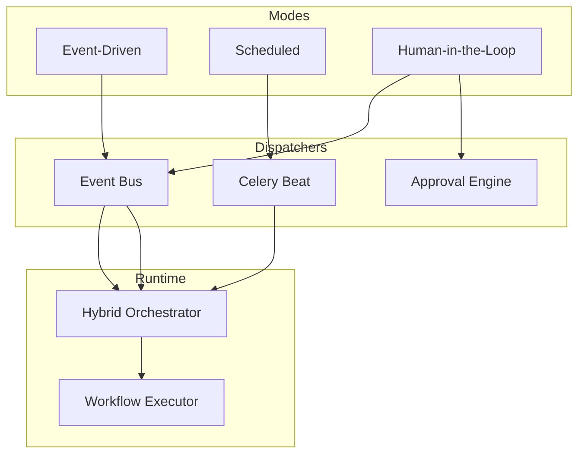

# 21 — Hybrid Orchestration Platform

**Version 3.1** | Phase 8 | AI Lead Intelligence Platform

---

## Product Positioning

This is **not** a simple workflow engine. It is a **hybrid orchestration platform** with three first-class execution modes. Each mode has its own dispatcher, validation rules, and runtime semantics.

| Workflow Type | Mode | Purpose | Example |
|---------------|------|---------|---------|
| **Event-Driven** | `event_driven` | Reacts to system events | When a new lead is created, assign it and notify the sales manager. |
| **Scheduled** | `scheduled` | Runs on a schedule | Every Monday at 8 AM, generate a pipeline report and email executives. |
| **Human-in-the-Loop** | `human_in_the_loop` | Requires user approval | If a lead score exceeds 90, send it for manager approval before creating an opportunity. |

---

## Architecture



### Mode → Dispatcher Mapping

| Mode | Dispatcher | Trigger Source |
|------|------------|----------------|
| `event_driven` | `event_bus` | Domain events (`lead.created`, `contact.created`, …) |
| `scheduled` | `celery_beat` | `workflow_schedules` + cron triggers |
| `human_in_the_loop` | `approval_engine` | Domain events + approval gate nodes |

---

## API

### List orchestration modes

```http
GET /api/v1/workflows/modes
```

```json
{
  "data": [
    {
      "mode": "event_driven",
      "display_name": "Event-Driven",
      "purpose": "Reacts to system events",
      "example": "When a new lead is created, assign it and notify the sales manager.",
      "dispatcher": "event_bus"
    }
  ]
}
```

### Create with explicit mode

```http
POST /api/v1/workflows
```

```json
{
  "name": "High-Score Approval",
  "orchestration_mode": "human_in_the_loop",
  "trigger": { "type": "lead.updated", "config": {} },
  "canvas": {
    "nodes": [
      { "key": "trigger", "type": "trigger", "config": {} },
      { "key": "check", "type": "condition", "config": { "condition": { "field": "trigger.score", "operator": "gte", "value": 90 } } },
      { "key": "approval", "type": "approval", "config": { "approval_type": "sequential", "approvers": ["manager"] } },
      { "key": "deal", "type": "action", "config": { "action_type": "create_deal" } },
      { "key": "end", "type": "end", "config": {} }
    ],
    "edges": [
      { "source": "trigger", "target": "check" },
      { "source": "check", "target": "approval", "label": "true" },
      { "source": "approval", "target": "deal" },
      { "source": "deal", "target": "end" }
    ]
  }
}
```

### Filter workflows by mode

```http
GET /api/v1/workflows?orchestration_mode=scheduled
```

---

## Validation Rules

| Mode | Required |
|------|----------|
| Event-Driven | Domain event trigger (not cron/manual) |
| Scheduled | Cron/scheduled trigger **or** active `workflow_schedules` row |
| Human-in-the-Loop | At least one `approval` node in canvas |

Mode is **auto-inferred** when omitted:
- Approval node present → `human_in_the_loop`
- Cron trigger → `scheduled`
- Otherwise → `event_driven`

---

## Code References

| Component | Path |
|-----------|------|
| Mode definitions | `backend/app/workflows/orchestration.py` |
| Hybrid orchestrator | `backend/app/workflows/engine/orchestrator.py` |
| Mode enum | `backend/app/workflows/constants.py` → `OrchestrationMode` |
| DB column | `workflows.orchestration_mode` (migration `015`) |