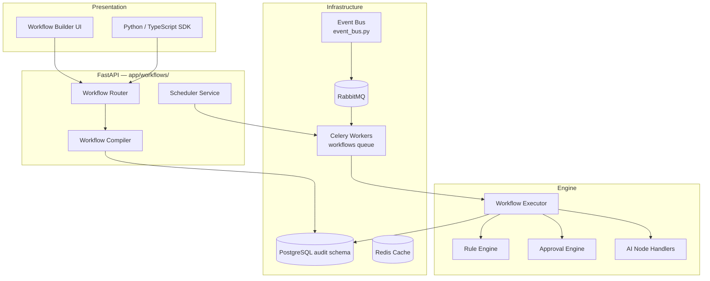

# Phase 8 — Workflow Platform

**Version 1.0** | AI Lead Intelligence Platform

Phase 8 defines the **enterprise visual workflow platform** — a no-code/low-code automation layer for lead intelligence, CRM operations, AI scoring, approvals, and scheduled jobs. It extends the Phase 3 rule-based workflows (`app/workflows/`) into a full **compiler → executor → state machine** system with a visual builder, AI nodes, and production-grade observability.

## Design Principles

| Principle | Implementation |
|-----------|----------------|
| **Event-driven** | Domain events via `backend/infrastructure/messaging/event_bus.py` + RabbitMQ |
| **Multi-tenant** | Row-level `organization_id` on all workflow tables (`audit` schema) |
| **API-first** | REST at `/api/v1/workflows/*` with OpenAPI 3.1 |
| **Visual + code** | Canvas builder (React Flow) + JSON/YAML definitions + Python/TS SDK |
| **Durable execution** | PostgreSQL state + Celery workers on `workflows` queue |
| **Safe by default** | RBAC (`workflows:*`), sandboxed expressions, tenant isolation |
| **Observable** | Prometheus metrics, OpenTelemetry traces, execution replay |

## Quick Start (Windows / PowerShell)

```powershell
# Start platform stack (API, worker, postgres, redis, rabbitmq)
cd C:\path\to\AI-Lead-intelligence-
.\scripts\start-free-stack.ps1

# Enable workflow platform feature flag (per org or global)
# POST /api/v1/admin/feature-flags  { "key": "workflow_platform_v2", "is_enabled": true }

# Create workflow from template
curl -X POST http://localhost:8000/api/v1/workflows/templates/auto-score-contacts/instantiate `
  -H "Authorization: Bearer $TOKEN" `
  -H "Content-Type: application/json" `
  -d '{ "name": "My Auto-Score Workflow" }'

# Trigger manual execution
curl -X POST http://localhost:8000/api/v1/workflows/{workflow_id}/execute `
  -H "Authorization: Bearer $TOKEN" `
  -d '{ "entity_type": "contact", "entity_id": "uuid" }'
```

### Service URLs (Workflow-Related)

| Service | URL | Role |
|---------|-----|------|
| Workflow API | http://localhost:8000/api/v1/workflows | CRUD, execute, templates |
| Workflow Builder | http://localhost:3000/workflows | Visual canvas UI |
| RabbitMQ Management | http://localhost:15672 | `guest` / `guest` (dev) |
| Grafana Workflows Dashboard | http://localhost:3001/d/workflows | Execution metrics |
| Celery Flower (optional) | http://localhost:5555 | Worker queue inspection |

## Architecture Overview



## Documentation Index

| # | Topic | Document |
|---|-------|----------|
| 1 | Workflow Platform Architecture | [01-workflow-platform-architecture.md](./01-workflow-platform-architecture.md) |
| 2 | Visual Workflow Builder Spec | [02-visual-workflow-builder-spec.md](./02-visual-workflow-builder-spec.md) |
| 3 | Workflow Engine Design | [03-workflow-engine-design.md](./03-workflow-engine-design.md) |
| 4 | Rule Engine Design | [04-rule-engine-design.md](./04-rule-engine-design.md) |
| 5 | Event Bus Architecture | [05-event-bus-architecture.md](./05-event-bus-architecture.md) |
| 6 | Database Schema | [06-database-schema.md](./06-database-schema.md) |
| 7 | API Specification | [07-api-specification.md](./07-api-specification.md) |
| 8 | AI Node Specifications | [08-ai-node-specifications.md](./08-ai-node-specifications.md) |
| 9 | Approval Engine Design | [09-approval-engine-design.md](./09-approval-engine-design.md) |
| 10 | Scheduler Design | [10-scheduler-design.md](./10-scheduler-design.md) |
| 11 | Workflow Templates | [11-workflow-templates.md](./11-workflow-templates.md) |
| 12 | Analytics Dashboard | [12-analytics-dashboard.md](./12-analytics-dashboard.md) |
| 13 | Security Model | [13-security-model.md](./13-security-model.md) |
| 14 | Observability Strategy | [14-observability-strategy.md](./14-observability-strategy.md) |
| 15 | Testing Strategy | [15-testing-strategy.md](./15-testing-strategy.md) |
| 16 | Sample Workflow Definitions | [16-sample-workflow-definitions.md](./16-sample-workflow-definitions.md) |
| 17 | Developer SDK | [17-developer-sdk.md](./17-developer-sdk.md) |
| 18 | Administrator Guide | [18-administrator-guide.md](./18-administrator-guide.md) |
| 19 | Operational Runbook | [19-operational-runbook.md](./19-operational-runbook.md) |
| 20 | Production Deployment Guide | [20-production-deployment-guide.md](./20-production-deployment-guide.md) |

## Key Repository Paths

| Component | Path |
|-----------|------|
| Workflow module | `backend/app/workflows/` |
| Workflow models (legacy) | `backend/app/admin/models.py` |
| Event bus | `backend/infrastructure/messaging/event_bus.py` |
| Celery tasks | `backend/workers/tasks/workflows.py` |
| Workflow compiler | `backend/app/workflows/engine/compiler.py` |
| Workflow executor | `backend/app/workflows/engine/executor.py` |
| Rule engine | `backend/app/workflows/engine/conditions.py` |
| Approval engine | `backend/app/workflows/engine/approval.py` |
| Scheduler | `backend/app/workflows/models.py` (WorkflowSchedule) |
| API router | `backend/app/workflows/router.py` |
| DB schema constant | `backend/app/common/db_schemas.py` → `DBSchema.AUDIT` |
| Permissions | `backend/app/core/permissions.py` |
| Frontend builder | `frontend/src/features/workflows/` |
| Migrations | `backend/migrations/versions/014_phase8_workflow_engine.py` |
| Python SDK | `backend/sdk/workflows/client.py` |
| Template seed | `scripts/seed/workflow_templates.py` |
| Prometheus metrics | `backend/infrastructure/observability/metrics.py` |
| Grafana dashboards | `infra/monitoring/grafana/dashboards/workflows.json` |

## Relationship to Prior Phases

| Phase | Focus | Phase 8 Extends |
|-------|-------|-----------------|
| Phase 3 | Backend architecture, basic workflows | Full visual platform, compiler, executor |
| Phase 5 | Discovery, workers, observability | AI nodes, workflow analytics |
| Phase 11 | Operations, K8s, monitoring | Production deployment, runbooks |
| frontend-v3 | UI navigation (`/workflows`) | Visual workflow builder canvas |

## Prerequisites

- [Docker Desktop](https://www.docker.com/products/docker-desktop/) with RabbitMQ service enabled
- [Node.js 20 LTS](https://nodejs.org/) for workflow builder UI
- [Python 3.12+](https://www.python.org/) for SDK and local development
- Manager role or higher for `workflows:write` / `workflows:execute` permissions

## Implementation Phases

| Sprint | Deliverable | Docs |
|--------|-------------|------|
| 8.1 | Schema migration + compiler + basic executor | 03, 06 |
| 8.2 | Event bus integration + rule engine | 04, 05 |
| 8.3 | Visual builder UI | 02 |
| 8.4 | AI nodes + approval engine | 08, 09 |
| 8.5 | Scheduler + templates | 10, 11 |
| 8.6 | Analytics + observability | 12, 14 |
| 8.7 | SDK + production hardening | 17, 20 |