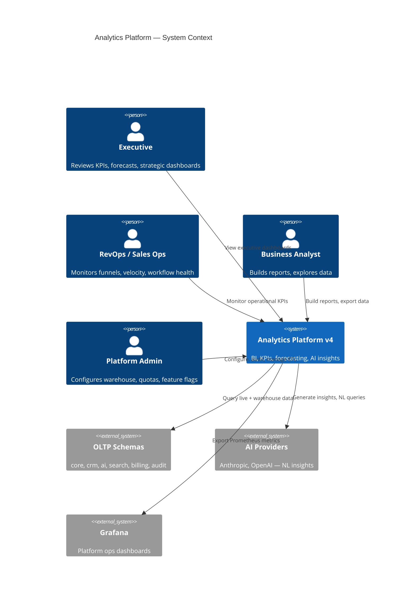
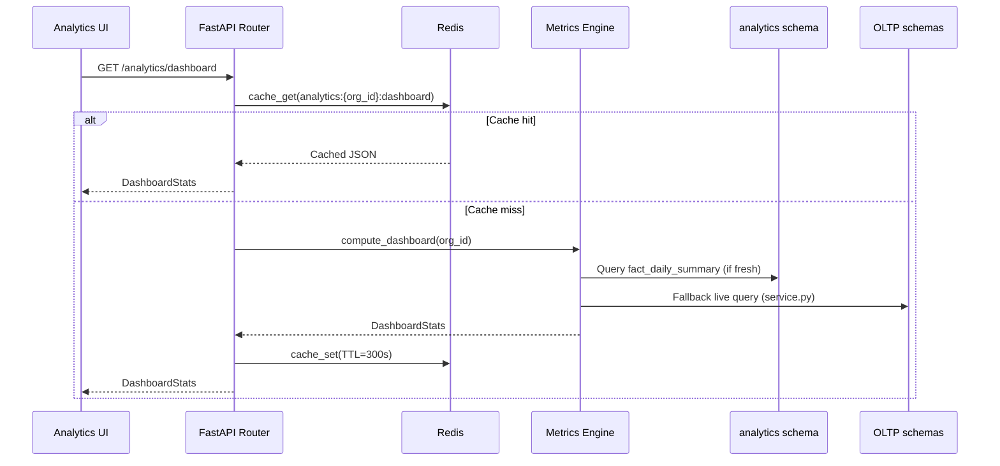
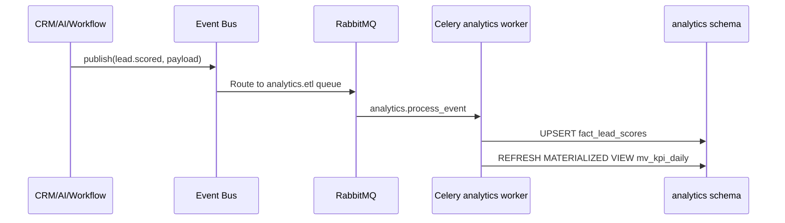
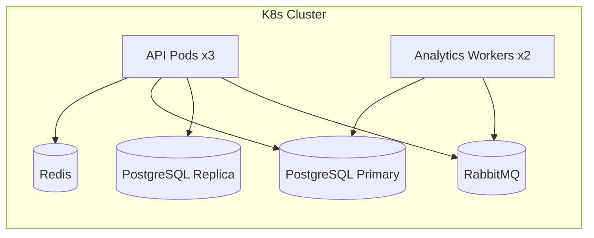

# 01 — Analytics Platform Architecture

**Version 4.0** | Phase 9 | AI Lead Intelligence Platform

---

## Table of Contents

1. [Executive Summary](#1-executive-summary)
2. [System Context](#2-system-context)
3. [Component Architecture](#3-component-architecture)
4. [Data Flow](#4-data-flow)
5. [Bounded Context](#5-bounded-context)
6. [Technology Stack](#6-technology-stack)
7. [Deployment Topology](#7-deployment-topology)
8. [Integration Points](#8-integration-points)
9. [Non-Functional Requirements](#9-non-functional-requirements)

---

## 1. Executive Summary

Phase 9 transforms the Phase 3 **operational analytics module** (`backend/app/analytics/`) and Phase 8 **workflow analytics** into a full **Enterprise BI & Decision Support Platform** capable of:

- Real-time and historical KPI computation across CRM, AI, search, billing, and workflow domains
- Star-schema data warehouse in the dedicated `analytics` PostgreSQL schema
- Executive, operational, and self-service dashboards with 25+ visualization types
- AI-powered insights, anomaly detection, and natural-language query support
- Configurable alerting with threshold, trend, and anomaly triggers
- Multi-tenant isolation with row-level security and PII masking

The platform follows **Clean Architecture** boundaries established in Phase 3, extending `backend/app/analytics/` with engine submodules and integrating via the existing event bus at `backend/infrastructure/messaging/event_bus.py`.

---

## 2. System Context



### Stakeholders

| Stakeholder | Primary Concern |
|-------------|-----------------|
| C-Suite / VP Sales | Revenue pipeline, conversion rates, forecast accuracy |
| RevOps | Lead velocity, score distribution, CRM funnel health |
| Sales Ops | Workflow automation ROI, approval turnaround |
| Data Analysts | Self-service exploration, custom reports |
| Engineering | Extensible metrics SDK, reliable ETL |
| Security | Tenant isolation, PII protection, audit trails |
| Platform Ops | Query performance, ETL lag, cache hit rates |

---

## 3. Component Architecture

```mermaid
flowchart TB
    subgraph Presentation Layer
        ExecDash[Executive Dashboards]
        OpsDash[Operational Dashboards]
        ReportBuilder[Report Builder]
        AlertUI[Alert Configuration]
        NLQuery[NL Query Panel]
    end

    subgraph Application Layer — backend/app/analytics/
        Router[REST Router<br/>router.py]
        Service[Analytics Service<br/>service.py]
        MetricsEngine[Metrics Engine]
        ForecastEngine[Forecasting Engine]
        InsightEngine[AI Insight Engine]
        AlertService[Alerting Service]
        ReportService[Report Service]
        WarehouseSvc[Warehouse Service]
    end

    subgraph Domain Layer
        KPIRegistry[KPI Registry]
        MetricCompiler[Metric Definition Compiler]
        DimModel[Dimensional Model]
        VizSpec[Visualization Spec Validator]
        AlertEvaluator[Alert Rule Evaluator]
    end

    subgraph Infrastructure Layer
        EventBus[Event Bus Port<br/>event_bus.py]
        CeleryW[Celery Workers<br/>analytics queue]
        Cache[Redis Cache<br/>cache.py]
        Repo[Analytics Repositories]
        Metrics[Prometheus Metrics]
        Tracer[OpenTelemetry]
    end

    subgraph Persistence
        PG_OLTP[(PostgreSQL OLTP<br/>core, crm, ai, audit, billing)]
        PG_DW[(PostgreSQL DW<br/>analytics schema)]
        RMQ[(RabbitMQ)]
        S3[(S3 — report exports)]
    end

    ExecDash --> Router
    OpsDash --> Router
    ReportBuilder --> Router
    AlertUI --> Router
    NLQuery --> InsightEngine
    Router --> Service
    Router --> MetricsEngine
    Router --> ForecastEngine
    Router --> InsightEngine
    Router --> AlertService
    Router --> ReportService
    Router --> WarehouseSvc
    MetricsEngine --> KPIRegistry
    MetricsEngine --> Cache
    MetricsEngine --> Repo
    WarehouseSvc --> CeleryW
    EventBus --> RMQ
    RMQ --> CeleryW
    CeleryW --> PG_DW
    Repo --> PG_OLTP
    Repo --> PG_DW
    ReportService --> S3
```

### Module Layout (v4 Target)

```
backend/app/analytics/
├── __init__.py
├── router.py              # Existing v3 endpoints + v4 extensions
├── service.py             # Existing OLTP queries (backward compatible)
├── schemas.py             # Pydantic models
├── engine/
│   ├── __init__.py
│   ├── metrics.py         # KPI computation, caching, aggregation
│   ├── forecasting.py     # Time-series forecasting (ARIMA, Prophet)
│   ├── insights.py        # AI insight generation
│   └── compiler.py        # Metric definition DSL compiler
├── warehouse/
│   ├── __init__.py
│   ├── etl.py             # Extract-transform-load orchestration
│   ├── dimensions.py      # Dimension table loaders
│   └── facts.py           # Fact table loaders
├── alerts/
│   ├── __init__.py
│   ├── service.py         # Alert CRUD + evaluation
│   ├── evaluator.py       # Threshold/trend/anomaly evaluation
│   └── notifier.py        # Notification dispatch via event bus
├── reports/
│   ├── __init__.py
│   ├── service.py         # Report definition CRUD
│   └── generator.py       # PDF/CSV/XLSX export
└── models.py              # SQLAlchemy models (analytics schema)
```

---

## 4. Data Flow

### 4.1 Real-Time Query Path (Dashboard)



### 4.2 Event-Driven ETL Path



### 4.3 Scheduled Batch ETL

| Job | Schedule | Celery Task | Purpose |
|-----|----------|-------------|---------|
| Incremental ETL | Every 15 min | `analytics.etl_incremental` | Sync changed OLTP rows |
| Full dimension refresh | Daily 02:00 UTC | `analytics.refresh_dimensions` | Rebuild dim_date, dim_org |
| Materialized view refresh | Every 30 min | `analytics.refresh_mvs` | Refresh pre-aggregated KPIs |
| Forecast generation | Daily 04:00 UTC | `analytics.generate_forecasts` | Pipeline & revenue forecasts |
| Alert evaluation | Every 5 min | `analytics.evaluate_alerts` | Check all active alert rules |
| Report delivery | Per schedule | `analytics.deliver_report` | Email scheduled reports |

---

## 5. Bounded Context

The analytics platform is a **supporting domain** that reads from multiple bounded contexts without owning their entities:

| Source Context | Schema | Analytics Consumption |
|----------------|--------|----------------------|
| Core | `core` | Organizations, industries, geographies |
| CRM | `crm` | Deals, pipeline stages, activities |
| AI | `ai` | Lead scores, model metadata |
| Search | `search` | Search volume, result quality |
| Billing | `billing` | Credit usage, subscription tiers |
| Audit / Workflows | `audit` | Execution metrics (Phase 8) |
| Auth | `auth` | User activity (anonymized) |

**Write boundary:** Analytics owns only the `analytics` schema. All writes to OLTP schemas are prohibited from analytics workers.

---

## 6. Technology Stack

| Layer | Technology | Version | Notes |
|-------|-----------|---------|-------|
| API | FastAPI | 0.115+ | Async endpoints, OpenAPI 3.1 |
| ORM | SQLAlchemy | 2.0+ | Async sessions, schema-qualified models |
| Cache | Redis | 7.x | TTL-based result caching |
| Queue | Celery + RabbitMQ | 5.x / 3.x | `analytics` dedicated queue |
| Database | PostgreSQL | 16+ | `analytics` schema, materialized views |
| Forecasting | statsmodels + Prophet | — | ARIMA for short-term, Prophet for seasonality |
| ML (anomaly) | scikit-learn | — | Isolation Forest for metric anomalies |
| AI Insights | Anthropic Claude API | — | NL summaries, recommended actions |
| Frontend | React 18 + Recharts + D3 | — | Visualization library |
| Observability | Prometheus + OTel | — | Query latency, ETL lag, cache hit rate |

---

## 7. Deployment Topology



### Scaling Guidelines

| Component | Min Replicas | Scale Trigger |
|-----------|-------------|---------------|
| API pods | 2 | p95 latency > 500ms |
| Analytics workers | 1 | ETL lag > 30 min |
| PostgreSQL read replica | 1 (prod) | Dashboard query load > 60% CPU |
| Redis | 1 (cluster in prod) | Cache memory > 80% |

---

## 8. Integration Points

### Phase 8 Workflow Analytics

Phase 8 workflow metrics (see `docs/phase8/12-analytics-dashboard.md`) are ingested into `analytics.fact_workflow_executions` via event bus subscriptions:

```python
# backend/app/analytics/warehouse/etl.py
EVENT_HANDLERS = {
    "workflow.execution.completed": handle_workflow_execution,
    "workflow.execution.failed": handle_workflow_execution,
    "workflow.approval.resolved": handle_approval_event,
}
```

Unified KPIs combine workflow and CRM metrics:

| Unified KPI | Formula |
|-------------|---------|
| **Automation ROI** | `(deals_from_workflows × avg_deal_value) / ai_credits_used` |
| **Lead-to-Deal Velocity** | `median(deal_created_at - contact_created_at)` |
| **Workflow-Assisted Conversion** | `deals_with_workflow_trigger / total_deals` |

### Existing v3 API Compatibility

All Phase 3 endpoints in `router.py` remain unchanged. v4 adds new routes under the same `/api/v1/analytics` prefix with feature-flag gating (`analytics_platform_v4`).

---

## 9. Non-Functional Requirements

| Requirement | Target | Measurement |
|-------------|--------|-------------|
| Dashboard p95 latency | < 300ms (cached), < 2s (cold) | Prometheus `analytics_query_duration_seconds` |
| ETL freshness | < 15 min lag | `analytics_etl_lag_seconds` |
| Cache hit rate | > 80% for dashboard endpoints | Redis metrics |
| Forecast accuracy (MAPE) | < 15% for 30-day pipeline forecast | Backtesting job |
| Uptime | 99.9% | Synthetic monitoring |
| Tenant isolation | Zero cross-tenant data leaks | Integration test suite |
| Report generation | < 60s for 100K row export | Celery task duration |
| Concurrent dashboard users | 500 per tenant | Load test baseline |