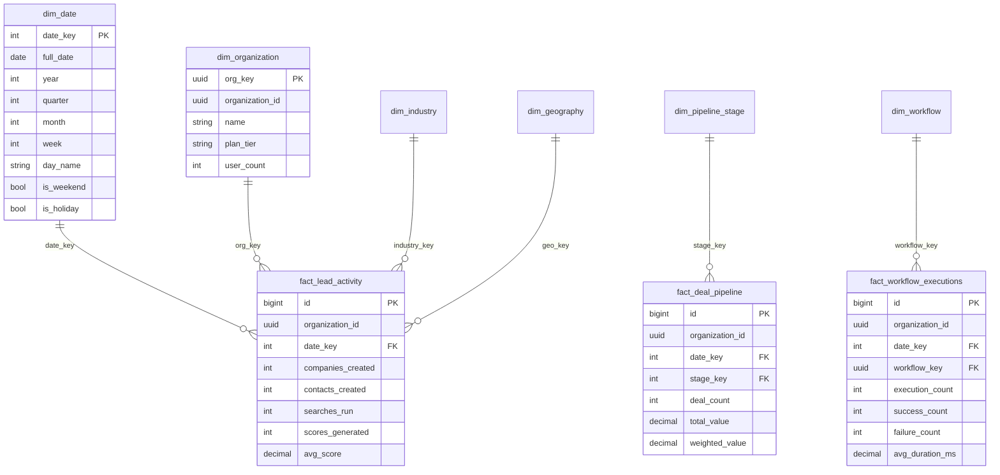
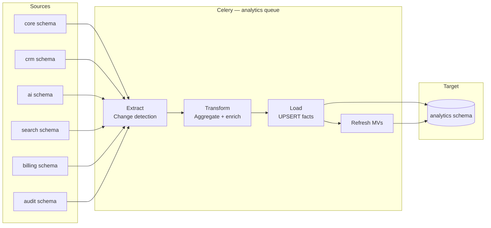

# 02 — Data Warehouse Design

**Version 4.0** | Phase 9 | AI Lead Intelligence Platform

---

## Table of Contents

1. [Overview](#1-overview)
2. [Schema Strategy](#2-schema-strategy)
3. [Dimensional Model](#3-dimensional-model)
4. [Fact Tables](#4-fact-tables)
5. [ETL Pipeline](#5-etl-pipeline)
6. [Materialized Views](#6-materialized-views)
7. [Data Quality](#7-data-quality)
8. [Retention & Archival](#8-retention--archival)

---

## 1. Overview

The Phase 9 data warehouse lives in the PostgreSQL `analytics` schema (reserved in `backend/app/common/db_schemas.py` → `DBSchema.ANALYTICS`). It implements a **Kimball-style star schema** optimized for:

- Multi-tenant analytics with `organization_id` on every fact table
- Incremental ETL from OLTP schemas (no separate warehouse database in v4.0)
- Materialized views for sub-second dashboard queries
- Event-driven near-real-time updates via Celery workers

### Design Decision: Co-located DW

| Option | Chosen | Rationale |
|--------|--------|-----------|
| Separate DW database | ❌ v4.0 | Operational complexity; PostgreSQL 16 handles analytics workload with replicas |
| Co-located `analytics` schema | ✅ v4.0 | Simpler ops, schema-level isolation, existing multi-schema pattern |
| External warehouse (Snowflake/BigQuery) | 🔮 v5.0 | Future connector for enterprise customers |

---

## 2. Schema Strategy



### Schema Isolation

```sql
-- Created by migration 015_phase9_analytics_platform.py
CREATE SCHEMA IF NOT EXISTS analytics;

-- Per-schema permissions (production)
GRANT USAGE ON SCHEMA analytics TO analytics_reader;
GRANT SELECT ON ALL TABLES IN SCHEMA analytics TO analytics_reader;
GRANT ALL ON ALL TABLES IN SCHEMA analytics TO analytics_writer;
```

---

## 3. Dimensional Model

### 3.1 Dimension Tables

| Dimension | Table | SCD Type | Refresh |
|-----------|-------|----------|---------|
| Date | `dim_date` | Type 0 (static) | Pre-populated 2020–2035 |
| Organization | `dim_organization` | Type 1 (overwrite) | Daily + on `org.updated` event |
| Industry | `dim_industry` | Type 1 | Daily from `core.industries` |
| Geography | `dim_geography` | Type 1 | Daily from `core.countries` |
| Pipeline Stage | `dim_pipeline_stage` | Type 2 (history) | On stage create/update |
| Workflow | `dim_workflow` | Type 1 | On workflow publish |
| User (anonymized) | `dim_user` | Type 1 | Daily; PII hashed |

### 3.2 Date Dimension

```sql
CREATE TABLE analytics.dim_date (
    date_key        INT PRIMARY KEY,  -- YYYYMMDD
    full_date       DATE NOT NULL UNIQUE,
    year            SMALLINT NOT NULL,
    quarter         SMALLINT NOT NULL,
    month           SMALLINT NOT NULL,
    week            SMALLINT NOT NULL,
    day_of_month    SMALLINT NOT NULL,
    day_of_week     SMALLINT NOT NULL,
    day_name        VARCHAR(10) NOT NULL,
    month_name      VARCHAR(10) NOT NULL,
    is_weekend      BOOLEAN NOT NULL DEFAULT FALSE,
    is_holiday      BOOLEAN NOT NULL DEFAULT FALSE,
    fiscal_year     SMALLINT,
    fiscal_quarter  SMALLINT
);

CREATE INDEX idx_dim_date_full_date ON analytics.dim_date (full_date);
```

### 3.3 Organization Dimension

```sql
CREATE TABLE analytics.dim_organization (
    org_key           UUID PRIMARY KEY DEFAULT gen_random_uuid(),
    organization_id   UUID NOT NULL UNIQUE,
    name              VARCHAR(255) NOT NULL,
    plan_tier         VARCHAR(50),
    user_count        INT DEFAULT 0,
    created_at        TIMESTAMPTZ NOT NULL,
    updated_at        TIMESTAMPTZ NOT NULL DEFAULT NOW(),
    is_active         BOOLEAN NOT NULL DEFAULT TRUE
);
```

---

## 4. Fact Tables

### 4.1 fact_lead_activity (Daily Grain)

Primary fact for lead intelligence metrics. One row per `(organization_id, date_key)`.

```sql
CREATE TABLE analytics.fact_lead_activity (
    id                  BIGSERIAL PRIMARY KEY,
    organization_id     UUID NOT NULL,
    date_key            INT NOT NULL REFERENCES analytics.dim_date(date_key),
    companies_created   INT NOT NULL DEFAULT 0,
    contacts_created    INT NOT NULL DEFAULT 0,
    searches_run        INT NOT NULL DEFAULT 0,
    scores_generated    INT NOT NULL DEFAULT 0,
    avg_score           DECIMAL(5,2),
    credits_consumed    INT NOT NULL DEFAULT 0,
    etl_updated_at      TIMESTAMPTZ NOT NULL DEFAULT NOW(),

    UNIQUE (organization_id, date_key)
);

CREATE INDEX idx_fact_lead_activity_org_date
    ON analytics.fact_lead_activity (organization_id, date_key);
```

**Source mapping:**

| Column | OLTP Source | Transform |
|--------|-------------|-----------|
| `companies_created` | `core.companies` | `COUNT(*) WHERE created_at::date = $date` |
| `contacts_created` | `core.contacts` | Same pattern |
| `searches_run` | `search.searches` | Same pattern |
| `scores_generated` | `ai.lead_scores` | Same pattern |
| `avg_score` | `ai.lead_scores` | `AVG(overall_score)` |
| `credits_consumed` | `billing.credit_transactions` | `SUM(ABS(amount)) WHERE amount < 0` |

### 4.2 fact_deal_pipeline (Daily × Stage Grain)

```sql
CREATE TABLE analytics.fact_deal_pipeline (
    id                  BIGSERIAL PRIMARY KEY,
    organization_id     UUID NOT NULL,
    date_key            INT NOT NULL REFERENCES analytics.dim_date(date_key),
    stage_key           UUID NOT NULL,
    stage_name          VARCHAR(100) NOT NULL,
    deal_count          INT NOT NULL DEFAULT 0,
    total_value         DECIMAL(15,2) NOT NULL DEFAULT 0,
    weighted_value      DECIMAL(15,2) NOT NULL DEFAULT 0,
    avg_days_in_stage   DECIMAL(8,2),
    etl_updated_at      TIMESTAMPTZ NOT NULL DEFAULT NOW(),

    UNIQUE (organization_id, date_key, stage_key)
);
```

### 4.3 fact_workflow_executions (Phase 8 Integration)

```sql
CREATE TABLE analytics.fact_workflow_executions (
    id                  BIGSERIAL PRIMARY KEY,
    organization_id     UUID NOT NULL,
    date_key            INT NOT NULL REFERENCES analytics.dim_date(date_key),
    workflow_id         UUID NOT NULL,
    workflow_name       VARCHAR(255),
    trigger_type        VARCHAR(50),
    execution_count     INT NOT NULL DEFAULT 0,
    success_count       INT NOT NULL DEFAULT 0,
    failure_count       INT NOT NULL DEFAULT 0,
    avg_duration_ms     DECIMAL(10,2),
    p95_duration_ms     DECIMAL(10,2),
    ai_credits_used     INT NOT NULL DEFAULT 0,
    etl_updated_at      TIMESTAMPTZ NOT NULL DEFAULT NOW(),

    UNIQUE (organization_id, date_key, workflow_id, trigger_type)
);
```

### 4.4 fact_score_distribution (Snapshot)

```sql
CREATE TABLE analytics.fact_score_distribution (
    id                  BIGSERIAL PRIMARY KEY,
    organization_id     UUID NOT NULL,
    date_key            INT NOT NULL REFERENCES analytics.dim_date(date_key),
    bucket_label        VARCHAR(10) NOT NULL,  -- '0-20', '21-40', etc.
    bucket_count        INT NOT NULL DEFAULT 0,
    etl_updated_at      TIMESTAMPTZ NOT NULL DEFAULT NOW(),

    UNIQUE (organization_id, date_key, bucket_label)
);
```

---

## 5. ETL Pipeline

### 5.1 Architecture



### 5.2 Incremental ETL Logic

```python
# backend/app/analytics/warehouse/etl.py

async def etl_incremental(org_id: UUID | None = None) -> ETLResult:
    """
    Incremental ETL: process changes since last watermark.
    Runs every 15 minutes via Celery beat.
    """
    watermark = await get_etl_watermark("fact_lead_activity")
    since = watermark or datetime.now(timezone.utc) - timedelta(hours=24)

    orgs = [org_id] if org_id else await get_active_org_ids()

    for org in orgs:
        await _etl_lead_activity(org, since)
        await _etl_deal_pipeline(org, since)
        await _etl_workflow_executions(org, since)
        await _etl_score_distribution(org, since)

    await set_etl_watermark("fact_lead_activity", datetime.now(timezone.utc))
    await refresh_materialized_views(["mv_kpi_daily", "mv_pipeline_summary"])
```

### 5.3 Event-Driven Micro-ETL

For near-real-time updates, subscribe to domain events:

| Event | Handler | Target Fact |
|-------|---------|-------------|
| `company.created` | `increment_lead_activity(companies=1)` | `fact_lead_activity` |
| `contact.created` | `increment_lead_activity(contacts=1)` | `fact_lead_activity` |
| `lead.scored` | `increment_lead_activity(scores=1, avg_score)` | `fact_lead_activity` |
| `deal.stage_changed` | `recompute_deal_pipeline(date, stage)` | `fact_deal_pipeline` |
| `workflow.execution.completed` | `increment_workflow_execution(...)` | `fact_workflow_executions` |
| `credit.consumed` | `increment_lead_activity(credits)` | `fact_lead_activity` |

### 5.4 ETL Watermark Table

```sql
CREATE TABLE analytics.etl_watermarks (
    pipeline_name   VARCHAR(100) PRIMARY KEY,
    last_run_at     TIMESTAMPTZ NOT NULL,
    last_success_at TIMESTAMPTZ,
    rows_processed  BIGINT DEFAULT 0,
    status          VARCHAR(20) NOT NULL DEFAULT 'idle',
    error_message   TEXT
);
```

### 5.5 Celery Task Registration

```python
# backend/workers/tasks/analytics.py

@celery_app.task(name="analytics.etl_incremental", queue="analytics")
def etl_incremental_task(org_id: str | None = None):
    asyncio.run(etl_incremental(UUID(org_id) if org_id else None))

@celery_app.task(name="analytics.refresh_mvs", queue="analytics")
def refresh_mvs_task(view_names: list[str] | None = None):
    asyncio.run(refresh_materialized_views(view_names or ALL_MVS))

@celery_app.task(name="analytics.process_event", queue="analytics")
def process_event_task(event_type: str, payload: dict):
    handler = EVENT_HANDLERS.get(event_type)
    if handler:
        asyncio.run(handler(payload))
```

---

## 6. Materialized Views

### 6.1 mv_kpi_daily

Pre-aggregated daily KPIs for dashboard endpoints:

```sql
CREATE MATERIALIZED VIEW analytics.mv_kpi_daily AS
SELECT
    fla.organization_id,
    dd.full_date,
    dd.year,
    dd.quarter,
    dd.month,
    fla.companies_created,
    fla.contacts_created,
    fla.searches_run,
    fla.scores_generated,
    fla.avg_score,
    fla.credits_consumed,
    COALESCE(fdp.total_pipeline_value, 0) AS total_pipeline_value,
    COALESCE(fdp.open_deal_count, 0) AS open_deal_count,
    COALESCE(fwe.execution_count, 0) AS workflow_executions
FROM analytics.fact_lead_activity fla
JOIN analytics.dim_date dd ON fla.date_key = dd.date_key
LEFT JOIN LATERAL (
    SELECT SUM(total_value) AS total_pipeline_value,
           SUM(deal_count) AS open_deal_count
    FROM analytics.fact_deal_pipeline
    WHERE organization_id = fla.organization_id AND date_key = fla.date_key
) fdp ON TRUE
LEFT JOIN LATERAL (
    SELECT SUM(execution_count) AS execution_count
    FROM analytics.fact_workflow_executions
    WHERE organization_id = fla.organization_id AND date_key = fla.date_key
) fwe ON TRUE
WITH DATA;

CREATE UNIQUE INDEX idx_mv_kpi_daily_org_date
    ON analytics.mv_kpi_daily (organization_id, full_date);
```

### 6.2 mv_pipeline_summary

```sql
CREATE MATERIALIZED VIEW analytics.mv_pipeline_summary AS
SELECT
    organization_id,
    stage_name,
    SUM(deal_count) AS total_deals,
    SUM(total_value) AS total_value,
    AVG(avg_days_in_stage) AS avg_days_in_stage
FROM analytics.fact_deal_pipeline
WHERE date_key = (SELECT MAX(date_key) FROM analytics.fact_deal_pipeline)
GROUP BY organization_id, stage_name
WITH DATA;
```

### 6.3 Refresh Strategy

| View | Refresh Mode | Frequency | Method |
|------|-------------|-----------|--------|
| `mv_kpi_daily` | CONCURRENTLY | 30 min | `REFRESH MATERIALIZED VIEW CONCURRENTLY` |
| `mv_pipeline_summary` | CONCURRENTLY | 30 min | Same |
| `mv_workflow_health` | CONCURRENTLY | 15 min | Same |
| `mv_score_trends` | FULL | Daily 03:00 | Non-concurrent (small table) |

---

## 7. Data Quality

### 7.1 Validation Rules

| Rule | Check | Action on Failure |
|------|-------|-------------------|
| Row count reconciliation | OLTP count vs fact count (±5%) | Alert `analytics:admin`, retry ETL |
| Null organization_id | No NULLs in fact tables | Reject row, log error |
| Negative metrics | No negative counts | Clamp to 0, log warning |
| Stale watermark | `last_success_at` > 1 hour ago | Page on-call |
| Duplicate grain | UNIQUE constraint violation | UPSERT (idempotent) |

### 7.2 Data Quality Metrics Table

```sql
CREATE TABLE analytics.data_quality_checks (
    id              BIGSERIAL PRIMARY KEY,
    check_name      VARCHAR(100) NOT NULL,
    organization_id UUID,
    run_at          TIMESTAMPTZ NOT NULL DEFAULT NOW(),
    status          VARCHAR(20) NOT NULL,  -- pass, warn, fail
    expected_value  DECIMAL(15,4),
    actual_value    DECIMAL(15,4),
    details         JSONB
);
```

---

## 8. Retention & Archival

| Table | Hot Retention | Archive | Purge |
|-------|--------------|---------|-------|
| `fact_lead_activity` | 2 years | S3 parquet (monthly) | After 5 years |
| `fact_deal_pipeline` | 2 years | S3 parquet | After 5 years |
| `fact_workflow_executions` | 1 year | S3 parquet | After 3 years |
| `fact_score_distribution` | 1 year | None | After 2 years |
| `data_quality_checks` | 90 days | None | Auto-purge |
| Materialized views | Always current | N/A | N/A |

```sql
-- Monthly archival Celery task
-- analytics.archive_old_facts(retention_days=730)
DELETE FROM analytics.fact_lead_activity
WHERE date_key < (SELECT date_key FROM analytics.dim_date
                  WHERE full_date = CURRENT_DATE - INTERVAL '5 years');
```