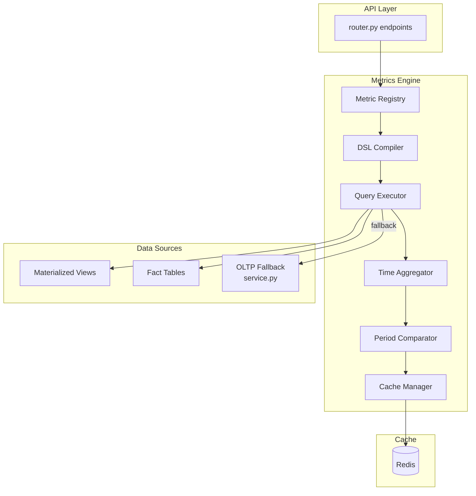
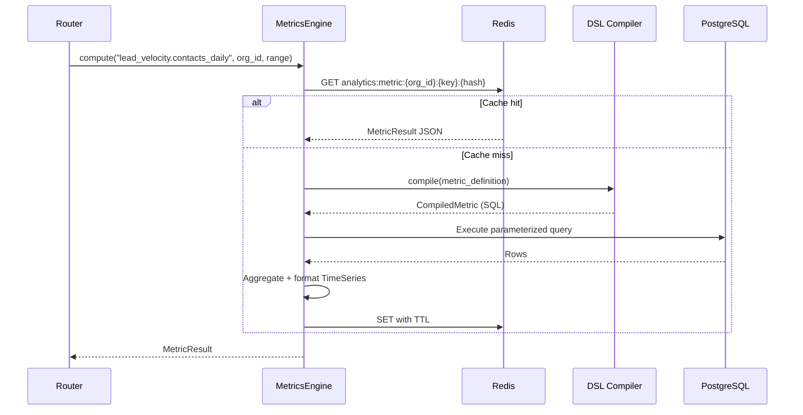

# 03 — Metrics Engine Design

**Version 4.0** | Phase 9 | AI Lead Intelligence Platform

---

## Table of Contents

1. [Overview](#1-overview)
2. [Architecture](#2-architecture)
3. [Metric Definition DSL](#3-metric-definition-dsl)
4. [Computation Pipeline](#4-computation-pipeline)
5. [Caching Strategy](#5-caching-strategy)
6. [Built-in Metrics Catalog](#6-built-in-metrics-catalog)
7. [Custom Metrics](#7-custom-metrics)
8. [Query Optimization](#8-query-optimization)

---

## 1. Overview

The Metrics Engine (`backend/app/analytics/engine/metrics.py`) is the computational core of Phase 9. It:

- Computes KPIs from warehouse facts and OLTP fallback queries
- Provides a declarative **Metric Definition DSL** for custom metrics
- Manages Redis caching with intelligent TTL and invalidation
- Supports time-range aggregation, comparison periods, and dimensional breakdowns
- Extends the existing `AnalyticsService` in `service.py` without breaking v3 API contracts

---

## 2. Architecture



### Class Diagram

```python
# backend/app/analytics/engine/metrics.py

class MetricDefinition(BaseModel):
    key: str                          # e.g. "lead_velocity.contacts_daily"
    name: str
    description: str
    category: MetricCategory          # operational | strategic | workflow | billing
    formula: MetricFormula
    dimensions: list[str] = []        # e.g. ["industry", "geography", "seniority"]
    default_granularity: Granularity  # hour | day | week | month | quarter
    cache_ttl_seconds: int = 300
    source: DataSource                # warehouse | oltp | hybrid

class MetricFormula(BaseModel):
    type: FormulaType                 # count | sum | avg | ratio | custom_sql
    expression: str                   # SQL or DSL expression
    numerator: str | None = None      # for ratio metrics
    denominator: str | None = None

class MetricsEngine:
    async def compute(
        self, metric_key: str, org_id: UUID,
        time_range: TimeRange, granularity: Granularity | None = None,
        dimensions: list[str] | None = None,
        comparison: ComparisonPeriod | None = None,
    ) -> MetricResult: ...

    async def compute_batch(
        self, metric_keys: list[str], org_id: UUID, time_range: TimeRange,
    ) -> dict[str, MetricResult]: ...

    async def invalidate_cache(self, org_id: UUID, metric_key: str | None = None) -> None: ...
```

---

## 3. Metric Definition DSL

### 3.1 YAML Metric Definitions

Stored in `backend/app/analytics/definitions/`:

```yaml
# definitions/operational/lead_velocity.yaml
key: lead_velocity.contacts_daily
name: Daily Contact Creation Rate
description: Number of new contacts created per day
category: operational
source: warehouse
default_granularity: day
cache_ttl_seconds: 300
formula:
  type: sum
  expression: |
    SELECT dd.full_date AS date, fla.contacts_created AS value
    FROM analytics.fact_lead_activity fla
    JOIN analytics.dim_date dd ON fla.date_key = dd.date_key
    WHERE fla.organization_id = :org_id
      AND dd.full_date BETWEEN :from_date AND :to_date
    ORDER BY dd.full_date
dimensions:
  - industry
  - geography
```

### 3.2 Ratio Metrics

```yaml
key: conversion.lead_to_deal_rate
name: Lead-to-Deal Conversion Rate
category: strategic
source: hybrid
formula:
  type: ratio
  numerator: |
    SELECT COUNT(*) FROM crm.crm_deals
    WHERE organization_id = :org_id AND created_at BETWEEN :from AND :to
  denominator: |
    SELECT COUNT(*) FROM core.contacts
    WHERE organization_id = :org_id AND created_at BETWEEN :from AND :to
      AND deleted_at IS NULL
cache_ttl_seconds: 900
```

### 3.3 DSL Compilation

```python
class MetricCompiler:
    def compile(self, definition: MetricDefinition) -> CompiledMetric:
        if definition.formula.type == FormulaType.ratio:
            return self._compile_ratio(definition)
        elif definition.formula.type == FormulaType.custom_sql:
            return self._compile_sql(definition)
        else:
            return self._compile_aggregate(definition)

    def _compile_sql(self, definition: MetricDefinition) -> CompiledMetric:
        # Validate SQL: no DDL, no cross-tenant, parameterized only
        validated = self._sandbox_validate(definition.formula.expression)
        return CompiledMetric(
            sql=validated,
            params={"org_id": ":org_id", "from_date": ":from", "to_date": ":to"},
            cache_ttl=definition.cache_ttl_seconds,
        )
```

---

## 4. Computation Pipeline



### MetricResult Schema

```python
class MetricResult(BaseModel):
    key: str
    name: str
    value: float | int | None          # Single-value metrics
    series: list[TimeSeriesPoint] = [] # Time-series metrics
    breakdown: list[BreakdownItem] = []# Dimensional breakdown
    comparison: ComparisonResult | None = None
    metadata: MetricMetadata

class ComparisonResult(BaseModel):
    period: str                         # "previous_period" | "previous_year"
    value: float | int
    change_absolute: float
    change_percent: float
    trend: Literal["up", "down", "flat"]

class MetricMetadata(BaseModel):
    computed_at: datetime
    source: Literal["warehouse", "oltp", "cache"]
    granularity: str
    time_range: TimeRange
    cache_ttl_seconds: int
    query_duration_ms: float
```

---

## 5. Caching Strategy

### 5.1 Cache Key Structure

```
analytics:metric:{org_id}:{metric_key}:{granularity}:{from}:{to}:{dim_hash}
analytics:dashboard:{org_id}:dashboard
analytics:batch:{org_id}:{keys_hash}
```

### 5.2 TTL Policy

| Metric Category | Default TTL | Invalidation Trigger |
|----------------|-------------|---------------------|
| Dashboard summary | 300s (5 min) | `company.created`, `contact.created` events |
| Time-series (daily) | 600s (10 min) | ETL watermark update |
| Time-series (hourly) | 120s (2 min) | Event-driven micro-ETL |
| Dimensional breakdown | 900s (15 min) | Dimension refresh |
| Strategic ratios | 1800s (30 min) | Daily ETL completion |
| Workflow metrics | 300s | `workflow.execution.*` events |

### 5.3 Cache Invalidation

```python
# Event-driven invalidation
CACHE_INVALIDATION_MAP = {
    "company.created": ["dashboard", "lead_velocity.*", "industry.*"],
    "contact.created": ["dashboard", "lead_velocity.*", "seniority.*", "geography.*"],
    "lead.scored": ["dashboard", "score_distribution.*"],
    "deal.stage_changed": ["crm_funnel.*", "pipeline.*"],
    "workflow.execution.completed": ["workflow.*"],
    "credit.consumed": ["credits.*", "dashboard"],
}

async def invalidate_on_event(event_type: str, org_id: UUID):
    patterns = CACHE_INVALIDATION_MAP.get(event_type, [])
    for pattern in patterns:
        await cache_delete_pattern(f"analytics:*:{org_id}:{pattern}*")
```

---

## 6. Built-in Metrics Catalog

### 6.1 Operational Metrics (from existing service.py)

| Key | Name | Source | v3 Endpoint |
|-----|------|--------|-------------|
| `dashboard.total_companies` | Total Companies | OLTP / warehouse | `/dashboard` |
| `dashboard.total_contacts` | Total Contacts | OLTP / warehouse | `/dashboard` |
| `dashboard.active_deals` | Active Deals | OLTP / warehouse | `/dashboard` |
| `dashboard.avg_lead_score` | Average Lead Score | OLTP / warehouse | `/dashboard` |
| `lead_velocity.companies` | Company Creation Rate | warehouse | `/lead-velocity` |
| `lead_velocity.contacts` | Contact Creation Rate | warehouse | `/lead-velocity` |
| `score.distribution` | Score Distribution | OLTP / warehouse | `/score-distribution` |
| `search.activity` | Search Activity | OLTP / warehouse | `/search-activity` |
| `crm.funnel` | CRM Pipeline Funnel | OLTP / warehouse | `/crm-funnel` |
| `billing.credit_usage` | Credit Usage | OLTP / warehouse | `/credits` |

### 6.2 Strategic Metrics (v4 new)

| Key | Name | Formula |
|-----|------|---------|
| `conversion.lead_to_deal` | Lead-to-Deal Rate | `deals_created / contacts_created` |
| `conversion.score_to_meeting` | Score-to-Meeting Rate | `meetings / contacts_scored_above_60` |
| `revenue.pipeline_value` | Total Pipeline Value | `SUM(deal.value) WHERE status=open` |
| `revenue.weighted_pipeline` | Weighted Pipeline | `SUM(deal.value × stage_probability)` |
| `revenue.avg_deal_size` | Average Deal Size | `AVG(deal.value) WHERE status IN (open,won)` |
| `efficiency.credits_per_deal` | Credits per Deal | `credits_consumed / deals_created` |
| `efficiency.searches_per_contact` | Searches per Contact | `searches / contacts_created` |

### 6.3 Workflow Metrics (Phase 8 integration)

| Key | Name | Source |
|-----|------|--------|
| `workflow.execution_count` | Workflow Executions | `fact_workflow_executions` |
| `workflow.success_rate` | Workflow Success Rate | `success / (success + failure)` |
| `workflow.avg_duration` | Avg Execution Duration | `AVG(avg_duration_ms)` |
| `workflow.approval_turnaround` | Approval Turnaround | `audit.workflow_approvals` |
| `workflow.ai_credit_usage` | AI Credits in Workflows | `SUM(ai_credits_used)` |
| `workflow.automation_roi` | Automation ROI | `(workflow_deals × avg_value) / ai_credits` |

---

## 7. Custom Metrics

### 7.1 Tenant-Defined Metrics

Organizations with `analytics:admin` permission can define custom metrics:

```sql
CREATE TABLE analytics.custom_metric_definitions (
    id              UUID PRIMARY KEY DEFAULT gen_random_uuid(),
    organization_id UUID NOT NULL,
    key             VARCHAR(100) NOT NULL,
    name            VARCHAR(255) NOT NULL,
    description     TEXT,
    formula_yaml    TEXT NOT NULL,
    is_active       BOOLEAN NOT NULL DEFAULT TRUE,
    created_by      UUID NOT NULL,
    created_at      TIMESTAMPTZ NOT NULL DEFAULT NOW(),
    updated_at      TIMESTAMPTZ NOT NULL DEFAULT NOW(),

    UNIQUE (organization_id, key)
);
```

### 7.2 Custom Metric API

```
POST   /api/v1/analytics/metrics/custom          # Create custom metric
GET    /api/v1/analytics/metrics/custom           # List custom metrics
GET    /api/v1/analytics/metrics/custom/{key}     # Get definition
PUT    /api/v1/analytics/metrics/custom/{key}     # Update definition
DELETE /api/v1/analytics/metrics/custom/{key}     # Deactivate
POST   /api/v1/analytics/metrics/custom/{key}/validate  # Validate SQL
```

### 7.3 SQL Sandbox Rules

| Rule | Enforcement |
|------|-------------|
| SELECT only | Parser rejects INSERT/UPDATE/DELETE/DDL |
| Parameterized | All values via `:org_id`, `:from`, `:to` bind params |
| Tenant scoped | Auto-inject `organization_id = :org_id` |
| Timeout | 30s query timeout |
| Row limit | Max 100,000 rows returned |
| Schema allowlist | `analytics`, `crm`, `core`, `ai`, `search`, `billing`, `audit` |

---

## 8. Query Optimization

### 8.1 Source Selection Logic

```python
async def _select_source(self, metric: MetricDefinition, org_id: UUID) -> DataSource:
    if metric.source == DataSource.oltp:
        return DataSource.oltp

    freshness = await get_etl_watermark_age("fact_lead_activity")
    if freshness < timedelta(minutes=30):
        return DataSource.warehouse

    # Stale warehouse — fall back to OLTP with warning
    logger.warning("Warehouse stale (%s), falling back to OLTP", freshness)
    return DataSource.oltp
```

### 8.2 Batch Computation

The `/analytics/full` endpoint uses batch computation to avoid N+1 queries:

```python
async def compute_dashboard_bundle(self, org_id: UUID) -> FullAnalyticsResponse:
    """Compute all dashboard metrics in parallel with shared cache."""
    metric_keys = [
        "dashboard.summary", "lead_velocity.contacts", "lead_velocity.companies",
        "score.distribution", "industry.breakdown", "geography.breakdown",
        "seniority.breakdown", "search.activity", "crm.funnel", "billing.credits",
    ]
    results = await asyncio.gather(*[
        self.compute(key, org_id, TimeRange.last_30_days())
        for key in metric_keys
    ])
    return self._assemble_full_response(results)
```

### 8.3 Performance Targets

| Operation | Target | Strategy |
|-----------|--------|----------|
| Single metric (cached) | < 50ms | Redis |
| Single metric (warehouse) | < 200ms | Materialized views |
| Single metric (OLTP fallback) | < 1s | Indexed queries |
| Dashboard bundle (10 metrics) | < 300ms | Parallel + cache |
| Custom metric query | < 5s | Timeout + row limit |