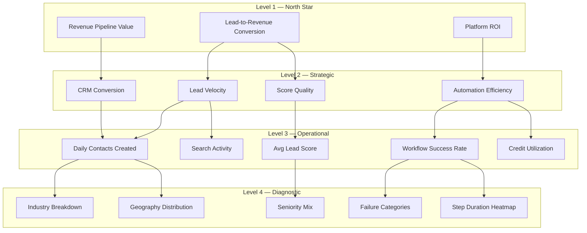
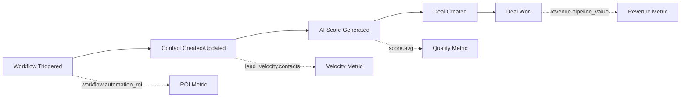

# 04 — KPI Framework

**Version 4.0** | Phase 9 | AI Lead Intelligence Platform

---

## Table of Contents

1. [Overview](#1-overview)
2. [KPI Hierarchy](#2-kpi-hierarchy)
3. [North Star Metrics](#3-north-star-metrics)
4. [Operational KPIs](#4-operational-kpis)
5. [Strategic KPIs](#5-strategic-kpis)
6. [Workflow KPIs](#6-workflow-kpis)
7. [KPI Scorecards](#7-kpi-scorecards)
8. [Targets & Thresholds](#8-targets--thresholds)
9. [KPI Governance](#9-kpi-governance)

---

## 1. Overview

The KPI Framework defines **what to measure**, **how to calculate it**, and **what good looks like** across the AI Lead Intelligence Platform. It bridges the Metrics Engine (computation) and Dashboard Specifications (presentation).

Every KPI maps to:
- A **metric key** in the Metrics Engine registry
- A **visualization type** from the Visualization Library
- **Target thresholds** for alerting
- An **owner role** for accountability

---

## 2. KPI Hierarchy



---

## 3. North Star Metrics

### 3.1 Revenue Pipeline Value

| Attribute | Value |
|-----------|-------|
| **Key** | `revenue.pipeline_value` |
| **Formula** | `SUM(deal.value) WHERE status = 'open' AND deleted_at IS NULL` |
| **Granularity** | Daily snapshot |
| **Visualization** | KPI card + trend line |
| **Owner** | VP Sales / CRO |
| **Target** | Growth ≥ 10% MoM |

### 3.2 Lead-to-Revenue Conversion

| Attribute | Value |
|-----------|-------|
| **Key** | `conversion.lead_to_revenue` |
| **Formula** | `won_deals / total_contacts_created` (trailing 90 days) |
| **Granularity** | Monthly |
| **Visualization** | Funnel + conversion rate badge |
| **Owner** | RevOps |
| **Target** | ≥ 2.5% |

### 3.3 Platform ROI

| Attribute | Value |
|-----------|-------|
| **Key** | `efficiency.platform_roi` |
| **Formula** | `(revenue_from_scored_leads - platform_cost) / platform_cost` |
| **Granularity** | Monthly |
| **Visualization** | KPI card with sparkline |
| **Owner** | CFO / VP Sales |
| **Target** | ≥ 300% |

---

## 4. Operational KPIs

### 4.1 Lead Generation

| KPI | Key | Formula | Target | Alert Threshold |
|-----|-----|---------|--------|-----------------|
| **Daily Contacts** | `lead_velocity.contacts` | `COUNT(contacts) per day` | ≥ 50/day (growth orgs) | < 10/day for 3 consecutive days |
| **Daily Companies** | `lead_velocity.companies` | `COUNT(companies) per day` | ≥ 20/day | < 5/day for 3 days |
| **Search Volume** | `search.activity` | `COUNT(searches) per day` | Stable ± 20% | Drop > 50% WoW |
| **Avg Results/Search** | `search.avg_results` | `AVG(result_count)` | ≥ 25 | < 10 |

### 4.2 Lead Quality

| KPI | Key | Formula | Target | Alert Threshold |
|-----|-----|---------|--------|-----------------|
| **Avg Lead Score** | `score.avg` | `AVG(overall_score)` | ≥ 55 | < 40 |
| **High-Score Rate** | `score.high_rate` | `COUNT(score ≥ 60) / total` | ≥ 30% | < 15% |
| **Score Coverage** | `score.coverage` | `scored_contacts / total_contacts` | ≥ 80% | < 50% |

### 4.3 CRM Health

| KPI | Key | Formula | Target | Alert Threshold |
|-----|-----|---------|--------|-----------------|
| **Active Deals** | `crm.active_deals` | `COUNT(deals) WHERE status=open` | Growing MoM | Decline > 20% MoM |
| **Avg Deal Value** | `revenue.avg_deal_size` | `AVG(value) WHERE status IN (open,won)` | Stable ± 15% | Drop > 30% |
| **Pipeline Velocity** | `crm.pipeline_velocity` | `AVG(days_in_current_stage)` | < 14 days/stage | > 30 days/stage |
| **Win Rate** | `crm.win_rate` | `won / (won + lost)` trailing 90d | ≥ 25% | < 15% |

### 4.4 Resource Utilization

| KPI | Key | Formula | Target | Alert Threshold |
|-----|-----|---------|--------|-----------------|
| **Credit Burn Rate** | `billing.burn_rate` | `credits_used_month / credits_monthly` | < 80% mid-month | > 95% before day 25 |
| **Credits per Lead** | `efficiency.credits_per_lead` | `credits_consumed / contacts_created` | < 5 | > 15 |
| **Credits per Deal** | `efficiency.credits_per_deal` | `credits_consumed / deals_created` | < 50 | > 200 |

---

## 5. Strategic KPIs

### 5.1 Growth Metrics

| KPI | Key | Period | Comparison |
|-----|-----|--------|------------|
| **Contact Growth Rate** | `growth.contacts_mom` | Monthly | Previous month, previous year |
| **Pipeline Growth** | `growth.pipeline_mom` | Monthly | Previous month |
| **Revenue Growth** | `growth.revenue_mom` | Monthly | Previous month, previous year |
| **Market Expansion** | `growth.new_geographies` | Quarterly | New countries with contacts |

### 5.2 Cohort Analysis

```sql
-- Monthly contact cohort retention (deals created within 90 days)
SELECT
    cohort_month,
    COUNT(DISTINCT contact_id) AS cohort_size,
    COUNT(DISTINCT CASE WHEN deal_created_within_90d THEN contact_id END) AS converted,
    ROUND(100.0 * COUNT(DISTINCT CASE WHEN deal_created_within_90d THEN contact_id END)
        / NULLIF(COUNT(DISTINCT contact_id), 0), 2) AS conversion_rate
FROM analytics.mv_contact_cohorts
WHERE organization_id = :org_id
GROUP BY cohort_month
ORDER BY cohort_month;
```

### 5.3 Forecast KPIs

| KPI | Key | Method | Horizon |
|-----|-----|--------|---------|
| **Pipeline Forecast** | `forecast.pipeline_value` | Prophet | 30/60/90 days |
| **Contact Velocity Forecast** | `forecast.contact_velocity` | ARIMA(1,1,1) | 30 days |
| **Credit Burn Forecast** | `forecast.credit_burn` | Linear regression | 30 days |
| **Revenue Forecast** | `forecast.revenue` | Weighted pipeline × historical win rate | 90 days |

---

## 6. Workflow KPIs

Integrated from Phase 8 workflow analytics (`docs/phase8/12-analytics-dashboard.md`):

| KPI | Key | Formula | Target |
|-----|-----|---------|--------|
| **Workflow Success Rate** | `workflow.success_rate` | `completed / (completed + failed)` | ≥ 95% |
| **Avg Execution Time** | `workflow.avg_duration` | `mean(completed_at - started_at)` | < 5s (non-AI) |
| **P95 Execution Time** | `workflow.p95_duration` | 95th percentile | < 30s |
| **Approval Turnaround** | `workflow.approval_turnaround` | `mean(resolved_at - created_at)` | < 24h |
| **AI Credit Usage (WF)** | `workflow.ai_credits` | Sum per period | Budget-dependent |
| **Queue Lag** | `workflow.queue_lag` | Trigger to execution start | < 2s |
| **Automation ROI** | `workflow.automation_roi` | `(deals_from_wf × avg_value) / ai_credits` | ≥ 5x |

### Cross-Domain KPI: Workflow-Assisted Pipeline



---

## 7. KPI Scorecards

### 7.1 Executive Scorecard

| KPI | Current | Target | Status | Trend |
|-----|---------|--------|--------|-------|
| Pipeline Value | $2.4M | $2.0M | 🟢 | ↑ 12% |
| Lead-to-Revenue | 3.1% | 2.5% | 🟢 | ↑ 0.4% |
| Avg Lead Score | 58.2 | 55.0 | 🟢 | → flat |
| Win Rate | 22% | 25% | 🟡 | ↓ 2% |
| Platform ROI | 340% | 300% | 🟢 | ↑ 15% |
| Credit Burn | 72% | < 80% | 🟢 | → flat |

### 7.2 Status Calculation

```python
def kpi_status(current: float, target: float, higher_is_better: bool = True) -> str:
    ratio = current / target if target else 0
    if higher_is_better:
        if ratio >= 1.0: return "green"
        if ratio >= 0.8: return "yellow"
        return "red"
    else:
        if ratio <= 1.0: return "green"
        if ratio <= 1.2: return "yellow"
        return "red"
```

### 7.3 Scorecard API Response

```json
{
  "scorecard": {
    "period": "2026-06",
    "kpis": [
      {
        "key": "revenue.pipeline_value",
        "name": "Pipeline Value",
        "current": 2400000,
        "target": 2000000,
        "unit": "USD",
        "status": "green",
        "trend": "up",
        "change_percent": 12.0,
        "sparkline": [{"date": "2026-06-01", "value": 2100000}, "..."]
      }
    ],
    "overall_health": "green",
    "generated_at": "2026-06-29T10:00:00Z"
  }
}
```

---

## 8. Targets & Thresholds

### 8.1 Default Targets by Plan Tier

| KPI | Starter | Professional | Enterprise |
|-----|---------|-------------|------------|
| Daily Contacts | 10 | 50 | 200 |
| Avg Lead Score | 45 | 55 | 60 |
| Score Coverage | 50% | 80% | 95% |
| Workflow Success Rate | — | 90% | 95% |
| Credit Burn (mid-month) | 70% | 80% | 85% |

### 8.2 Threshold Configuration

```sql
CREATE TABLE analytics.kpi_thresholds (
    id              UUID PRIMARY KEY DEFAULT gen_random_uuid(),
    organization_id UUID NOT NULL,
    metric_key      VARCHAR(100) NOT NULL,
    target_value    DECIMAL(15,4) NOT NULL,
    warning_below   DECIMAL(15,4),
    critical_below  DECIMAL(15,4),
    warning_above   DECIMAL(15,4),
    critical_above  DECIMAL(15,4),
    is_active       BOOLEAN NOT NULL DEFAULT TRUE,
    updated_by      UUID NOT NULL,
    updated_at      TIMESTAMPTZ NOT NULL DEFAULT NOW(),

    UNIQUE (organization_id, metric_key)
);
```

### 8.3 Platform-Wide Benchmarks

Anonymized cross-tenant benchmarks (opt-in) for enterprise customers:

| KPI | P25 | P50 | P75 | P90 |
|-----|-----|-----|-----|-----|
| Avg Lead Score | 42 | 55 | 68 | 78 |
| Lead-to-Deal Rate | 1.2% | 2.5% | 4.1% | 6.8% |
| Workflow Success Rate | 88% | 95% | 98% | 99.5% |
| Credits per Deal | 120 | 65 | 35 | 18 |

---

## 9. KPI Governance

### 9.1 Ownership Matrix

| KPI Category | Primary Owner | Review Cadence |
|-------------|---------------|----------------|
| North Star | CRO / VP Sales | Weekly |
| Strategic | RevOps Manager | Bi-weekly |
| Operational | Sales Ops Lead | Daily |
| Workflow | Automation Admin | Daily |
| Diagnostic | Business Analyst | As needed |

### 9.2 Change Management

1. **Propose** — Submit KPI change request via `analytics.kpi_change_log`
2. **Review** — Data governance committee validates formula
3. **Staging** — Deploy to staging with backfill
4. **Validate** — Compare old vs new computation for 7 days
5. **Promote** — Update metric registry, invalidate caches
6. **Communicate** — Dashboard changelog notification

### 9.3 Audit Trail

```sql
CREATE TABLE analytics.kpi_change_log (
    id              UUID PRIMARY KEY DEFAULT gen_random_uuid(),
    metric_key      VARCHAR(100) NOT NULL,
    change_type     VARCHAR(50) NOT NULL,  -- create, update, deprecate
    old_definition  JSONB,
    new_definition  JSONB,
    changed_by      UUID NOT NULL,
    approved_by     UUID,
    changed_at      TIMESTAMPTZ NOT NULL DEFAULT NOW(),
    effective_at    TIMESTAMPTZ NOT NULL
);
```