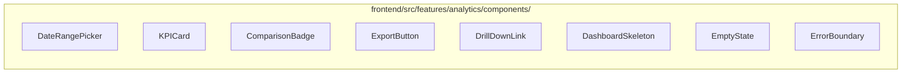

# 05 — Dashboard Specifications

**Version 4.0** | Phase 9 | AI Lead Intelligence Platform

---

## Table of Contents

1. [Overview](#1-overview)
2. [Dashboard Catalog](#2-dashboard-catalog)
3. [Executive Dashboard](#3-executive-dashboard)
4. [Operational Dashboard](#4-operational-dashboard)
5. [Workflow Analytics Dashboard](#5-workflow-analytics-dashboard)
6. [Revenue Dashboard](#6-revenue-dashboard)
7. [Shared Components](#7-shared-components)
8. [Responsive Layout](#8-responsive-layout)
9. [Export & Sharing](#9-export--sharing)

---

## 1. Overview

Phase 9 dashboards are available in three surfaces:

1. **In-app UI** — `/analytics/*` (tenant-scoped, role-based)
2. **Embedded widgets** — iframe/API embed for external portals
3. **Grafana** — `infra/monitoring/grafana/dashboards/analytics.json` (ops-scoped)

All dashboards consume the Metrics Engine and respect RBAC permissions (`analytics:read` minimum).

---

## 2. Dashboard Catalog

| Dashboard | Route | Audience | Permission |
|-----------|-------|----------|------------|
| Executive Overview | `/analytics/executive` | C-suite, VP Sales | `analytics:read` |
| Operational | `/analytics/operational` | Sales Ops, RevOps | `analytics:read` |
| Lead Intelligence | `/analytics/leads` | SDR, AE teams | `analytics:read` |
| CRM Pipeline | `/analytics/pipeline` | Sales managers | `analytics:read` + `crm:read` |
| Workflow Analytics | `/analytics/workflows` | Automation admins | `analytics:read` + `workflows:read` |
| Revenue & Forecasting | `/analytics/revenue` | Finance, RevOps | `analytics:read` + `billing:read` |
| Credit & Usage | `/analytics/usage` | Admins | `analytics:read` + `billing:read` |
| Custom Dashboards | `/analytics/custom/{id}` | Analysts | `analytics:write` |

---

## 3. Executive Dashboard

### 3.1 Layout

```
┌─────────────────────────────────────────────────────────────────────┐
│  Executive Overview          [Q2 2026 ▼] [Compare: Prev Quarter ▼]  │
├──────────┬──────────┬──────────┬──────────┬──────────┬──────────────┤
│ Pipeline │ Win Rate │ Lead     │ Platform │ Active   │ Forecast     │
│ Value    │          │ Velocity │ ROI      │ Deals    │ (30d)        │
│ $2.4M ↑  │ 22% ↓    │ 142/wk ↑ │ 340% ↑   │ 87 →     │ $2.8M        │
├──────────┴──────────┴──────────┴──────────┴──────────┴──────────────┤
│  KPI Scorecard (traffic lights)                                      │
├──────────────────────────────┬──────────────────────────────────────┤
│  Pipeline Trend (area chart) │  Lead Velocity (dual-axis line)      │
├──────────────────────────────┼──────────────────────────────────────┤
│  Conversion Funnel           │  AI Insights Panel                   │
├──────────────────────────────┴──────────────────────────────────────┤
│  Top Industries (horizontal bar) │ Geography Map (choropleth)      │
└─────────────────────────────────────────────────────────────────────┘
```

### 3.2 Panel Specifications

| Panel | Viz Type | Metric Keys | Refresh |
|-------|----------|-------------|---------|
| KPI Cards (6) | `kpi_card` | `revenue.pipeline_value`, `crm.win_rate`, `lead_velocity.contacts`, `efficiency.platform_roi`, `crm.active_deals`, `forecast.pipeline_value` | 5 min |
| Scorecard | `scorecard_grid` | All L1+L2 KPIs | 15 min |
| Pipeline Trend | `area_chart` | `revenue.pipeline_value` (daily, 90d) | 10 min |
| Lead Velocity | `dual_axis_line` | `lead_velocity.contacts`, `lead_velocity.companies` | 5 min |
| Conversion Funnel | `funnel_chart` | Contacts → Scored → Qualified → Deal → Won | 15 min |
| AI Insights | `insight_panel` | AI-generated (see doc 09) | 1 hr |
| Industries | `horizontal_bar` | `industry.breakdown` | 15 min |
| Geography | `choropleth_map` | `geography.breakdown` | 15 min |

### 3.3 API Bundle

```
GET /api/v1/analytics/dashboards/executive?period=quarter&compare=previous_period
```

---

## 4. Operational Dashboard

### 4.1 Layout

```
┌─────────────────────────────────────────────────────────────────────┐
│  Operational Analytics              [Last 30 Days ▼] [Export CSV]    │
├──────────┬──────────┬──────────┬──────────┬──────────────────────────┤
│ Contacts │ Companies│ Searches │ Avg Score│ Credits Used             │
│ 1,247    │ 423      │ 3,891    │ 58.2     │ 4,200 / 10,000           │
├──────────┴──────────┴──────────┴──────────┴──────────────────────────┤
│  Lead Velocity Over Time (stacked area)                              │
├──────────────────────────────┬──────────────────────────────────────┤
│  Score Distribution (donut)  │  Seniority Breakdown (bar)           │
├──────────────────────────────┼──────────────────────────────────────┤
│  Search Activity (line)      │  Credit Usage by Type (pie)          │
├──────────────────────────────┴──────────────────────────────────────┤
│  Recent Activity Feed (table)                                        │
└─────────────────────────────────────────────────────────────────────┘
```

### 4.2 Data Sources

Maps directly to existing v3 endpoints in `backend/app/analytics/router.py`:

| Panel | Endpoint | Cache TTL |
|-------|----------|-----------|
| Summary cards | `GET /analytics/dashboard` | 300s |
| Lead velocity | `GET /analytics/lead-velocity?days=30` | 300s |
| Score distribution | `GET /analytics/score-distribution` | 300s |
| Seniority | `GET /analytics/seniority` | none |
| Search activity | `GET /analytics/search-activity?days=30` | none |
| Credit usage | `GET /analytics/credits?days=30` | none |
| Full bundle | `GET /analytics/full` | 300s |

---

## 5. Workflow Analytics Dashboard

Extends Phase 8 workflow analytics (`docs/phase8/12-analytics-dashboard.md`) into the unified analytics hub.

### 5.1 Layout

```
┌─────────────────────────────────────────────────────────────────────┐
│  Workflow Analytics                 [Date Range ▼] [Export]          │
├──────────┬──────────┬──────────┬──────────┬──────────────────────────┤
│ Active   │ Runs 24h │ Success  │ Avg Time │ Pending                  │
│ Workflows│          │ Rate     │          │ Approvals                │
│    28    │  1,523   │  97.4%   │  3.2s    │    5                     │
├──────────┴──────────┴──────────┴──────────┴──────────────────────────┤
│  Executions Over Time (line chart)                                   │
├──────────────────────────────┬──────────────────────────────────────┤
│  Top Workflows by Volume     │  Failure Breakdown (donut)           │
├──────────────────────────────┼──────────────────────────────────────┤
│  Step Duration Heatmap       │  AI Node Usage (bar)                 │
├──────────────────────────────┼──────────────────────────────────────┤
│  Automation ROI Trend        │  Approval Funnel                     │
├──────────────────────────────┴──────────────────────────────────────┤
│  Recent Failures (table)                                             │
└─────────────────────────────────────────────────────────────────────┘
```

### 5.2 API Endpoints (v4)

```
GET /api/v1/analytics/workflows/summary
GET /api/v1/analytics/workflows/executions?from=&to=&granularity=hour
GET /api/v1/analytics/workflows/top?limit=10
GET /api/v1/analytics/workflows/failures?from=&to=
GET /api/v1/analytics/workflows/roi?from=&to=
```

### 5.3 Cross-Dashboard Link

Workflow dashboard links to operational dashboard via shared contact/deal drill-down:

```typescript
// Drill-down: click workflow execution count → filtered contact list
navigate(`/contacts?workflow_id=${workflowId}&created_after=${from}`);
```

---

## 6. Revenue Dashboard

### 6.1 Layout

| Row | Panels |
|-----|--------|
| KPI row | Pipeline Value, Weighted Pipeline, Avg Deal Size, Win Rate, Revenue Forecast |
| Chart row | Pipeline by Stage (funnel), Deal Value Trend (line), Win/Loss Ratio (donut) |
| Table row | Top Deals (table), Stage Aging (heatmap), Forecast vs Actual (combo chart) |

### 6.2 CRM Funnel Panel

Uses existing `GET /analytics/crm-funnel` with v4 enhancements:

```json
{
  "stages": [
    {"label": "Prospecting", "value": 45, "percentage": 32.1},
    {"label": "Qualification", "value": 28, "percentage": 20.0},
    {"label": "Proposal", "value": 18, "percentage": 12.9},
    {"label": "Negotiation", "value": 12, "percentage": 8.6},
    {"label": "Closed Won", "value": 37, "percentage": 26.4}
  ],
  "total_deals": 140,
  "total_value": 2400000,
  "avg_deal_value": 17142.86,
  "forecast_30d": 2800000,
  "forecast_confidence": 0.82
}
```

---

## 7. Shared Components

### 7.1 Component Library



### 7.2 DateRangePicker

| Preset | Range |
|--------|-------|
| Today | Current day |
| Last 7 days | Rolling 7d |
| Last 30 days | Rolling 30d (default) |
| This month | Month-to-date |
| This quarter | Quarter-to-date |
| This year | Year-to-date |
| Custom | User-defined with max 365 days |

### 7.3 ComparisonBadge

Displays period-over-period change with color coding:

```typescript
interface ComparisonBadgeProps {
  current: number;
  previous: number;
  format: 'number' | 'percent' | 'currency';
  higherIsBetter?: boolean;
}
// Renders: "↑ 12.4%" (green) or "↓ 3.2%" (red)
```

---

## 8. Responsive Layout

### 8.1 Grid System

12-column CSS grid with responsive breakpoints:

| Breakpoint | Columns | KPI Cards/Row | Chart Layout |
|------------|---------|---------------|--------------|
| ≥ 1440px (desktop) | 12 | 6 | Side-by-side |
| 1024–1439px (laptop) | 12 | 4 | Side-by-side |
| 768–1023px (tablet) | 8 | 2 | Stacked |
| < 768px (mobile) | 4 | 1 | Stacked |

### 8.2 Dashboard Config Schema

```typescript
interface DashboardConfig {
  id: string;
  name: string;
  layout: GridLayout[];
  globalFilters: FilterConfig[];
  refreshInterval: number;  // seconds, 0 = manual
  permissions: string[];
}

interface GridLayout {
  panelId: string;
  metricKey: string;
  vizType: VisualizationType;
  x: number; y: number;
  w: number; h: number;
  config: Record<string, unknown>;
}
```

Stored in `analytics.dashboard_configs` table (see doc 11).

---

## 9. Export & Sharing

### 9.1 Export Formats

| Format | Use Case | Endpoint |
|--------|----------|----------|
| PNG | Slide decks | Client-side (html2canvas) |
| PDF | Executive reports | `POST /analytics/export/pdf` |
| CSV | Data analysis | `POST /analytics/export/csv` |
| XLSX | Finance teams | `POST /analytics/export/xlsx` |
| JSON | API consumers | `GET /analytics/full` |

### 9.2 Scheduled Delivery

```json
{
  "dashboard_id": "executive",
  "schedule": "0 8 * * 1",
  "format": "pdf",
  "recipients": ["vp-sales@company.com"],
  "filters": {"period": "last_week"}
}
```

### 9.3 Share Links

```
POST /api/v1/analytics/dashboards/{id}/share
→ { "share_url": "https://app.example.com/analytics/shared/abc123", "expires_at": "..." }
```

Shared links require authentication and respect `analytics:read` permission.