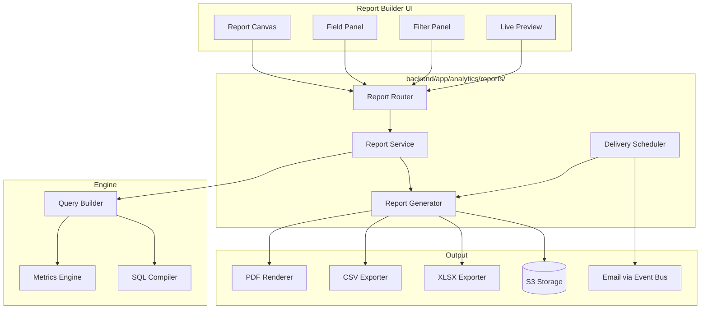
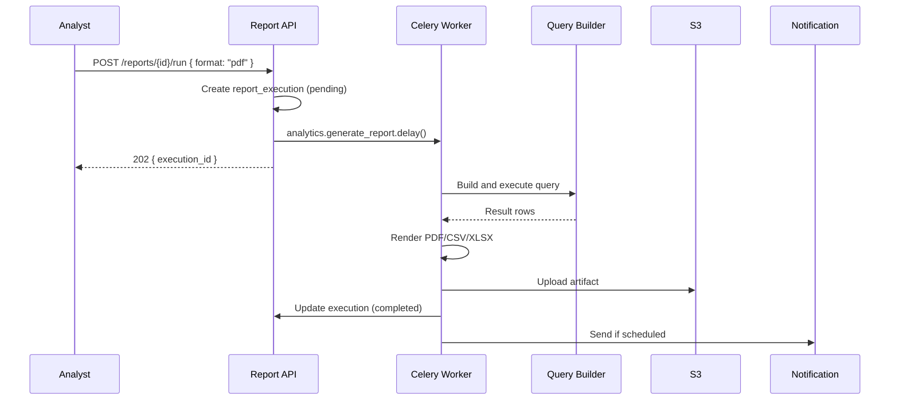

# 06 — Report Builder Design

**Version 4.0** | Phase 9 | AI Lead Intelligence Platform

---

## Table of Contents

1. [Overview](#1-overview)
2. [Architecture](#2-architecture)
3. [Report Definition Model](#3-report-definition-model)
4. [Query Builder](#4-query-builder)
5. [Report Templates](#5-report-templates)
6. [Generation Pipeline](#6-generation-pipeline)
7. [Scheduling & Delivery](#7-scheduling--delivery)
8. [UI Specification](#8-ui-specification)

---

## 1. Overview

The Report Builder enables **self-service analytics** for business analysts and power users. It provides:

- Drag-and-drop report design with dimensions, metrics, and filters
- Pre-built templates for common business questions
- Scheduled delivery via email with PDF/CSV/XLSX attachments
- Saved report definitions per tenant with version history

**Route:** `/analytics/reports`  
**Permission:** `analytics:write` (create/edit), `analytics:read` (view/run)

---

## 2. Architecture



---

## 3. Report Definition Model

### 3.1 Report Schema

```python
class ReportDefinition(BaseModel):
    id: UUID
    organization_id: UUID
    name: str
    description: str | None
    category: ReportCategory  # leads | pipeline | workflows | usage | custom
    layout: ReportLayout
    query: ReportQuery
    visualization: VisualizationConfig
    schedule: ReportSchedule | None
    created_by: UUID
    version: int
    is_published: bool

class ReportQuery(BaseModel):
    data_source: Literal["warehouse", "oltp", "metric"]
    dimensions: list[DimensionField]
    metrics: list[MetricField]
    filters: list[FilterCondition]
    sort: list[SortField]
    limit: int = 1000
    time_range: TimeRange | None

class DimensionField(BaseModel):
    key: str           # e.g. "industry", "geography", "seniority", "stage"
    label: str
    granularity: Granularity | None  # for date dimensions

class MetricField(BaseModel):
    key: str           # e.g. "lead_velocity.contacts", "crm.active_deals"
    label: str
    aggregation: Aggregation  # sum | avg | count | min | max
    format: ValueFormat  # number | currency | percent
```

### 3.2 Database Storage

```sql
CREATE TABLE analytics.report_definitions (
    id              UUID PRIMARY KEY DEFAULT gen_random_uuid(),
    organization_id UUID NOT NULL,
    name            VARCHAR(255) NOT NULL,
    description     TEXT,
    category        VARCHAR(50) NOT NULL,
    definition_json JSONB NOT NULL,
    version         INT NOT NULL DEFAULT 1,
    is_published    BOOLEAN NOT NULL DEFAULT FALSE,
    created_by      UUID NOT NULL,
    created_at      TIMESTAMPTZ NOT NULL DEFAULT NOW(),
    updated_at      TIMESTAMPTZ NOT NULL DEFAULT NOW()
);

CREATE TABLE analytics.report_versions (
    id              UUID PRIMARY KEY DEFAULT gen_random_uuid(),
    report_id       UUID NOT NULL REFERENCES analytics.report_definitions(id),
    version         INT NOT NULL,
    definition_json JSONB NOT NULL,
    changed_by      UUID NOT NULL,
    created_at      TIMESTAMPTZ NOT NULL DEFAULT NOW()
);

CREATE TABLE analytics.report_executions (
    id              UUID PRIMARY KEY DEFAULT gen_random_uuid(),
    report_id       UUID NOT NULL REFERENCES analytics.report_definitions(id),
    organization_id UUID NOT NULL,
    status          VARCHAR(20) NOT NULL,  -- pending, running, completed, failed
    format          VARCHAR(10) NOT NULL,  -- pdf, csv, xlsx, json
    row_count       INT,
    file_url        TEXT,
    started_at      TIMESTAMPTZ NOT NULL DEFAULT NOW(),
    completed_at    TIMESTAMPTZ,
    error_message   TEXT,
    triggered_by    UUID
);
```

---

## 4. Query Builder

### 4.1 Available Fields

| Category | Dimensions | Metrics |
|----------|-----------|---------|
| **Leads** | industry, geography, seniority, company_size, date | contacts_created, companies_created, avg_score |
| **Pipeline** | stage, status, owner, date | deal_count, total_value, avg_deal_value, win_rate |
| **Search** | date, query_type | search_count, avg_results |
| **Workflows** | workflow_name, trigger_type, node_type, date | execution_count, success_rate, avg_duration |
| **Billing** | transaction_type, date | credits_used, credits_remaining |

### 4.2 Filter Operators

| Operator | Types | Example |
|----------|-------|---------|
| `eq` | string, number | `industry eq "Technology"` |
| `neq` | string, number | `status neq "lost"` |
| `gt`, `gte`, `lt`, `lte` | number, date | `avg_score gte 60` |
| `in` | string, number | `country in ["US", "UK", "DE"]` |
| `between` | number, date | `created_at between "2026-01-01" and "2026-06-30"` |
| `contains` | string | `workflow_name contains "auto-score"` |

### 4.3 Generated SQL Example

Report: "Contacts by Industry and Seniority, Last 30 Days"

```sql
SELECT
    c.industry AS dimension_industry,
    ct.seniority_level AS dimension_seniority,
    COUNT(DISTINCT ct.id) AS metric_contacts_created,
    AVG(ls.overall_score) AS metric_avg_score
FROM core.contacts ct
JOIN core.companies c ON ct.company_id = c.id
LEFT JOIN ai.lead_scores ls ON ls.contact_id = ct.id
WHERE ct.organization_id = :org_id
  AND ct.deleted_at IS NULL
  AND ct.created_at >= :from_date
  AND ct.created_at <= :to_date
GROUP BY c.industry, ct.seniority_level
ORDER BY metric_contacts_created DESC
LIMIT 1000;
```

---

## 5. Report Templates

### 5.1 Built-in Templates

| Template | Category | Dimensions | Metrics |
|----------|----------|-----------|---------|
| Weekly Lead Summary | leads | date (week) | contacts, companies, avg_score |
| Pipeline Snapshot | pipeline | stage | deal_count, total_value, avg_days |
| Workflow Health Report | workflows | workflow_name | executions, success_rate, failures |
| Credit Usage Report | usage | transaction_type, date | credits_used |
| Industry Performance | leads | industry | contacts, deals, conversion_rate |
| Geography Expansion | leads | country | contacts, companies, avg_score |
| Executive Monthly | strategic | month | pipeline_value, win_rate, lead_velocity, roi |

### 5.2 Template Instantiation

```
POST /api/v1/analytics/reports/templates/{template_id}/instantiate
{
  "name": "My Weekly Lead Summary",
  "filters": { "period": "last_7_days" }
}
```

---

## 6. Generation Pipeline



### 6.1 Celery Task

```python
@celery_app.task(name="analytics.generate_report", queue="analytics", time_limit=300)
def generate_report_task(execution_id: str):
    execution = await get_execution(UUID(execution_id))
    report = await get_report_definition(execution.report_id)

    rows = await query_builder.execute(report.query, execution.organization_id)

    if execution.format == "pdf":
        file_bytes = await pdf_renderer.render(report, rows)
    elif execution.format == "csv":
        file_bytes = csv_exporter.export(rows)
    elif execution.format == "xlsx":
        file_bytes = xlsx_exporter.export(report, rows)

    url = await s3_upload(f"reports/{execution_id}.{execution.format}", file_bytes)
    await update_execution(execution_id, status="completed", file_url=url, row_count=len(rows))
```

### 6.2 Performance Limits

| Constraint | Limit |
|------------|-------|
| Max rows per report | 100,000 |
| Max generation time | 300s (Celery time_limit) |
| Max concurrent reports per org | 5 |
| Max saved reports per org | 50 (Starter), 200 (Pro), unlimited (Enterprise) |
| Max scheduled reports per org | 10 (Starter), 50 (Pro), unlimited (Enterprise) |

---

## 7. Scheduling & Delivery

### 7.1 Schedule Configuration

```python
class ReportSchedule(BaseModel):
    cron: str                    # "0 8 * * 1" = Monday 8 AM
    timezone: str = "UTC"
    format: Literal["pdf", "csv", "xlsx"]
    recipients: list[str]        # email addresses
    filters_override: dict | None
    is_active: bool = True
```

### 7.2 Delivery Flow

1. Celery beat triggers `analytics.deliver_scheduled_reports` every minute
2. Query `analytics.report_schedules` for due reports
3. Create `report_execution` record
4. Dispatch `analytics.generate_report` task
5. On completion, publish `report.generated` event
6. Notification service sends email with S3 pre-signed URL (24h expiry)

### 7.3 Email Template

```
Subject: [AI Lead Intelligence] Weekly Lead Summary — Jun 23–29, 2026

Your scheduled report "Weekly Lead Summary" is ready.

Summary:
- 312 contacts created (↑ 8% vs last week)
- 89 companies discovered
- Average lead score: 57.4

Download: [PDF Report] (expires in 24 hours)

Manage schedules: https://app.example.com/analytics/reports
```

---

## 8. UI Specification

### 8.1 Builder Layout

```
┌─────────────────────────────────────────────────────────────────────┐
│  Report Builder: Weekly Lead Summary    [Save] [Preview] [Run ▼]   │
├──────────────────┬──────────────────────────────────────────────────┤
│  FIELDS          │  CANVAS                                          │
│  ─────────────   │  ┌────────────────────────────────────────────┐  │
│  📊 Metrics      │  │  Table: Contacts by Industry               │  │
│    Contacts      │  │  ┌──────────┬────────┬──────────┐         │  │
│    Companies     │  │  │ Industry │ Count  │ Avg Score│         │  │
│    Avg Score     │  │  ├──────────┼────────┼──────────┤         │  │
│    Deals         │  │  │ Tech     │ 142    │ 62.1     │         │  │
│  ─────────────   │  │  │ Finance  │ 89     │ 55.3     │         │  │
│  📐 Dimensions   │  │  │ Health   │ 67     │ 58.7     │         │  │
│    Industry      │  │  └──────────┴────────┴──────────┘         │  │
│    Geography     │  └────────────────────────────────────────────┘  │
│    Seniority     │                                                  │
│    Date          │  FILTERS: Last 30 days | Score ≥ 40             │
│  ─────────────   │                                                  │
│  🔍 Filters      │                                                  │
│    Date Range    │                                                  │
│    Score Min     │                                                  │
│    Country       │                                                  │
└──────────────────┴──────────────────────────────────────────────────┘
```

### 8.2 Interaction Patterns

| Action | Behavior |
|--------|----------|
| Drag metric to canvas | Adds column to table / value to chart |
| Drag dimension to canvas | Adds grouping row/column |
| Click filter | Opens filter editor popover |
| Preview | Live query with 100-row limit |
| Run | Full query → download or email |
| Save | Persist to `report_definitions` with version bump |
| Switch viz type | Table ↔ Bar ↔ Line ↔ Pie (same underlying query) |