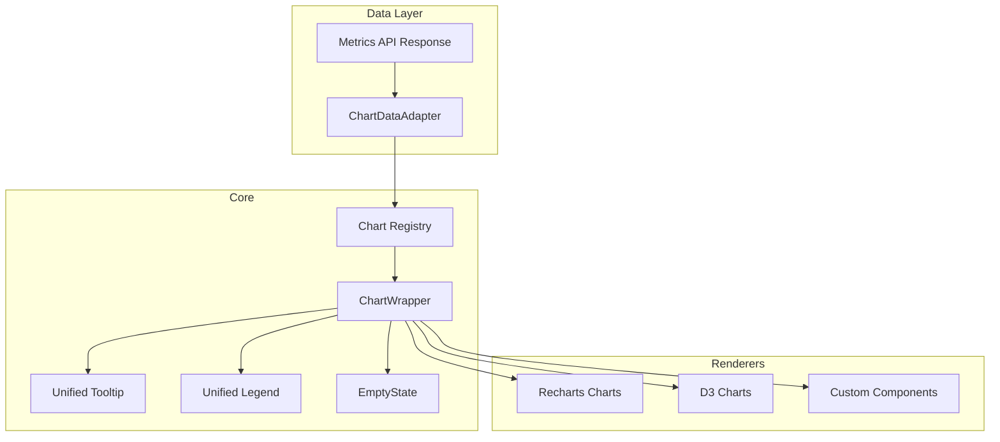

# 07 — Visualization Library

**Version 4.0** | Phase 9 | AI Lead Intelligence Platform

---

## Table of Contents

1. [Overview](#1-overview)
2. [Chart Catalog](#2-chart-catalog)
3. [Component Architecture](#3-component-architecture)
4. [Chart Specifications](#4-chart-specifications)
5. [Theming & Accessibility](#5-theming--accessibility)
6. [Data Adapters](#6-data-adapters)
7. [Performance Guidelines](#7-performance-guidelines)

---

## 1. Overview

The Visualization Library (`frontend/src/features/analytics/components/charts/`) provides 25+ chart types built on **Recharts** (standard charts) and **D3.js** (maps, heatmaps, custom). All charts consume a unified `ChartData` interface from the Metrics Engine.

---

## 2. Chart Catalog

| # | Type | Key | Library | Use Case |
|---|------|-----|---------|----------|
| 1 | KPI Card | `kpi_card` | Custom React | Single metric with trend badge |
| 2 | Scorecard Grid | `scorecard_grid` | Custom React | Multi-KPI traffic lights |
| 3 | Line Chart | `line_chart` | Recharts | Time-series trends |
| 4 | Area Chart | `area_chart` | Recharts | Volume over time |
| 5 | Stacked Area | `stacked_area` | Recharts | Multi-series volume |
| 6 | Bar Chart | `bar_chart` | Recharts | Category comparison |
| 7 | Horizontal Bar | `horizontal_bar` | Recharts | Ranked categories |
| 8 | Stacked Bar | `stacked_bar` | Recharts | Composition comparison |
| 9 | Grouped Bar | `grouped_bar` | Recharts | Side-by-side comparison |
| 10 | Donut Chart | `donut_chart` | Recharts | Part-of-whole |
| 11 | Pie Chart | `pie_chart` | Recharts | Simple distribution |
| 12 | Funnel Chart | `funnel_chart` | Custom D3 | Conversion funnel |
| 13 | Dual-Axis Line | `dual_axis_line` | Recharts | Two metrics, different scales |
| 14 | Combo Chart | `combo_chart` | Recharts | Bar + line overlay |
| 15 | Scatter Plot | `scatter_plot` | Recharts | Correlation analysis |
| 16 | Heatmap | `heatmap` | D3 | Step duration, activity patterns |
| 17 | Choropleth Map | `choropleth_map` | D3 + TopoJSON | Geography breakdown |
| 18 | Treemap | `treemap` | Recharts | Hierarchical proportions |
| 19 | Radar Chart | `radar_chart` | Recharts | Multi-dimensional comparison |
| 20 | Gauge | `gauge` | Custom D3 | Single metric vs target |
| 21 | Sparkline | `sparkline` | Recharts | Inline mini trend |
| 22 | Data Table | `data_table` | TanStack Table | Tabular with sort/filter |
| 23 | Insight Panel | `insight_panel` | Custom React | AI-generated text insights |
| 24 | Waterfall | `waterfall_chart` | Custom D3 | Incremental changes |
| 25 | Bullet Chart | `bullet_chart` | Custom D3 | KPI vs target vs range |

---

## 3. Component Architecture



### 3.1 Unified Interface

```typescript
// frontend/src/features/analytics/types/chart.ts

interface ChartData {
  series: TimeSeriesPoint[];
  breakdown: BreakdownItem[];
  comparison?: ComparisonResult;
  metadata: ChartMetadata;
}

interface ChartConfig {
  type: VisualizationType;
  title: string;
  subtitle?: string;
  metricKey: string;
  colors?: string[];
  showLegend?: boolean;
  showTooltip?: boolean;
  showGrid?: boolean;
  yAxisFormat?: ValueFormat;
  xAxisFormat?: ValueFormat;
  height?: number;
  interactive?: boolean;
}

interface ChartProps {
  data: ChartData;
  config: ChartConfig;
  onDrillDown?: (filter: DrillDownFilter) => void;
  loading?: boolean;
  error?: string | null;
}
```

### 3.2 Chart Registry

```typescript
const CHART_REGISTRY: Record<VisualizationType, React.ComponentType<ChartProps>> = {
  kpi_card: KPICard,
  line_chart: LineChart,
  area_chart: AreaChart,
  donut_chart: DonutChart,
  funnel_chart: FunnelChart,
  heatmap: HeatmapChart,
  choropleth_map: ChoroplethMap,
  // ... all 25 types
};

function renderChart(type: VisualizationType, props: ChartProps) {
  const Component = CHART_REGISTRY[type];
  if (!Component) throw new Error(`Unknown chart type: ${type}`);
  return <Component {...props} />;
}
```

---

## 4. Chart Specifications

### 4.1 KPI Card

```
┌─────────────────────┐
│  Pipeline Value      │
│  $2,400,000          │
│  ↑ 12.4% vs last Q  │
│  ▁▂▃▅▆▇ sparkline   │
└─────────────────────┘
```

```typescript
interface KPICardConfig extends ChartConfig {
  format: 'number' | 'currency' | 'percent';
  comparisonPeriod?: 'previous_period' | 'previous_year';
  showSparkline?: boolean;
  sparklineDays?: number;
  target?: number;
  targetLabel?: string;
}
```

### 4.2 Funnel Chart

```typescript
interface FunnelChartConfig extends ChartConfig {
  stages: string[];          // ordered stage names
  showConversionRates?: boolean;
  showValues?: boolean;
  orientation: 'vertical' | 'horizontal';
}
```

### 4.3 Heatmap

Used for workflow step duration (from Phase 8):

```typescript
interface HeatmapConfig extends ChartConfig {
  xAxis: string;            // e.g. "hour_of_day"
  yAxis: string;            // e.g. "node_type"
  valueKey: string;         // e.g. "avg_duration_ms"
  colorScale: 'sequential' | 'diverging';
  cellSize?: number;
}
```

### 4.4 Choropleth Map

```typescript
interface ChoroplethConfig extends ChartConfig {
  geoKey: string;           // ISO 3166-1 alpha-2 country code field
  valueKey: string;
  projection: 'naturalEarth' | 'mercator';
  colorScheme: string[];    // default: platform brand gradient
  showLabels?: boolean;
}
```

---

## 5. Theming & Accessibility

### 5.1 Color Palette

| Purpose | Light Mode | Dark Mode |
|---------|-----------|-----------|
| Primary | `#2563eb` | `#3b82f6` |
| Success (green) | `#22c55e` | `#4ade80` |
| Warning (yellow) | `#eab308` | `#facc15` |
| Danger (red) | `#ef4444` | `#f87171` |
| Neutral | `#6b7280` | `#9ca3af` |
| Chart series (8) | ColorBrewer Set2 | ColorBrewer Set2 (adjusted) |

### 5.2 Score Bucket Colors

Matches existing `service.py` bucket colors:

| Bucket | Color | Hex |
|--------|-------|-----|
| 0–20 | Red | `#ef4444` |
| 21–40 | Orange | `#f97316` |
| 41–60 | Yellow | `#eab308` |
| 61–80 | Green | `#22c55e` |
| 81–100 | Emerald | `#10b981` |

### 5.3 Accessibility

| Requirement | Implementation |
|-------------|----------------|
| Color contrast | WCAG 2.1 AA (4.5:1 text, 3:1 graphics) |
| Screen readers | `aria-label` on all charts, data table fallback |
| Keyboard nav | Tab through interactive elements, Enter to drill-down |
| Color blindness | Pattern fills + labels, not color-only encoding |
| Motion | `prefers-reduced-motion` disables animations |
| Tooltips | Always include exact value + percentage |

---

## 6. Data Adapters

### 6.1 MetricResult → ChartData

```typescript
function adaptMetricToChart(result: MetricResult, config: ChartConfig): ChartData {
  switch (config.type) {
    case 'kpi_card':
      return { series: result.series, comparison: result.comparison, ... };
    case 'donut_chart':
    case 'pie_chart':
      return { breakdown: result.breakdown, ... };
    case 'line_chart':
    case 'area_chart':
      return { series: result.series, ... };
    case 'funnel_chart':
      return { breakdown: result.breakdown, ... };
    case 'data_table':
      return { breakdown: result.breakdown, series: result.series, ... };
    default:
      return { series: result.series, breakdown: result.breakdown, ... };
  }
}
```

### 6.2 BreakdownItem Colors

```typescript
function assignColors(items: BreakdownItem[], scheme?: string[]): BreakdownItem[] {
  const colors = scheme || CHART_SERIES_COLORS;
  return items.map((item, i) => ({
    ...item,
    color: item.color || colors[i % colors.length],
  }));
}
```

---

## 7. Performance Guidelines

| Chart Type | Max Data Points | Strategy |
|------------|----------------|----------|
| Line/Area | 365 (daily, 1 year) | Recharts native |
| Bar | 50 categories | Top-N + "Other" bucket |
| Donut/Pie | 12 slices | Top-N + "Other" |
| Heatmap | 24 × 20 cells | Pre-aggregate server-side |
| Choropleth | 200 countries | TopoJSON simplification |
| Data Table | 1,000 rows | Virtual scroll (TanStack Virtual) |
| Sparkline | 30 points | Inline SVG, no animation |

### 7.1 Lazy Loading

```typescript
const FunnelChart = lazy(() => import('./FunnelChart'));
const ChoroplethMap = lazy(() => import('./ChoroplethMap'));
const HeatmapChart = lazy(() => import('./HeatmapChart'));
// D3 charts loaded on demand to reduce bundle size
```

### 7.2 Server-Side Aggregation

Charts requesting > 365 data points trigger server-side downsampling:

```
GET /api/v1/analytics/metrics/{key}?granularity=day&from=2024-01-01&to=2026-06-29
→ API auto-downsamples to week if > 365 points
```