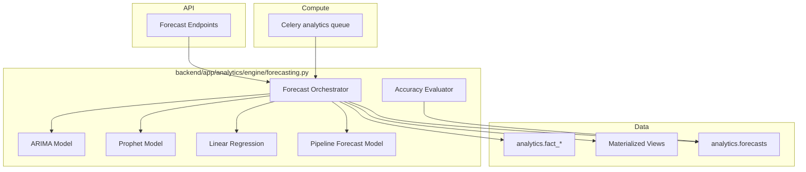
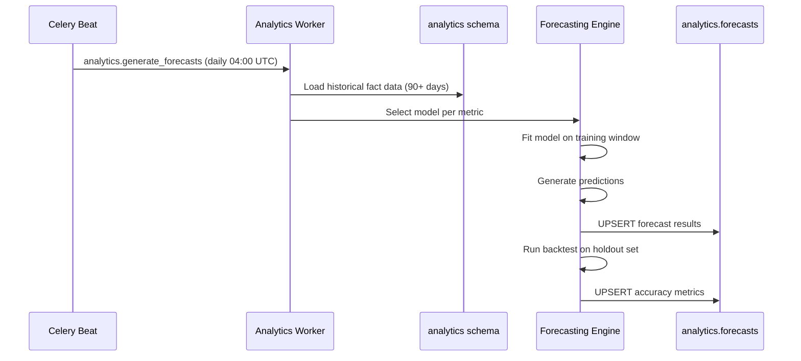

# 08 — Forecasting Engine Design

**Version 4.0** | Phase 9 | AI Lead Intelligence Platform

---

## Table of Contents

1. [Overview](#1-overview)
2. [Architecture](#2-architecture)
3. [Forecast Models](#3-forecast-models)
4. [Forecast Types](#4-forecast-types)
5. [Training Pipeline](#5-training-pipeline)
6. [API Interface](#6-api-interface)
7. [Accuracy & Backtesting](#7-accuracy--backtesting)
8. [Storage Schema](#8-storage-schema)

---

## 1. Overview

The Forecasting Engine (`backend/app/analytics/engine/forecasting.py`) provides predictive analytics for:

- Pipeline value forecasting (30/60/90 day horizons)
- Lead velocity projections
- Credit burn rate prediction
- Revenue forecasting from weighted pipeline

Forecasts run as **Celery batch jobs** (daily) with on-demand refresh via API.

---

## 2. Architecture



---

## 3. Forecast Models

### 3.1 Model Selection Matrix

| Metric | Primary Model | Fallback | Min History |
|--------|--------------|----------|-------------|
| Contact velocity | ARIMA(1,1,1) | Linear regression | 30 days |
| Pipeline value | Prophet | ARIMA(2,1,2) | 60 days |
| Credit burn | Linear regression | Moving average | 14 days |
| Revenue (won deals) | Pipeline × win rate | Prophet | 90 days |
| Workflow executions | ARIMA(1,1,1) | Moving average | 30 days |

### 3.2 ARIMA Configuration

```python
from statsmodels.tsa.arima.model import ARIMA

class ARIMAForecaster:
    def __init__(self, order: tuple[int, int, int] = (1, 1, 1)):
        self.order = order

    async def fit_predict(
        self, series: pd.Series, horizon: int, confidence: float = 0.95
    ) -> ForecastResult:
        model = ARIMA(series, order=self.order)
        fitted = model.fit()
        forecast = fitted.get_forecast(steps=horizon)
        return ForecastResult(
            points=forecast.predicted_mean.tolist(),
            lower_bound=forecast.conf_int(alpha=1 - confidence).iloc[:, 0].tolist(),
            upper_bound=forecast.conf_int(alpha=1 - confidence).iloc[:, 1].tolist(),
            model_name=f"ARIMA{self.order}",
        )
```

### 3.3 Prophet Configuration

```python
from prophet import Prophet

class ProphetForecaster:
    async def fit_predict(
        self, df: pd.DataFrame, horizon: int, confidence: float = 0.95
    ) -> ForecastResult:
        model = Prophet(
            yearly_seasonality=True,
            weekly_seasonality=True,
            daily_seasonality=False,
            interval_width=confidence,
        )
        model.fit(df)  # columns: ds (datetime), y (value)
        future = model.make_future_dataframe(periods=horizon)
        forecast = model.predict(future)
        return ForecastResult(
            points=forecast['yhat'].tail(horizon).tolist(),
            lower_bound=forecast['yhat_lower'].tail(horizon).tolist(),
            upper_bound=forecast['yhat_upper'].tail(horizon).tolist(),
            model_name="Prophet",
        )
```

### 3.4 Pipeline Revenue Model

```python
class PipelineForecastModel:
    """Revenue forecast = weighted_pipeline × historical_win_rate × time_factor"""

    async def forecast(self, org_id: UUID, horizon_days: int) -> ForecastResult:
        weighted_pipeline = await self._get_weighted_pipeline(org_id)
        win_rate = await self._get_trailing_win_rate(org_id, days=90)
        velocity = await self._get_pipeline_velocity(org_id)

        daily_close_rate = win_rate / velocity if velocity else 0
        points = []
        remaining = weighted_pipeline

        for day in range(1, horizon_days + 1):
            daily_revenue = remaining * daily_close_rate
            points.append(daily_revenue)
            remaining -= daily_revenue

        return ForecastResult(
            points=points,
            total_forecast=sum(points),
            model_name="pipeline_revenue",
            confidence=win_rate,
        )
```

---

## 4. Forecast Types

### 4.1 Point Forecast

Single-value prediction for a specific future date:

```json
{
  "metric_key": "forecast.pipeline_value",
  "horizon_days": 30,
  "forecast_date": "2026-07-29",
  "point_value": 2800000,
  "lower_bound": 2400000,
  "upper_bound": 3200000,
  "confidence": 0.82,
  "model": "Prophet"
}
```

### 4.2 Series Forecast

Daily predictions over a horizon:

```json
{
  "metric_key": "forecast.contact_velocity",
  "horizon_days": 30,
  "series": [
    {"date": "2026-06-30", "value": 48, "lower": 38, "upper": 58},
    {"date": "2026-07-01", "value": 51, "lower": 40, "upper": 62}
  ],
  "model": "ARIMA(1,1,1)",
  "mape": 12.4
}
```

### 4.3 Scenario Forecast

What-if analysis with adjustable parameters:

```json
{
  "metric_key": "forecast.revenue",
  "scenarios": [
    {"name": "conservative", "win_rate_adjustment": -0.05, "value": 1800000},
    {"name": "baseline", "win_rate_adjustment": 0, "value": 2400000},
    {"name": "optimistic", "win_rate_adjustment": 0.05, "value": 3100000}
  ]
}
```

---

## 5. Training Pipeline



### 5.1 Celery Task

```python
@celery_app.task(name="analytics.generate_forecasts", queue="analytics")
def generate_forecasts_task(org_id: str | None = None):
    orgs = [UUID(org_id)] if org_id else get_active_org_ids()
    for org in orgs:
        for metric_key, config in FORECAST_CONFIGS.items():
            history = asyncio.run(load_history(org, metric_key, days=config.min_history))
            if len(history) < config.min_history:
                continue
            forecaster = select_model(metric_key, len(history))
            result = asyncio.run(forecaster.fit_predict(history, config.horizon))
            asyncio.run(save_forecast(org, metric_key, result))
```

### 5.2 FORECAST_CONFIGS

```python
FORECAST_CONFIGS = {
    "forecast.contact_velocity": ForecastConfig(model="arima", horizon=30, min_history=30),
    "forecast.pipeline_value": ForecastConfig(model="prophet", horizon=90, min_history=60),
    "forecast.credit_burn": ForecastConfig(model="linear", horizon=30, min_history=14),
    "forecast.revenue": ForecastConfig(model="pipeline", horizon=90, min_history=90),
    "forecast.workflow_executions": ForecastConfig(model="arima", horizon=30, min_history=30),
}
```

---

## 6. API Interface

```
GET  /api/v1/analytics/forecasts                          # List available forecasts
GET  /api/v1/analytics/forecasts/{metric_key}           # Get latest forecast
GET  /api/v1/analytics/forecasts/{metric_key}/series    # Get series forecast
POST /api/v1/analytics/forecasts/{metric_key}/refresh   # Trigger on-demand forecast
POST /api/v1/analytics/forecasts/scenarios              # Run scenario analysis
GET  /api/v1/analytics/forecasts/{metric_key}/accuracy  # Get backtest accuracy
```

### 6.1 Response Schema

```python
class ForecastResponse(BaseModel):
    metric_key: str
    metric_name: str
    model: str
    horizon_days: int
    generated_at: datetime
    point_value: float | None
    series: list[ForecastPoint] = []
    confidence: float
    mape: float | None
    scenarios: list[ScenarioForecast] = []

class ForecastPoint(BaseModel):
    date: str
    value: float
    lower_bound: float | None = None
    upper_bound: float | None = None
```

---

## 7. Accuracy & Backtesting

### 7.1 Backtesting Protocol

1. Split historical data: 80% train, 20% holdout
2. Fit model on training set
3. Predict holdout period
4. Calculate accuracy metrics
5. Store in `analytics.forecast_accuracy`

### 7.2 Accuracy Metrics

| Metric | Formula | Target |
|--------|---------|--------|
| MAPE | `mean(|actual - predicted| / actual) × 100` | < 15% |
| RMSE | `sqrt(mean((actual - predicted)²))` | Context-dependent |
| MAE | `mean(|actual - predicted|)` | Context-dependent |
| Coverage | `% of actuals within confidence interval` | ≥ 90% |

### 7.3 Model Auto-Selection

If backtest MAPE > 20%, the engine automatically tries the fallback model:

```python
async def select_best_model(metric_key: str, history: pd.Series) -> Forecaster:
    candidates = MODEL_CANDIDATES[metric_key]
    best_model, best_mape = None, float('inf')

    for model_cls in candidates:
        mape = await backtest(model_cls, history)
        if mape < best_mape:
            best_model, best_mape = model_cls, mape

    if best_mape > 0.20:
        logger.warning("Best model MAPE %.1f%% exceeds threshold for %s", best_mape * 100, metric_key)

    return best_model()
```

---

## 8. Storage Schema

```sql
CREATE TABLE analytics.forecasts (
    id              UUID PRIMARY KEY DEFAULT gen_random_uuid(),
    organization_id UUID NOT NULL,
    metric_key      VARCHAR(100) NOT NULL,
    model_name      VARCHAR(50) NOT NULL,
    horizon_days    INT NOT NULL,
    forecast_date   DATE NOT NULL,
    point_value     DECIMAL(15,4),
    lower_bound     DECIMAL(15,4),
    upper_bound     DECIMAL(15,4),
    confidence      DECIMAL(5,4),
    generated_at    TIMESTAMPTZ NOT NULL DEFAULT NOW(),

    UNIQUE (organization_id, metric_key, forecast_date, generated_at)
);

CREATE TABLE analytics.forecast_accuracy (
    id              UUID PRIMARY KEY DEFAULT gen_random_uuid(),
    organization_id UUID NOT NULL,
    metric_key      VARCHAR(100) NOT NULL,
    model_name      VARCHAR(50) NOT NULL,
    evaluation_date DATE NOT NULL,
    mape            DECIMAL(8,4),
    rmse            DECIMAL(15,4),
    mae             DECIMAL(15,4),
    coverage        DECIMAL(5,4),
    holdout_days    INT NOT NULL,
    evaluated_at    TIMESTAMPTZ NOT NULL DEFAULT NOW()
);

CREATE INDEX idx_forecasts_org_metric ON analytics.forecasts (organization_id, metric_key, forecast_date);
```