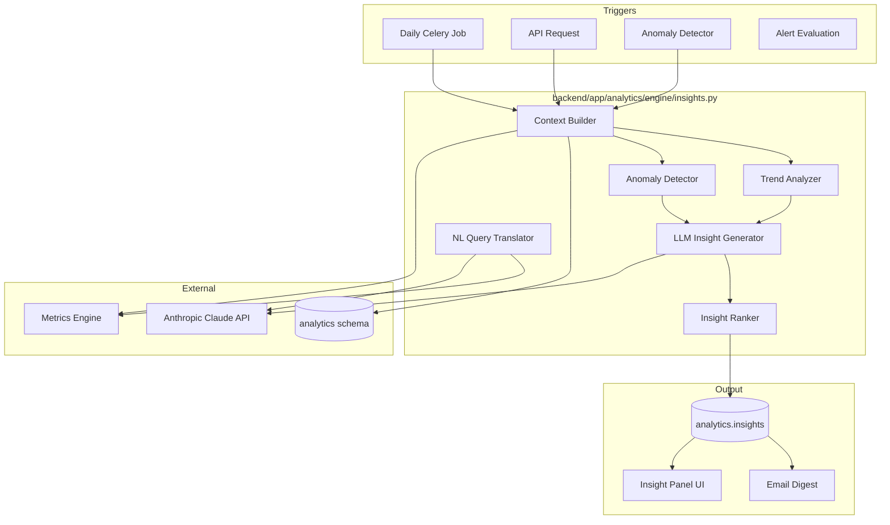
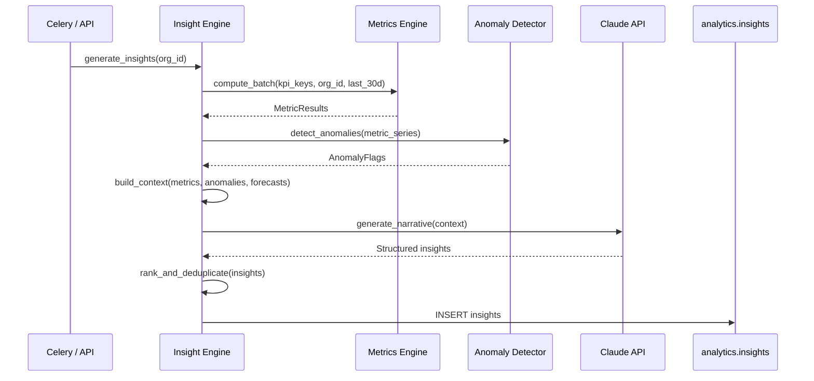
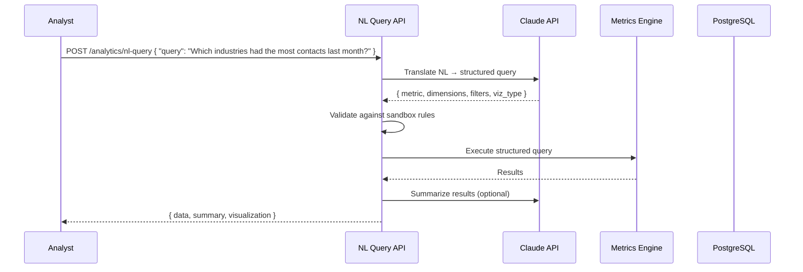

# 09 — AI Insight Engine

**Version 4.0** | Phase 9 | AI Lead Intelligence Platform

---

## Table of Contents

1. [Overview](#1-overview)
2. [Architecture](#2-architecture)
3. [Insight Types](#3-insight-types)
4. [Generation Pipeline](#4-generation-pipeline)
5. [Natural Language Queries](#5-natural-language-queries)
6. [Anomaly Detection](#6-anomaly-detection)
7. [Prompt Engineering](#7-prompt-engineering)
8. [API Interface](#8-api-interface)

---

## 1. Overview

The AI Insight Engine (`backend/app/analytics/engine/insights.py`) transforms raw metrics into **actionable business intelligence** using:

- LLM-powered narrative summaries (Anthropic Claude)
- Statistical anomaly detection (Isolation Forest)
- Trend analysis and correlation discovery
- Natural-language query interface for non-technical users

Insights appear in dashboard panels, email digests, and alert notifications.

---

## 2. Architecture



---

## 3. Insight Types

| Type | Description | Trigger | Priority |
|------|-------------|---------|----------|
| `trend` | Significant trend detected (up/down) | Metric change > 20% | Medium |
| `anomaly` | Statistical outlier in metric | Isolation Forest score < -0.5 | High |
| `correlation` | Two metrics moving together | Correlation > 0.7 | Low |
| `recommendation` | Actionable suggestion | LLM analysis | Medium |
| `milestone` | KPI target reached/missed | Threshold crossing | High |
| `forecast` | Forecast deviation from actual | MAPE > 20% | Medium |
| `comparison` | Period-over-period notable change | Change > 15% | Low |

### 3.1 Insight Schema

```python
class Insight(BaseModel):
    id: UUID
    organization_id: UUID
    type: InsightType
    priority: Literal["low", "medium", "high", "critical"]
    title: str
    summary: str
    detail: str | None
    metric_keys: list[str]
    data: dict                          # Supporting data points
    recommended_actions: list[str]
    confidence: float                   # 0.0 – 1.0
    generated_at: datetime
    expires_at: datetime | None
    is_dismissed: bool = False
```

---

## 4. Generation Pipeline



### 4.1 Context Builder

```python
async def build_insight_context(org_id: UUID) -> InsightContext:
    metrics = await metrics_engine.compute_batch(KPI_KEYS, org_id, TimeRange.last_30_days())
    comparisons = await metrics_engine.compute_batch(KPI_KEYS, org_id, TimeRange.last_30_days(),
                                                      comparison=ComparisonPeriod.previous_period())
    forecasts = await forecasting_engine.get_latest(org_id)
    anomalies = await anomaly_detector.scan(org_id, metrics)

    return InsightContext(
        organization=await get_org_summary(org_id),
        metrics=metrics,
        comparisons=comparisons,
        forecasts=forecasts,
        anomalies=anomalies,
        period=TimeRange.last_30_days(),
    )
```

### 4.2 Celery Schedule

```python
@celery_app.task(name="analytics.generate_insights", queue="analytics")
def generate_insights_task(org_id: str | None = None):
    orgs = [UUID(org_id)] if org_id else get_active_org_ids()
    for org in orgs:
        asyncio.run(insight_engine.generate(org))
```

Runs daily at 06:00 UTC (after forecast generation at 04:00).

---

## 5. Natural Language Queries

### 5.1 Flow



### 5.2 NL → Structured Query Translation

```python
NL_QUERY_SYSTEM_PROMPT = """
You are an analytics query translator for a lead intelligence platform.
Convert natural language questions into structured analytics queries.

Available metrics: {metric_catalog}
Available dimensions: industry, geography, seniority, stage, workflow_name, date
Available filters: date ranges, score thresholds, deal status

Output JSON:
{
  "metric_key": "...",
  "dimensions": ["..."],
  "filters": [{"field": "...", "operator": "...", "value": "..."}],
  "time_range": {"from": "...", "to": "..."},
  "visualization": "bar_chart|line_chart|table|...",
  "sort": {"field": "...", "direction": "desc"}
}
"""
```

### 5.3 Example Queries

| NL Query | Structured Output |
|----------|-------------------|
| "How many contacts did we add last week?" | `metric: lead_velocity.contacts, time_range: last_7_days` |
| "Which industries have the highest avg score?" | `metric: score.avg, dimensions: [industry], sort: desc` |
| "Show me workflow failures this month" | `metric: workflow.failure_count, time_range: this_month` |
| "Compare pipeline value to last quarter" | `metric: revenue.pipeline_value, comparison: previous_period` |
| "What's our credit burn rate?" | `metric: billing.burn_rate, time_range: this_month` |

### 5.4 Safety Constraints

| Constraint | Enforcement |
|------------|-------------|
| Tenant scope | Auto-inject `organization_id` |
| No raw SQL from NL | LLM outputs structured query only; SQL compiled server-side |
| Rate limit | 20 NL queries per user per hour |
| Credit cost | 1 AI credit per NL query |
| Audit log | All NL queries logged in `analytics.nl_query_log` |

---

## 6. Anomaly Detection

### 6.1 Isolation Forest

```python
from sklearn.ensemble import IsolationForest

class AnomalyDetector:
    def __init__(self, contamination: float = 0.05):
        self.model = IsolationForest(contamination=contamination, random_state=42)

    async def scan(self, org_id: UUID, metrics: dict[str, MetricResult]) -> list[AnomalyFlag]:
        anomalies = []
        for key, result in metrics.items():
            if len(result.series) < 14:
                continue
            values = [p.value for p in result.series]
            scores = self.model.fit_predict(np.array(values).reshape(-1, 1))
            for i, score in enumerate(scores):
                if score == -1:
                    anomalies.append(AnomalyFlag(
                        metric_key=key,
                        date=result.series[i].date,
                        value=values[i],
                        expected_range=self._expected_range(values, i),
                        severity="high" if self._is_extreme(values[i], values) else "medium",
                    ))
        return anomalies
```

### 6.2 Anomaly → Insight Conversion

```python
async def anomaly_to_insight(flag: AnomalyFlag, org_id: UUID) -> Insight:
    return Insight(
        type="anomaly",
        priority="high" if flag.severity == "high" else "medium",
        title=f"Unusual {flag.metric_key} on {flag.date}",
        summary=f"Value {flag.value} is outside expected range {flag.expected_range}",
        metric_keys=[flag.metric_key],
        recommended_actions=[
            "Review activity on this date for data quality issues",
            "Check if a workflow or campaign caused the spike",
        ],
        confidence=0.85,
    )
```

---

## 7. Prompt Engineering

### 7.1 Insight Generation Prompt

```
You are a senior RevOps analyst for {org_name}. Analyze the following metrics
and generate 3-5 actionable insights.

METRICS (current period):
{metrics_json}

COMPARISONS (vs previous period):
{comparisons_json}

ANOMALIES DETECTED:
{anomalies_json}

FORECASTS:
{forecasts_json}

For each insight, provide:
1. title (max 80 chars)
2. summary (2-3 sentences)
3. recommended_actions (1-3 bullet points)
4. priority (low/medium/high/critical)
5. confidence (0.0-1.0)

Focus on: trends, risks, opportunities, and actionable recommendations.
Do not repeat obvious facts. Prioritize insights that require action.
```

### 7.2 Token Budget

| Component | Max Tokens |
|-----------|-----------|
| Context (metrics + comparisons) | 4,000 |
| System prompt | 500 |
| Response | 2,000 |
| Total per org | ~6,500 |

### 7.3 Cost Management

| Plan Tier | Daily Insight Budget | NL Queries/Day |
|-----------|---------------------|--------------|
| Starter | 1 generation/day | 5 |
| Professional | 2 generations/day | 20 |
| Enterprise | Unlimited | 100 |

---

## 8. API Interface

```
GET  /api/v1/analytics/insights                     # List active insights
GET  /api/v1/analytics/insights/{id}                # Get insight detail
POST /api/v1/analytics/insights/generate            # Trigger on-demand generation
POST /api/v1/analytics/insights/{id}/dismiss        # Dismiss insight
POST /api/v1/analytics/nl-query                       # Natural language query
GET  /api/v1/analytics/nl-query/history               # Query history
```

### 8.1 Storage Schema

```sql
CREATE TABLE analytics.insights (
    id                  UUID PRIMARY KEY DEFAULT gen_random_uuid(),
    organization_id     UUID NOT NULL,
    type                VARCHAR(30) NOT NULL,
    priority            VARCHAR(10) NOT NULL,
    title               VARCHAR(255) NOT NULL,
    summary             TEXT NOT NULL,
    detail              TEXT,
    metric_keys         TEXT[] NOT NULL,
    data                JSONB,
    recommended_actions TEXT[],
    confidence          DECIMAL(5,4),
    generated_at        TIMESTAMPTZ NOT NULL DEFAULT NOW(),
    expires_at          TIMESTAMPTZ,
    is_dismissed        BOOLEAN NOT NULL DEFAULT FALSE,
    dismissed_by        UUID,
    dismissed_at        TIMESTAMPTZ
);

CREATE TABLE analytics.nl_query_log (
    id              UUID PRIMARY KEY DEFAULT gen_random_uuid(),
    organization_id UUID NOT NULL,
    user_id         UUID NOT NULL,
    query_text      TEXT NOT NULL,
    parsed_query    JSONB,
    result_summary  TEXT,
    credits_used    INT NOT NULL DEFAULT 1,
    duration_ms     INT,
    created_at      TIMESTAMPTZ NOT NULL DEFAULT NOW()
);

CREATE INDEX idx_insights_org_active ON analytics.insights (organization_id, is_dismissed, generated_at DESC);
```