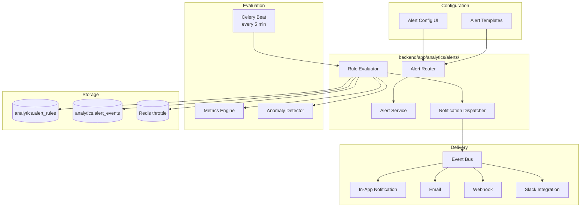
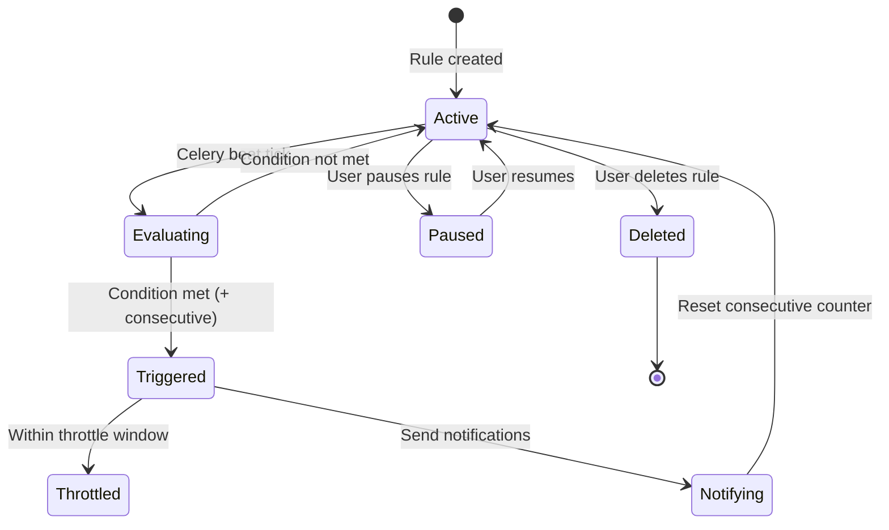

# 10 — Alerting System

**Version 4.0** | Phase 9 | AI Lead Intelligence Platform

---

## Table of Contents

1. [Overview](#1-overview)
2. [Architecture](#2-architecture)
3. [Alert Rule Types](#3-alert-rule-types)
4. [Evaluation Engine](#4-evaluation-engine)
5. [Notification Channels](#5-notification-channels)
6. [Alert Lifecycle](#6-alert-lifecycle)
7. [Default Alert Templates](#7-default-alert-templates)
8. [API Interface](#8-api-interface)

---

## 1. Overview

The Alerting System (`backend/app/analytics/alerts/`) monitors KPIs and triggers notifications when conditions are met. It supports:

- **Threshold alerts** — metric crosses a defined boundary
- **Trend alerts** — sustained directional change
- **Anomaly alerts** — statistical outlier detection (from AI Insight Engine)
- **Composite alerts** — multiple conditions with AND/OR logic

Alerts integrate with the platform notification system via the event bus.

---

## 2. Architecture



---

## 3. Alert Rule Types

### 3.1 Threshold Alert

```yaml
type: threshold
metric_key: score.avg
condition:
  operator: lt          # lt, lte, gt, gte, eq, neq
  value: 40
evaluation:
  window: 1d            # evaluate over 1 day
  consecutive: 3        # must be true for 3 consecutive evaluations
severity: high
```

### 3.2 Trend Alert

```yaml
type: trend
metric_key: lead_velocity.contacts
condition:
  direction: down       # up, down, either
  change_percent: 30    # minimum % change
  period: 7d            # over 7 days
severity: medium
```

### 3.3 Anomaly Alert

```yaml
type: anomaly
metric_key: billing.burn_rate
condition:
  detector: isolation_forest
  sensitivity: 0.05     # contamination parameter
severity: high
```

### 3.4 Composite Alert

```yaml
type: composite
logic: AND
conditions:
  - type: threshold
    metric_key: crm.active_deals
    operator: lt
    value: 10
  - type: trend
    metric_key: lead_velocity.contacts
    direction: down
    change_percent: 20
    period: 7d
severity: critical
```

### 3.5 Alert Rule Schema

```python
class AlertRule(BaseModel):
    id: UUID
    organization_id: UUID
    name: str
    description: str | None
    type: AlertType
    metric_key: str
    condition: AlertCondition
    severity: Literal["low", "medium", "high", "critical"]
    channels: list[NotificationChannel]
    recipients: list[UUID]              # user IDs
    throttle_minutes: int = 60            # min time between repeat alerts
    is_active: bool = True
    created_by: UUID
```

---

## 4. Evaluation Engine

### 4.1 Evaluation Loop

```python
# backend/app/analytics/alerts/evaluator.py

@celery_app.task(name="analytics.evaluate_alerts", queue="analytics")
def evaluate_alerts_task():
    rules = asyncio.run(get_active_rules())
    for rule in rules:
        try:
            result = asyncio.run(evaluate_rule(rule))
            if result.triggered:
                asyncio.run(handle_alert_triggered(rule, result))
        except Exception as e:
            logger.error("Alert evaluation failed for rule %s: %s", rule.id, e)

async def evaluate_rule(rule: AlertRule) -> EvaluationResult:
    if await is_throttled(rule):
        return EvaluationResult(triggered=False, reason="throttled")

    metric = await metrics_engine.compute(
        rule.metric_key, rule.organization_id, rule.condition.time_range
    )

    match rule.type:
        case AlertType.threshold:
            return evaluate_threshold(metric, rule.condition)
        case AlertType.trend:
            return evaluate_trend(metric, rule.condition)
        case AlertType.anomaly:
            return await evaluate_anomaly(metric, rule.condition)
        case AlertType.composite:
            return await evaluate_composite(rule)
```

### 4.2 Throttling

```python
async def is_throttled(rule: AlertRule) -> bool:
    key = f"analytics:alert:throttle:{rule.id}"
    return await cache_exists(key)

async def set_throttle(rule: AlertRule):
    key = f"analytics:alert:throttle:{rule.id}"
    await cache_set(key, "1", ttl=rule.throttle_minutes * 60)
```

### 4.3 Consecutive Evaluation

For threshold alerts requiring sustained conditions:

```python
async def check_consecutive(rule: AlertRule, current_result: bool) -> bool:
    key = f"analytics:alert:consecutive:{rule.id}"
    if current_result:
        count = int(await cache_get(key) or 0) + 1
        await cache_set(key, str(count), ttl=3600)
        return count >= rule.condition.consecutive
    else:
        await cache_delete(key)
        return False
```

---

## 5. Notification Channels

| Channel | Event | Payload |
|---------|-------|---------|
| **In-app** | `notification.created` | Title, body, link to dashboard |
| **Email** | `email.send` | HTML template with metric context |
| **Webhook** | `webhook.dispatch` | JSON payload with alert details |
| **Slack** | `slack.message` | Block kit message with metric chart link |

### 5.1 Notification Payload

```json
{
  "alert_id": "uuid",
  "rule_name": "Low Average Lead Score",
  "severity": "high",
  "metric_key": "score.avg",
  "current_value": 38.2,
  "threshold": 40,
  "message": "Average lead score has dropped below 40 for 3 consecutive days (current: 38.2)",
  "dashboard_url": "https://app.example.com/analytics/leads",
  "triggered_at": "2026-06-29T10:05:00Z"
}
```

### 5.2 Email Template

```html
<div style="border-left: 4px solid #ef4444; padding: 16px;">
  <h3>⚠️ Alert: Low Average Lead Score</h3>
  <p>Average lead score has been below 40 for 3 consecutive days.</p>
  <table>
    <tr><td>Current Value</td><td><strong>38.2</strong></td></tr>
    <tr><td>Threshold</td><td>40</td></tr>
    <tr><td>Severity</td><td>High</td></tr>
  </table>
  <a href="{dashboard_url}">View Dashboard →</a>
</div>
```

---

## 6. Alert Lifecycle



### 6.1 Alert Events Log

```sql
CREATE TABLE analytics.alert_events (
    id              UUID PRIMARY KEY DEFAULT gen_random_uuid(),
    rule_id         UUID NOT NULL REFERENCES analytics.alert_rules(id),
    organization_id UUID NOT NULL,
    severity        VARCHAR(10) NOT NULL,
    metric_key      VARCHAR(100) NOT NULL,
    current_value   DECIMAL(15,4),
    threshold_value DECIMAL(15,4),
    message         TEXT NOT NULL,
    channels_sent   TEXT[],
    triggered_at    TIMESTAMPTZ NOT NULL DEFAULT NOW(),
    acknowledged_by UUID,
    acknowledged_at TIMESTAMPTZ,
    resolved_at     TIMESTAMPTZ
);
```

---

## 7. Default Alert Templates

Shipped templates (instantiated per org on feature flag enable):

| Template | Type | Metric | Condition | Severity |
|----------|------|--------|-----------|----------|
| Low Lead Score | threshold | `score.avg` | < 40 for 3 days | high |
| Credit Budget Warning | threshold | `billing.burn_rate` | > 80% mid-month | medium |
| Credit Budget Critical | threshold | `billing.burn_rate` | > 95% | critical |
| Lead Velocity Drop | trend | `lead_velocity.contacts` | down 30% over 7d | high |
| Pipeline Decline | trend | `revenue.pipeline_value` | down 20% MoM | high |
| Workflow Failure Spike | anomaly | `workflow.failure_count` | isolation_forest | high |
| Stale Pipeline | threshold | `crm.pipeline_velocity` | > 30 days/stage | medium |
| ETL Lag Warning | threshold | `system.etl_lag_minutes` | > 60 min | medium |

### 7.1 Workflow Alert Integration (Phase 8)

Workflow-specific alerts from Phase 8 are unified under the analytics alerting system:

| Phase 8 Alert | Phase 9 Rule |
|---------------|-------------|
| Workflow success rate < 95% | `workflow.success_rate` threshold |
| Approval pending > 24h | `workflow.approval_turnaround` threshold |
| Queue lag > 2s | `workflow.queue_lag` threshold |
| DLQ depth > 100 | `workflow.dlq_depth` threshold |

---

## 8. API Interface

```
GET    /api/v1/analytics/alerts/rules                    # List alert rules
POST   /api/v1/analytics/alerts/rules                    # Create rule
GET    /api/v1/analytics/alerts/rules/{id}               # Get rule
PUT    /api/v1/analytics/alerts/rules/{id}               # Update rule
DELETE /api/v1/analytics/alerts/rules/{id}               # Delete rule
POST   /api/v1/analytics/alerts/rules/{id}/pause         # Pause rule
POST   /api/v1/analytics/alerts/rules/{id}/resume        # Resume rule
GET    /api/v1/analytics/alerts/events                   # List alert events
POST   /api/v1/analytics/alerts/events/{id}/acknowledge  # Acknowledge alert
GET    /api/v1/analytics/alerts/templates                  # List templates
POST   /api/v1/analytics/alerts/templates/{id}/instantiate
```

### 8.1 Alert Rules Table

```sql
CREATE TABLE analytics.alert_rules (
    id              UUID PRIMARY KEY DEFAULT gen_random_uuid(),
    organization_id UUID NOT NULL,
    name            VARCHAR(255) NOT NULL,
    description     TEXT,
    type            VARCHAR(20) NOT NULL,
    metric_key      VARCHAR(100) NOT NULL,
    condition_json  JSONB NOT NULL,
    severity        VARCHAR(10) NOT NULL,
    channels        TEXT[] NOT NULL DEFAULT '{in_app}',
    recipients      UUID[],
    throttle_minutes INT NOT NULL DEFAULT 60,
    is_active       BOOLEAN NOT NULL DEFAULT TRUE,
    created_by      UUID NOT NULL,
    created_at      TIMESTAMPTZ NOT NULL DEFAULT NOW(),
    updated_at      TIMESTAMPTZ NOT NULL DEFAULT NOW()
);
```

**Permission:** `analytics:admin` for CRUD; `analytics:read` for viewing events.