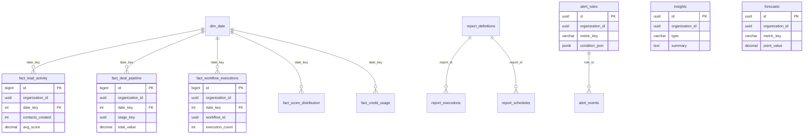

# 11 — Analytics Database Schema

**Version 4.0** | Phase 9 | AI Lead Intelligence Platform

---

## Table of Contents

1. [Overview](#1-overview)
2. [Schema DDL](#2-schema-ddl)
3. [Dimension Tables](#3-dimension-tables)
4. [Fact Tables](#4-fact-tables)
5. [Platform Tables](#5-platform-tables)
6. [Materialized Views](#6-materialized-views)
7. [Indexes & Partitioning](#7-indexes--partitioning)
8. [Migration Script](#8-migration-script)
9. [Entity Relationship Diagram](#9-entity-relationship-diagram)

---

## 1. Overview

All Phase 9 analytics tables reside in the `analytics` PostgreSQL schema, following the multi-schema pattern in `backend/app/common/db_schemas.py`. Migration: `backend/migrations/versions/015_phase9_analytics_platform.py`.

**Conventions:**
- `organization_id UUID NOT NULL` on every tenant-scoped table
- `created_at TIMESTAMPTZ NOT NULL DEFAULT NOW()` on mutable tables
- `etl_updated_at` on fact tables for freshness tracking
- UUIDs generated via `gen_random_uuid()`

---

## 2. Schema DDL

```sql
-- 015_phase9_analytics_platform.py

CREATE SCHEMA IF NOT EXISTS analytics;

-- Grant permissions
GRANT USAGE ON SCHEMA analytics TO app_user;
GRANT ALL ON ALL TABLES IN SCHEMA analytics TO app_user;
ALTER DEFAULT PRIVILEGES IN SCHEMA analytics GRANT ALL ON TABLES TO app_user;
```

---

## 3. Dimension Tables

### 3.1 dim_date

```sql
CREATE TABLE analytics.dim_date (
    date_key        INT PRIMARY KEY,
    full_date       DATE NOT NULL UNIQUE,
    year            SMALLINT NOT NULL,
    quarter         SMALLINT NOT NULL,
    month           SMALLINT NOT NULL,
    week            SMALLINT NOT NULL,
    day_of_month    SMALLINT NOT NULL,
    day_of_week     SMALLINT NOT NULL,
    day_name        VARCHAR(10) NOT NULL,
    month_name      VARCHAR(10) NOT NULL,
    is_weekend      BOOLEAN NOT NULL DEFAULT FALSE,
    is_holiday      BOOLEAN NOT NULL DEFAULT FALSE,
    fiscal_year     SMALLINT,
    fiscal_quarter  SMALLINT
);
```

### 3.2 dim_organization

```sql
CREATE TABLE analytics.dim_organization (
    org_key           UUID PRIMARY KEY DEFAULT gen_random_uuid(),
    organization_id   UUID NOT NULL UNIQUE,
    name              VARCHAR(255) NOT NULL,
    plan_tier         VARCHAR(50),
    user_count        INT DEFAULT 0,
    created_at        TIMESTAMPTZ NOT NULL,
    updated_at        TIMESTAMPTZ NOT NULL DEFAULT NOW(),
    is_active         BOOLEAN NOT NULL DEFAULT TRUE
);
```

### 3.3 dim_industry

```sql
CREATE TABLE analytics.dim_industry (
    industry_key    UUID PRIMARY KEY DEFAULT gen_random_uuid(),
    industry_id     UUID,
    name            VARCHAR(255) NOT NULL,
    parent_name     VARCHAR(255),
    updated_at      TIMESTAMPTZ NOT NULL DEFAULT NOW()
);
```

### 3.4 dim_geography

```sql
CREATE TABLE analytics.dim_geography (
    geo_key         UUID PRIMARY KEY DEFAULT gen_random_uuid(),
    country_code    CHAR(2),
    country_name    VARCHAR(100) NOT NULL,
    region          VARCHAR(100),
    continent       VARCHAR(50),
    updated_at      TIMESTAMPTZ NOT NULL DEFAULT NOW()
);
```

### 3.5 dim_pipeline_stage

```sql
CREATE TABLE analytics.dim_pipeline_stage (
    stage_key       UUID PRIMARY KEY DEFAULT gen_random_uuid(),
    organization_id UUID NOT NULL,
    stage_id        UUID NOT NULL,
    name            VARCHAR(100) NOT NULL,
    stage_order     INT NOT NULL,
    probability     DECIMAL(5,4),
    is_won          BOOLEAN NOT NULL DEFAULT FALSE,
    is_lost         BOOLEAN NOT NULL DEFAULT FALSE,
    valid_from      TIMESTAMPTZ NOT NULL DEFAULT NOW(),
    valid_to        TIMESTAMPTZ,
    is_current      BOOLEAN NOT NULL DEFAULT TRUE
);
```

### 3.6 dim_workflow

```sql
CREATE TABLE analytics.dim_workflow (
    workflow_key    UUID PRIMARY KEY DEFAULT gen_random_uuid(),
    organization_id UUID NOT NULL,
    workflow_id     UUID NOT NULL,
    name            VARCHAR(255) NOT NULL,
    trigger_type    VARCHAR(50),
    is_active       BOOLEAN NOT NULL DEFAULT TRUE,
    updated_at      TIMESTAMPTZ NOT NULL DEFAULT NOW()
);
```

---

## 4. Fact Tables

### 4.1 fact_lead_activity

```sql
CREATE TABLE analytics.fact_lead_activity (
    id                  BIGSERIAL PRIMARY KEY,
    organization_id     UUID NOT NULL,
    date_key            INT NOT NULL REFERENCES analytics.dim_date(date_key),
    companies_created   INT NOT NULL DEFAULT 0,
    contacts_created    INT NOT NULL DEFAULT 0,
    searches_run        INT NOT NULL DEFAULT 0,
    scores_generated    INT NOT NULL DEFAULT 0,
    avg_score           DECIMAL(5,2),
    credits_consumed    INT NOT NULL DEFAULT 0,
    etl_updated_at      TIMESTAMPTZ NOT NULL DEFAULT NOW(),

    UNIQUE (organization_id, date_key)
);
```

### 4.2 fact_deal_pipeline

```sql
CREATE TABLE analytics.fact_deal_pipeline (
    id                  BIGSERIAL PRIMARY KEY,
    organization_id     UUID NOT NULL,
    date_key            INT NOT NULL REFERENCES analytics.dim_date(date_key),
    stage_key           UUID NOT NULL,
    stage_name          VARCHAR(100) NOT NULL,
    deal_count          INT NOT NULL DEFAULT 0,
    total_value         DECIMAL(15,2) NOT NULL DEFAULT 0,
    weighted_value      DECIMAL(15,2) NOT NULL DEFAULT 0,
    avg_days_in_stage   DECIMAL(8,2),
    etl_updated_at      TIMESTAMPTZ NOT NULL DEFAULT NOW(),

    UNIQUE (organization_id, date_key, stage_key)
);
```

### 4.3 fact_workflow_executions

```sql
CREATE TABLE analytics.fact_workflow_executions (
    id                  BIGSERIAL PRIMARY KEY,
    organization_id     UUID NOT NULL,
    date_key            INT NOT NULL REFERENCES analytics.dim_date(date_key),
    workflow_id         UUID NOT NULL,
    workflow_name       VARCHAR(255),
    trigger_type        VARCHAR(50),
    execution_count     INT NOT NULL DEFAULT 0,
    success_count       INT NOT NULL DEFAULT 0,
    failure_count       INT NOT NULL DEFAULT 0,
    avg_duration_ms     DECIMAL(10,2),
    p95_duration_ms     DECIMAL(10,2),
    ai_credits_used     INT NOT NULL DEFAULT 0,
    etl_updated_at      TIMESTAMPTZ NOT NULL DEFAULT NOW(),

    UNIQUE (organization_id, date_key, workflow_id, trigger_type)
);
```

### 4.4 fact_score_distribution

```sql
CREATE TABLE analytics.fact_score_distribution (
    id                  BIGSERIAL PRIMARY KEY,
    organization_id     UUID NOT NULL,
    date_key            INT NOT NULL REFERENCES analytics.dim_date(date_key),
    bucket_label        VARCHAR(10) NOT NULL,
    bucket_count        INT NOT NULL DEFAULT 0,
    etl_updated_at      TIMESTAMPTZ NOT NULL DEFAULT NOW(),

    UNIQUE (organization_id, date_key, bucket_label)
);
```

### 4.5 fact_credit_usage

```sql
CREATE TABLE analytics.fact_credit_usage (
    id                  BIGSERIAL PRIMARY KEY,
    organization_id     UUID NOT NULL,
    date_key            INT NOT NULL REFERENCES analytics.dim_date(date_key),
    transaction_type    VARCHAR(50) NOT NULL,
    credits_used        INT NOT NULL DEFAULT 0,
    transaction_count   INT NOT NULL DEFAULT 0,
    etl_updated_at      TIMESTAMPTZ NOT NULL DEFAULT NOW(),

    UNIQUE (organization_id, date_key, transaction_type)
);
```

---

## 5. Platform Tables

### 5.1 ETL & Data Quality

```sql
CREATE TABLE analytics.etl_watermarks (
    pipeline_name   VARCHAR(100) PRIMARY KEY,
    last_run_at     TIMESTAMPTZ NOT NULL,
    last_success_at TIMESTAMPTZ,
    rows_processed  BIGINT DEFAULT 0,
    status          VARCHAR(20) NOT NULL DEFAULT 'idle',
    error_message   TEXT
);

CREATE TABLE analytics.data_quality_checks (
    id              BIGSERIAL PRIMARY KEY,
    check_name      VARCHAR(100) NOT NULL,
    organization_id UUID,
    run_at          TIMESTAMPTZ NOT NULL DEFAULT NOW(),
    status          VARCHAR(20) NOT NULL,
    expected_value  DECIMAL(15,4),
    actual_value    DECIMAL(15,4),
    details         JSONB
);
```

### 5.2 Metrics & KPIs

```sql
CREATE TABLE analytics.custom_metric_definitions (
    id              UUID PRIMARY KEY DEFAULT gen_random_uuid(),
    organization_id UUID NOT NULL,
    key             VARCHAR(100) NOT NULL,
    name            VARCHAR(255) NOT NULL,
    description     TEXT,
    formula_yaml    TEXT NOT NULL,
    is_active       BOOLEAN NOT NULL DEFAULT TRUE,
    created_by      UUID NOT NULL,
    created_at      TIMESTAMPTZ NOT NULL DEFAULT NOW(),
    updated_at      TIMESTAMPTZ NOT NULL DEFAULT NOW(),
    UNIQUE (organization_id, key)
);

CREATE TABLE analytics.kpi_thresholds (
    id              UUID PRIMARY KEY DEFAULT gen_random_uuid(),
    organization_id UUID NOT NULL,
    metric_key      VARCHAR(100) NOT NULL,
    target_value    DECIMAL(15,4) NOT NULL,
    warning_below   DECIMAL(15,4),
    critical_below  DECIMAL(15,4),
    warning_above   DECIMAL(15,4),
    critical_above  DECIMAL(15,4),
    is_active       BOOLEAN NOT NULL DEFAULT TRUE,
    updated_by      UUID NOT NULL,
    updated_at      TIMESTAMPTZ NOT NULL DEFAULT NOW(),
    UNIQUE (organization_id, metric_key)
);

CREATE TABLE analytics.kpi_change_log (
    id              UUID PRIMARY KEY DEFAULT gen_random_uuid(),
    metric_key      VARCHAR(100) NOT NULL,
    change_type     VARCHAR(50) NOT NULL,
    old_definition  JSONB,
    new_definition  JSONB,
    changed_by      UUID NOT NULL,
    approved_by     UUID,
    changed_at      TIMESTAMPTZ NOT NULL DEFAULT NOW(),
    effective_at    TIMESTAMPTZ NOT NULL
);
```

### 5.3 Dashboards & Reports

```sql
CREATE TABLE analytics.dashboard_configs (
    id              UUID PRIMARY KEY DEFAULT gen_random_uuid(),
    organization_id UUID NOT NULL,
    name            VARCHAR(255) NOT NULL,
    dashboard_type  VARCHAR(50) NOT NULL,
    layout_json     JSONB NOT NULL,
    is_default      BOOLEAN NOT NULL DEFAULT FALSE,
    created_by      UUID NOT NULL,
    created_at      TIMESTAMPTZ NOT NULL DEFAULT NOW(),
    updated_at      TIMESTAMPTZ NOT NULL DEFAULT NOW()
);

CREATE TABLE analytics.report_definitions (
    id              UUID PRIMARY KEY DEFAULT gen_random_uuid(),
    organization_id UUID NOT NULL,
    name            VARCHAR(255) NOT NULL,
    description     TEXT,
    category        VARCHAR(50) NOT NULL,
    definition_json JSONB NOT NULL,
    version         INT NOT NULL DEFAULT 1,
    is_published    BOOLEAN NOT NULL DEFAULT FALSE,
    created_by      UUID NOT NULL,
    created_at      TIMESTAMPTZ NOT NULL DEFAULT NOW(),
    updated_at      TIMESTAMPTZ NOT NULL DEFAULT NOW()
);

CREATE TABLE analytics.report_executions (
    id              UUID PRIMARY KEY DEFAULT gen_random_uuid(),
    report_id       UUID NOT NULL REFERENCES analytics.report_definitions(id),
    organization_id UUID NOT NULL,
    status          VARCHAR(20) NOT NULL,
    format          VARCHAR(10) NOT NULL,
    row_count       INT,
    file_url        TEXT,
    started_at      TIMESTAMPTZ NOT NULL DEFAULT NOW(),
    completed_at    TIMESTAMPTZ,
    error_message   TEXT,
    triggered_by    UUID
);

CREATE TABLE analytics.report_schedules (
    id              UUID PRIMARY KEY DEFAULT gen_random_uuid(),
    report_id       UUID NOT NULL REFERENCES analytics.report_definitions(id),
    organization_id UUID NOT NULL,
    cron_expression VARCHAR(100) NOT NULL,
    timezone        VARCHAR(50) NOT NULL DEFAULT 'UTC',
    format          VARCHAR(10) NOT NULL,
    recipients      TEXT[] NOT NULL,
    is_active       BOOLEAN NOT NULL DEFAULT TRUE,
    last_run_at     TIMESTAMPTZ,
    next_run_at     TIMESTAMPTZ,
    created_by      UUID NOT NULL,
    created_at      TIMESTAMPTZ NOT NULL DEFAULT NOW()
);
```

### 5.4 Forecasts & Insights

```sql
CREATE TABLE analytics.forecasts (
    id              UUID PRIMARY KEY DEFAULT gen_random_uuid(),
    organization_id UUID NOT NULL,
    metric_key      VARCHAR(100) NOT NULL,
    model_name      VARCHAR(50) NOT NULL,
    horizon_days    INT NOT NULL,
    forecast_date   DATE NOT NULL,
    point_value     DECIMAL(15,4),
    lower_bound     DECIMAL(15,4),
    upper_bound     DECIMAL(15,4),
    confidence      DECIMAL(5,4),
    generated_at    TIMESTAMPTZ NOT NULL DEFAULT NOW()
);

CREATE TABLE analytics.forecast_accuracy (
    id              UUID PRIMARY KEY DEFAULT gen_random_uuid(),
    organization_id UUID NOT NULL,
    metric_key      VARCHAR(100) NOT NULL,
    model_name      VARCHAR(50) NOT NULL,
    evaluation_date DATE NOT NULL,
    mape            DECIMAL(8,4),
    rmse            DECIMAL(15,4),
    mae             DECIMAL(15,4),
    coverage        DECIMAL(5,4),
    holdout_days    INT NOT NULL,
    evaluated_at    TIMESTAMPTZ NOT NULL DEFAULT NOW()
);

CREATE TABLE analytics.insights (
    id                  UUID PRIMARY KEY DEFAULT gen_random_uuid(),
    organization_id     UUID NOT NULL,
    type                VARCHAR(30) NOT NULL,
    priority            VARCHAR(10) NOT NULL,
    title               VARCHAR(255) NOT NULL,
    summary             TEXT NOT NULL,
    detail              TEXT,
    metric_keys         TEXT[] NOT NULL,
    data                JSONB,
    recommended_actions TEXT[],
    confidence          DECIMAL(5,4),
    generated_at        TIMESTAMPTZ NOT NULL DEFAULT NOW(),
    expires_at          TIMESTAMPTZ,
    is_dismissed        BOOLEAN NOT NULL DEFAULT FALSE,
    dismissed_by        UUID,
    dismissed_at        TIMESTAMPTZ
);

CREATE TABLE analytics.nl_query_log (
    id              UUID PRIMARY KEY DEFAULT gen_random_uuid(),
    organization_id UUID NOT NULL,
    user_id         UUID NOT NULL,
    query_text      TEXT NOT NULL,
    parsed_query    JSONB,
    result_summary  TEXT,
    credits_used    INT NOT NULL DEFAULT 1,
    duration_ms     INT,
    created_at      TIMESTAMPTZ NOT NULL DEFAULT NOW()
);
```

### 5.5 Alerting

```sql
CREATE TABLE analytics.alert_rules (
    id              UUID PRIMARY KEY DEFAULT gen_random_uuid(),
    organization_id UUID NOT NULL,
    name            VARCHAR(255) NOT NULL,
    description     TEXT,
    type            VARCHAR(20) NOT NULL,
    metric_key      VARCHAR(100) NOT NULL,
    condition_json  JSONB NOT NULL,
    severity        VARCHAR(10) NOT NULL,
    channels        TEXT[] NOT NULL DEFAULT '{in_app}',
    recipients      UUID[],
    throttle_minutes INT NOT NULL DEFAULT 60,
    is_active       BOOLEAN NOT NULL DEFAULT TRUE,
    created_by      UUID NOT NULL,
    created_at      TIMESTAMPTZ NOT NULL DEFAULT NOW(),
    updated_at      TIMESTAMPTZ NOT NULL DEFAULT NOW()
);

CREATE TABLE analytics.alert_events (
    id              UUID PRIMARY KEY DEFAULT gen_random_uuid(),
    rule_id         UUID NOT NULL REFERENCES analytics.alert_rules(id),
    organization_id UUID NOT NULL,
    severity        VARCHAR(10) NOT NULL,
    metric_key      VARCHAR(100) NOT NULL,
    current_value   DECIMAL(15,4),
    threshold_value DECIMAL(15,4),
    message         TEXT NOT NULL,
    channels_sent   TEXT[],
    triggered_at    TIMESTAMPTZ NOT NULL DEFAULT NOW(),
    acknowledged_by UUID,
    acknowledged_at TIMESTAMPTZ,
    resolved_at     TIMESTAMPTZ
);
```

---

## 6. Materialized Views

```sql
CREATE MATERIALIZED VIEW analytics.mv_kpi_daily AS
SELECT
    fla.organization_id,
    dd.full_date,
    dd.year, dd.quarter, dd.month,
    fla.companies_created, fla.contacts_created,
    fla.searches_run, fla.scores_generated,
    fla.avg_score, fla.credits_consumed,
    COALESCE(fdp.total_pipeline_value, 0) AS total_pipeline_value,
    COALESCE(fdp.open_deal_count, 0) AS open_deal_count,
    COALESCE(fwe.execution_count, 0) AS workflow_executions
FROM analytics.fact_lead_activity fla
JOIN analytics.dim_date dd ON fla.date_key = dd.date_key
LEFT JOIN LATERAL (
    SELECT SUM(total_value) AS total_pipeline_value,
           SUM(deal_count) AS open_deal_count
    FROM analytics.fact_deal_pipeline
    WHERE organization_id = fla.organization_id AND date_key = fla.date_key
) fdp ON TRUE
LEFT JOIN LATERAL (
    SELECT SUM(execution_count) AS execution_count
    FROM analytics.fact_workflow_executions
    WHERE organization_id = fla.organization_id AND date_key = fla.date_key
) fwe ON TRUE
WITH DATA;

CREATE UNIQUE INDEX idx_mv_kpi_daily_org_date
    ON analytics.mv_kpi_daily (organization_id, full_date);

CREATE MATERIALIZED VIEW analytics.mv_pipeline_summary AS
SELECT
    organization_id, stage_name,
    SUM(deal_count) AS total_deals,
    SUM(total_value) AS total_value,
    AVG(avg_days_in_stage) AS avg_days_in_stage
FROM analytics.fact_deal_pipeline
WHERE date_key = (SELECT MAX(date_key) FROM analytics.fact_deal_pipeline)
GROUP BY organization_id, stage_name
WITH DATA;

CREATE MATERIALIZED VIEW analytics.mv_workflow_health AS
SELECT
    organization_id, workflow_id, workflow_name,
    SUM(execution_count) AS total_executions,
    SUM(success_count) AS total_success,
    SUM(failure_count) AS total_failures,
    CASE WHEN SUM(execution_count) > 0
         THEN ROUND(100.0 * SUM(success_count) / SUM(execution_count), 2)
         ELSE 0 END AS success_rate,
    AVG(avg_duration_ms) AS avg_duration_ms
FROM analytics.fact_workflow_executions
WHERE date_key >= (SELECT date_key FROM analytics.dim_date
                   WHERE full_date = CURRENT_DATE - INTERVAL '30 days')
GROUP BY organization_id, workflow_id, workflow_name
WITH DATA;
```

---

## 7. Indexes & Partitioning

### 7.1 Indexes

```sql
-- Fact table indexes (organization_id first for tenant isolation)
CREATE INDEX idx_fact_lead_activity_org_date ON analytics.fact_lead_activity (organization_id, date_key);
CREATE INDEX idx_fact_deal_pipeline_org_date ON analytics.fact_deal_pipeline (organization_id, date_key);
CREATE INDEX idx_fact_workflow_org_date ON analytics.fact_workflow_executions (organization_id, date_key);
CREATE INDEX idx_fact_score_dist_org_date ON analytics.fact_score_distribution (organization_id, date_key);
CREATE INDEX idx_fact_credit_org_date ON analytics.fact_credit_usage (organization_id, date_key);

-- Platform table indexes
CREATE INDEX idx_insights_org_active ON analytics.insights (organization_id, is_dismissed, generated_at DESC);
CREATE INDEX idx_alert_events_org ON analytics.alert_events (organization_id, triggered_at DESC);
CREATE INDEX idx_forecasts_org_metric ON analytics.forecasts (organization_id, metric_key, forecast_date);
CREATE INDEX idx_report_exec_org ON analytics.report_executions (organization_id, started_at DESC);
CREATE INDEX idx_nl_query_org ON analytics.nl_query_log (organization_id, created_at DESC);
```

### 7.2 Future Partitioning (v5.0)

```sql
-- When fact tables exceed 10M rows, partition by date_key range
-- CREATE TABLE analytics.fact_lead_activity (...) PARTITION BY RANGE (date_key);
```

---

## 8. Migration Script

```python
# backend/migrations/versions/015_phase9_analytics_platform.py

"""Phase 9: Analytics Platform schema

Revision ID: 015_phase9_analytics
"""

from alembic import op
import sqlalchemy as sa

revision = "015_phase9_analytics"
down_revision = "014_phase8_workflow_engine"

def upgrade():
    op.execute("CREATE SCHEMA IF NOT EXISTS analytics")
    # Execute all DDL from sections 3-6 above
    op.execute(POPULATE_DIM_DATE_SQL)  # 2020-01-01 to 2035-12-31

def downgrade():
    op.execute("DROP SCHEMA IF EXISTS analytics CASCADE")
```

---

## 9. Entity Relationship Diagram

