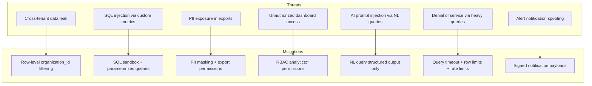

# 13 — Security Architecture

**Version 4.0** | Phase 9 | AI Lead Intelligence Platform

---

## Table of Contents

1. [Overview](#1-overview)
2. [Threat Model](#2-threat-model)
3. [Authentication & Authorization](#3-authentication--authorization)
4. [Tenant Isolation](#4-tenant-isolation)
5. [Data Protection](#5-data-protection)
6. [Query Sandboxing](#6-query-sandboxing)
7. [Export Security](#7-export-security)
8. [Audit Logging](#8-audit-logging)
9. [Compliance](#9-compliance)

---

## 1. Overview

The analytics platform handles aggregated business data across CRM, AI, billing, and workflow domains. Security follows the platform-wide model from Phase 8 (`docs/phase8/13-security-model.md`) with analytics-specific extensions for query sandboxing, PII masking, and export controls.

---

## 2. Threat Model



| Threat | Severity | Likelihood | Mitigation |
|--------|----------|------------|------------|
| Cross-tenant data leak | Critical | Low | Mandatory `organization_id` filter |
| SQL injection | Critical | Medium | Sandbox parser, no raw SQL from client |
| PII in exports | High | Medium | Field-level masking, export permissions |
| Unauthorized access | High | Low | RBAC + feature flags |
| NL prompt injection | Medium | Medium | Structured output, no SQL from LLM |
| Query DoS | Medium | Medium | Timeouts, row limits, rate limits |
| Stale data decisions | Medium | High | Freshness indicators, ETL lag alerts |

---

## 3. Authentication & Authorization

### 3.1 Permission Matrix

| Resource | `analytics:read` | `analytics:write` | `analytics:admin` |
|----------|-------------------|--------------------|--------------------|
| View dashboards | ✅ | ✅ | ✅ |
| View metrics | ✅ | ✅ | ✅ |
| View insights | ✅ | ✅ | ✅ |
| View alert events | ✅ | ✅ | ✅ |
| Export CSV/PDF | ✅ | ✅ | ✅ |
| Create reports | ❌ | ✅ | ✅ |
| Create custom dashboards | ❌ | ✅ | ✅ |
| NL queries | ✅ (rate limited) | ✅ | ✅ |
| Manage alert rules | ❌ | ❌ | ✅ |
| Custom metric definitions | ❌ | ❌ | ✅ |
| KPI threshold config | ❌ | ❌ | ✅ |
| Warehouse refresh | ❌ | ❌ | ✅ |
| View NL query logs (all users) | ❌ | ❌ | ✅ |

### 3.2 Role Mapping

From `backend/app/core/permissions.py`:

```python
ROLE_PERMISSIONS = {
    "member": [..., "analytics:read", ...],
    "manager": [..., "analytics:read", "analytics:write", ...],
    "admin": [..., "analytics:read", "analytics:write", "analytics:admin", ...],
}
```

### 3.3 Feature Flag Gating

```python
@router.get("/dashboards/executive")
async def get_executive_dashboard(
    current_user: User = Depends(get_current_user),
    _flag: None = Depends(require_feature_flag("analytics_platform_v4")),
):
    ...
```

---

## 4. Tenant Isolation

### 4.1 Database Level

Every analytics query includes mandatory tenant filter:

```python
async def execute_metric_query(sql: str, org_id: UUID, params: dict) -> list:
    params["org_id"] = org_id
    # SQL must contain: WHERE organization_id = :org_id
    if ":org_id" not in sql and "organization_id" not in sql:
        raise SecurityError("Query missing tenant isolation filter")
    return await db.execute(text(sql), params)
```

### 4.2 Cache Isolation

Cache keys always include `organization_id`:

```
analytics:{org_id}:dashboard
analytics:{org_id}:metric:{key}:{hash}
analytics:alert:throttle:{rule_id}  # rule_id is org-scoped
```

### 4.3 Cross-Tenant Benchmarks

Anonymized benchmarks require:
- Opt-in per organization (`analytics.benchmark_opt_in = true`)
- Minimum 10 contributing orgs per benchmark segment
- k-anonymity: no segment with < 5 orgs
- No individual org identifiable in benchmark data

---

## 5. Data Protection

### 5.1 PII Classification

| Field | Classification | Analytics Treatment |
|-------|---------------|-------------------|
| Contact email | PII | Never in analytics tables |
| Contact name | PII | Never in analytics tables |
| User email | PII | Hashed in `dim_user` |
| Company name | Business | Allowed in breakdowns |
| Deal value | Financial | Allowed, tenant-scoped |
| Lead score | Business | Allowed |
| IP address | PII | Never stored in analytics |
| Search queries | Sensitive | Aggregated only, no raw text in warehouse |

### 5.2 PII Masking in Exports

```python
PII_FIELDS = {"email", "phone", "first_name", "last_name", "ip_address"}

def mask_export_row(row: dict, permissions: set[str]) -> dict:
    if "analytics:admin" not in permissions:
        return {k: v for k, v in row.items() if k not in PII_FIELDS}
    return row
```

### 5.3 Encryption

| Layer | Method |
|-------|--------|
| At rest (PostgreSQL) | AES-256 disk encryption (cloud provider) |
| At rest (S3 exports) | SSE-S3 or SSE-KMS |
| In transit | TLS 1.3 |
| Redis cache | No PII cached; aggregated metrics only |

---

## 6. Query Sandboxing

### 6.1 Custom Metric SQL Validation

```python
class SQLSandbox:
    FORBIDDEN_KEYWORDS = {
        "INSERT", "UPDATE", "DELETE", "DROP", "ALTER", "CREATE", "TRUNCATE",
        "GRANT", "REVOKE", "COPY", "EXECUTE", "pg_", "information_schema",
    }
    ALLOWED_SCHEMAS = {
        "analytics", "core", "crm", "ai", "search", "billing", "audit",
    }

    def validate(self, sql: str) -> str:
        normalized = sql.upper().strip()
        if not normalized.startswith("SELECT"):
            raise SandboxViolation("Only SELECT queries allowed")
        for keyword in self.FORBIDDEN_KEYWORDS:
            if keyword in normalized:
                raise SandboxViolation(f"Forbidden keyword: {keyword}")
        for schema in self._extract_schemas(sql):
            if schema not in self.ALLOWED_SCHEMAS:
                raise SandboxViolation(f"Schema not allowed: {schema}")
        return sql
```

### 6.2 NL Query Safety

| Rule | Implementation |
|------|----------------|
| No raw SQL from LLM | LLM outputs structured JSON only |
| Server-side SQL compilation | Structured query → parameterized SQL |
| No schema enumeration | LLM prompt excludes table/column names |
| Input sanitization | Max 500 chars, strip control characters |
| Output validation | Pydantic schema validation on parsed query |

### 6.3 Query Resource Limits

| Limit | Value |
|-------|-------|
| Query timeout | 30s (custom metrics), 10s (standard) |
| Max rows returned | 100,000 |
| Max concurrent queries per org | 10 |
| Max query complexity | No more than 3 JOINs in custom metrics |

---

## 7. Export Security

### 7.1 Export Controls

| Control | Implementation |
|---------|----------------|
| Permission check | `analytics:read` minimum |
| Watermarking | PDF exports include org name + timestamp + user |
| Download URLs | S3 pre-signed, 24h expiry |
| Row limits | 100K max per export |
| Audit trail | All exports logged in `audit.audit_logs` |

### 7.2 Scheduled Report Security

- Recipients must be users within the same organization
- External email addresses require `analytics:admin` approval
- Report attachments encrypted at rest (S3 SSE)
- Unsubscribe link in every scheduled email

---

## 8. Audit Logging

### 8.1 Audited Events

| Event | Schema | Retention |
|-------|--------|-----------|
| Dashboard view | `audit.audit_logs` | 1 year |
| Report generation | `audit.audit_logs` | 1 year |
| Export download | `audit.audit_logs` | 1 year |
| Alert rule CRUD | `audit.audit_logs` | 2 years |
| Custom metric CRUD | `audit.audit_logs` | 2 years |
| NL query execution | `analytics.nl_query_log` | 90 days |
| Warehouse refresh | `audit.audit_logs` | 1 year |
| KPI threshold change | `analytics.kpi_change_log` | Permanent |
| Failed auth attempts | `audit.audit_logs` | 1 year |

### 8.2 Audit Log Format

```json
{
  "event_type": "analytics.export.downloaded",
  "organization_id": "uuid",
  "user_id": "uuid",
  "resource_type": "report_execution",
  "resource_id": "uuid",
  "metadata": {
    "format": "pdf",
    "row_count": 1234,
    "report_name": "Weekly Lead Summary"
  },
  "ip_address": "10.0.0.1",
  "timestamp": "2026-06-29T10:00:00Z"
}
```

---

## 9. Compliance

### 9.1 GDPR

| Requirement | Implementation |
|-------------|----------------|
| Right to access | Export via report builder |
| Right to erasure | Org deletion cascades analytics schema |
| Data minimization | No PII in warehouse, aggregates only |
| Purpose limitation | Analytics data used only for BI |
| Storage limitation | Retention policies (see doc 02) |

### 9.2 SOC 2 Controls

| Control | Evidence |
|---------|----------|
| Access control | RBAC permissions, feature flags |
| Encryption | TLS + at-rest encryption |
| Monitoring | Prometheus metrics, alert on anomalies |
| Change management | `kpi_change_log`, migration versioning |
| Incident response | Alert escalation, audit trail |

### 9.3 Data Residency

- Analytics data stored in same PostgreSQL instance as OLTP (per-tenant cloud region)
- S3 export bucket in same region as PostgreSQL
- No cross-region analytics data transfer without explicit enterprise agreement