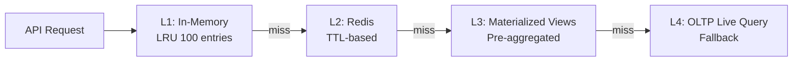
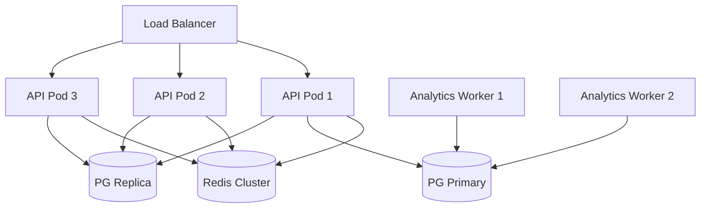

# 14 — Performance Optimization

**Version 4.0** | Phase 9 | AI Lead Intelligence Platform

---

## Table of Contents

1. [Overview](#1-overview)
2. [Performance Targets](#2-performance-targets)
3. [Caching Strategy](#3-caching-strategy)
4. [Query Optimization](#4-query-optimization)
5. [ETL Performance](#5-etl-performance)
6. [API Optimization](#6-api-optimization)
7. [Frontend Performance](#7-frontend-performance)
8. [Infrastructure Scaling](#8-infrastructure-scaling)
9. [Monitoring & Alerting](#9-monitoring--alerting)

---

## 1. Overview

The analytics platform must serve dashboards to hundreds of concurrent users while maintaining sub-second response times. Performance optimization spans caching, query tuning, ETL efficiency, and infrastructure scaling.

---

## 2. Performance Targets

| Operation | p50 | p95 | p99 |
|-----------|-----|-----|-----|
| Dashboard (cached) | 50ms | 150ms | 300ms |
| Dashboard (cold) | 500ms | 1.5s | 2s |
| Single metric query | 100ms | 300ms | 500ms |
| Dashboard bundle (10 metrics) | 200ms | 500ms | 800ms |
| Report generation (10K rows) | 5s | 15s | 30s |
| NL query | 2s | 5s | 8s |
| Forecast generation (batch) | 30s/org | 60s/org | 120s/org |
| ETL incremental (per org) | 5s | 15s | 30s |
| Materialized view refresh | 10s | 30s | 60s |

---

## 3. Caching Strategy

### 3.1 Multi-Layer Cache



### 3.2 Redis Cache Configuration

```python
# Existing pattern from backend/app/analytics/router.py
CACHE_TTL = 300  # 5 minutes for dashboard

# v4 TTL policy
CACHE_TTL_POLICY = {
    "dashboard": 300,
    "metric_timeseries_daily": 600,
    "metric_timeseries_hourly": 120,
    "breakdown": 900,
    "forecast": 3600,
    "insight": 3600,
    "scorecard": 900,
}
```

### 3.3 Cache Warming

```python
@celery_app.task(name="analytics.warm_cache", queue="analytics")
def warm_cache_task():
    """Pre-warm dashboard cache after ETL completion."""
    for org_id in get_active_org_ids():
        asyncio.run(analytics_service.get_dashboard_stats(db, org_id))
        asyncio.run(analytics_service.get_full_analytics(db, org_id))
```

Triggered after `analytics.etl_incremental` and `analytics.refresh_mvs` complete.

### 3.4 Cache Hit Rate Target

| Endpoint | Target Hit Rate |
|----------|----------------|
| `/dashboard` | > 85% |
| `/full` | > 80% |
| `/metrics/*` | > 70% |
| `/forecasts/*` | > 90% |

---

## 4. Query Optimization

### 4.1 Materialized View Strategy

Pre-aggregate expensive queries into materialized views (see doc 02):

| View | Replaces | Speedup |
|------|----------|---------|
| `mv_kpi_daily` | 6 OLTP COUNT/AVG queries | ~10x |
| `mv_pipeline_summary` | CRM funnel aggregation | ~8x |
| `mv_workflow_health` | Workflow execution stats | ~5x |

### 4.2 Index Strategy

```sql
-- Composite indexes for common query patterns
CREATE INDEX idx_fact_lead_activity_org_date
    ON analytics.fact_lead_activity (organization_id, date_key);

-- Covering index for dashboard summary
CREATE INDEX idx_mv_kpi_daily_covering
    ON analytics.mv_kpi_daily (organization_id, full_date)
    INCLUDE (contacts_created, companies_created, avg_score, total_pipeline_value);

-- BRIN index for time-series range scans (large tables)
CREATE INDEX idx_fact_lead_activity_date_brin
    ON analytics.fact_lead_activity USING BRIN (date_key);
```

### 4.3 Query Plan Guidelines

| Pattern | Optimization |
|---------|-------------|
| Time-range scan | Use `date_key` integer comparison, not `full_date` cast |
| Tenant filter | `organization_id` as leading index column |
| Aggregation | Prefer warehouse facts over OLTP live queries |
| JOIN reduction | Pre-join in materialized views |
| Large result sets | Server-side pagination + cursor |

### 4.4 OLTP Fallback Optimization

When warehouse is stale, existing `service.py` queries are already optimized:

```python
# All queries use indexed organization_id + deleted_at filters
# Consider adding covering indexes on OLTP tables:
# CREATE INDEX idx_contacts_org_created ON core.contacts (organization_id, created_at)
#   WHERE deleted_at IS NULL;
```

### 4.5 Connection Pooling

```python
# SQLAlchemy async engine configuration
engine = create_async_engine(
    DATABASE_URL,
    pool_size=20,
    max_overflow=10,
    pool_pre_ping=True,
    pool_recycle=3600,
)
```

For analytics-heavy workloads, dedicate a read-replica connection pool:

```python
analytics_engine = create_async_engine(READ_REPLICA_URL, pool_size=15)
```

---

## 5. ETL Performance

### 5.1 Incremental vs Full

| Mode | Duration (per org) | Frequency |
|------|-------------------|-----------|
| Incremental | 5–15s | Every 15 min |
| Full dimension refresh | 30–60s | Daily |
| Materialized view refresh | 10–30s | Every 30 min |
| Full fact rebuild | 2–5 min | Weekly (off-peak) |

### 5.2 Parallel ETL

```python
async def etl_incremental(org_ids: list[UUID]) -> None:
    semaphore = asyncio.Semaphore(5)  # max 5 concurrent org ETLs
    async def _etl_org(org_id):
        async with semaphore:
            await _etl_lead_activity(org_id, since)
            await _etl_deal_pipeline(org_id, since)
    await asyncio.gather(*[_etl_org(oid) for oid in org_ids])
```

### 5.3 Event-Driven Micro-ETL

For near-real-time updates, event handlers perform targeted UPSERTs instead of full scans:

```python
async def handle_contact_created(event: DomainEvent):
    date_key = int(event.timestamp.strftime("%Y%m%d"))
    await db.execute(text("""
        INSERT INTO analytics.fact_lead_activity (organization_id, date_key, contacts_created)
        VALUES (:org_id, :date_key, 1)
        ON CONFLICT (organization_id, date_key)
        DO UPDATE SET contacts_created = fact_lead_activity.contacts_created + 1,
                      etl_updated_at = NOW()
    """), {"org_id": event.organization_id, "date_key": date_key})
```

### 5.4 Batch Size Tuning

| Operation | Batch Size | Rationale |
|-----------|-----------|-----------|
| Fact UPSERT | 1,000 rows | Balance memory vs round-trips |
| Dimension refresh | 5,000 rows | Infrequent, larger batches OK |
| MV refresh | Full view | PostgreSQL handles internally |
| Event micro-ETL | 1 row | Minimal latency |

---

## 6. API Optimization

### 6.1 Batch Endpoints

Prefer bundle endpoints over N+1 individual calls:

```
GET /analytics/full          → 10 metrics in 1 request (existing)
GET /analytics/metrics?keys=a,b,c  → batch metric computation (v4)
GET /analytics/dashboards/executive  → pre-composed dashboard (v4)
```

### 6.2 Response Compression

```python
# FastAPI middleware
app.add_middleware(GZipMiddleware, minimum_size=1000)
```

### 6.3 Pagination

```python
class PaginatedMetrics(BaseModel):
    items: list[MetricResult]
    total: int
    page: int
    page_size: int
    has_more: bool
```

Default `page_size=50`, max `page_size=200`.

### 6.4 Async Report Generation

Report generation always returns `202 Accepted` with polling:

```
POST /reports/{id}/run → 202 { execution_id }
GET  /reports/executions/{id} → { status: "running" | "completed" }
GET  /reports/executions/{id}/download → pre-signed URL
```

---

## 7. Frontend Performance

### 7.1 Code Splitting

```typescript
const ExecutiveDashboard = lazy(() => import('./ExecutiveDashboard'));
const ReportBuilder = lazy(() => import('./ReportBuilder'));
const ChoroplethMap = lazy(() => import('../charts/ChoroplethMap'));
```

### 7.2 Data Fetching

```typescript
// React Query with stale-while-revalidate
const { data } = useQuery({
  queryKey: ['analytics', 'dashboard', orgId],
  queryFn: () => api.get('/analytics/dashboard'),
  staleTime: 5 * 60 * 1000,  // 5 min
  cacheTime: 30 * 60 * 1000, // 30 min
});
```

### 7.3 Chart Rendering

| Optimization | Implementation |
|-------------|----------------|
| Virtual scrolling | TanStack Virtual for data tables > 100 rows |
| Canvas rendering | D3 heatmaps use canvas, not SVG |
| Debounced filters | 300ms debounce on date range changes |
| Skeleton loading | Show layout skeleton while data loads |
| Memoization | `React.memo` on chart components |

### 7.4 Bundle Size Targets

| Chunk | Max Size (gzip) |
|-------|----------------|
| Analytics core | 80 KB |
| Recharts | 45 KB (lazy) |
| D3 charts | 30 KB (lazy) |
| Report builder | 60 KB (lazy) |

---

## 8. Infrastructure Scaling

### 8.1 Horizontal Scaling



### 8.2 Scaling Triggers

| Component | Scale Up When | Scale Down When |
|-----------|--------------|-----------------|
| API pods | p95 > 500ms for 5 min | p95 < 200ms for 30 min |
| Analytics workers | ETL lag > 30 min | ETL lag < 5 min for 1 hr |
| Redis | Memory > 80% | Memory < 40% for 1 hr |
| PG replica | Read CPU > 70% | Read CPU < 30% for 1 hr |

### 8.3 Resource Limits (K8s)

```yaml
# Analytics API pod
resources:
  requests: { cpu: "500m", memory: "512Mi" }
  limits: { cpu: "2", memory: "2Gi" }

# Analytics Celery worker
resources:
  requests: { cpu: "1", memory: "1Gi" }
  limits: { cpu: "4", memory: "4Gi" }
```

---

## 9. Monitoring & Alerting

### 9.1 Prometheus Metrics

```python
# backend/infrastructure/observability/metrics.py

analytics_query_duration = Histogram(
    "analytics_query_duration_seconds",
    "Analytics query duration",
    ["endpoint", "source", "organization_id"],
    buckets=[0.05, 0.1, 0.25, 0.5, 1.0, 2.5, 5.0, 10.0],
)

analytics_cache_hits = Counter(
    "analytics_cache_hits_total",
    "Analytics cache hits",
    ["endpoint", "organization_id"],
)

analytics_cache_misses = Counter(
    "analytics_cache_misses_total",
    "Analytics cache misses",
    ["endpoint", "organization_id"],
)

analytics_etl_lag = Gauge(
    "analytics_etl_lag_seconds",
    "ETL pipeline lag",
    ["pipeline_name"],
)

analytics_etl_rows = Counter(
    "analytics_etl_rows_processed_total",
    "ETL rows processed",
    ["pipeline_name", "organization_id"],
)

analytics_report_duration = Histogram(
    "analytics_report_generation_seconds",
    "Report generation duration",
    ["format", "organization_id"],
)
```

### 9.2 Grafana Dashboard Panels

| Panel | Query | Alert |
|-------|-------|-------|
| Query p95 latency | `histogram_quantile(0.95, analytics_query_duration_seconds)` | > 2s |
| Cache hit rate | `hits / (hits + misses)` | < 70% |
| ETL lag | `analytics_etl_lag_seconds` | > 3600s |
| Active report jobs | `analytics_report_generation_seconds_count` | > 50 concurrent |
| Worker queue depth | Celery `analytics` queue length | > 100 |

### 9.3 Slow Query Logging

```python
SLOW_QUERY_THRESHOLD_MS = 1000

async def execute_with_timing(sql, params):
    start = time.monotonic()
    result = await db.execute(sql, params)
    duration_ms = (time.monotonic() - start) * 1000
    if duration_ms > SLOW_QUERY_THRESHOLD_MS:
        logger.warning("Slow analytics query (%.0fms): %s", duration_ms, sql[:200])
        analytics_slow_queries.inc()
    return result
```