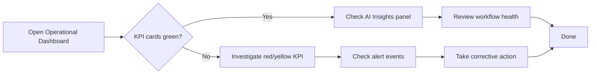

# 17 — Operational Analytics Guide

**Version 4.0** | Phase 9 | AI Lead Intelligence Platform

---

## Table of Contents

1. [Overview](#1-overview)
2. [Daily Operations Workflow](#2-daily-operations-workflow)
3. [Lead Intelligence Monitoring](#3-lead-intelligence-monitoring)
4. [CRM Pipeline Monitoring](#4-crm-pipeline-monitoring)
5. [Workflow Analytics (Phase 8)](#5-workflow-analytics-phase-8)
6. [Credit & Usage Monitoring](#6-credit--usage-monitoring)
7. [Troubleshooting](#7-troubleshooting)
8. [Runbook Procedures](#8-runbook-procedures)

---

## 1. Overview

This guide is for **Sales Ops, RevOps, and Automation Admins** who monitor day-to-day platform health using operational analytics dashboards. It covers daily workflows, key metrics to watch, and troubleshooting procedures.

**Primary dashboard:** `/analytics/operational`  
**Required permission:** `analytics:read`

---

## 2. Daily Operations Workflow

### 2.1 Morning Check (5 minutes)



| Step | Action | Where |
|------|--------|-------|
| 1 | Open operational dashboard | `/analytics/operational` |
| 2 | Check 5 KPI cards | Top row |
| 3 | Review AI insights | Bottom panel |
| 4 | Check active alerts | `/analytics/alerts/events` |
| 5 | Review workflow health | `/analytics/workflows` |
| 6 | Check credit burn rate | KPI card or `/analytics/usage` |

### 2.2 Weekly Review (30 minutes)

| Task | Dashboard | Action |
|------|-----------|--------|
| Lead velocity trend | Operational → Lead Velocity chart | Compare WoW, identify dips |
| Score distribution shift | Operational → Score donut | Check for quality changes |
| Pipeline stage aging | Pipeline → Stage heatmap | Follow up on stale deals |
| Workflow failure review | Workflows → Failure table | Fix or escalate failures |
| Credit usage analysis | Usage → Credit by type | Optimize high-cost operations |
| Report generation | Reports → Run weekly template | Distribute to team |

---

## 3. Lead Intelligence Monitoring

### 3.1 Key Metrics

| Metric | Healthy Range | Action if Outside |
|--------|--------------|-------------------|
| Daily contacts created | 20–200 (plan-dependent) | Check search campaigns, data sources |
| Daily companies discovered | 10–80 | Review industry filters |
| Avg lead score | 50–70 | Review scoring model, data quality |
| Score coverage | > 80% | Enable auto-score workflow |
| Search volume | Stable ± 20% | Check for API issues, user activity |
| Avg results per search | > 20 | Review search criteria specificity |

### 3.2 Lead Velocity Investigation

When lead velocity drops:

1. **Check search activity** — Are users running fewer searches?
   ```
   GET /api/v1/analytics/search-activity?days=7
   ```

2. **Check industry breakdown** — Is a specific industry declining?
   ```
   GET /api/v1/analytics/industry
   ```

3. **Check geography** — Are data sources for specific regions down?
   ```
   GET /api/v1/analytics/geography
   ```

4. **Check workflow health** — Are auto-discovery workflows failing?
   ```
   GET /api/v1/analytics/dashboards/workflows
   ```

### 3.3 Score Distribution Analysis

| Pattern | Interpretation | Action |
|---------|---------------|--------|
| Shift toward low scores | Data quality decline or broader search criteria | Tighten search filters |
| Bimodal distribution | Two distinct lead sources | Segment by industry/source |
| Scores clustering at 50 | Scoring model not discriminating | Review AI model configuration |
| High-score rate increasing | Better targeting | Document and replicate approach |

---

## 4. CRM Pipeline Monitoring

### 4.1 Pipeline Health Checks

| Check | Query | Frequency |
|-------|-------|-----------|
| Active deal count | Dashboard KPI card | Daily |
| Pipeline value trend | Revenue dashboard | Weekly |
| Stage aging | Pipeline heatmap | Weekly |
| Win rate | Scorecard | Monthly |
| Stale deals (>30 days) | Alert rule | Daily (automated) |

### 4.2 CRM Funnel Interpretation

Using `GET /api/v1/analytics/crm-funnel`:

```
Prospecting: 45 deals ($800K)   ← Top of funnel
Qualification: 28 deals ($520K)  ← 62% conversion (healthy: >50%)
Proposal: 18 deals ($380K)       ← 64% conversion (healthy: >40%)
Negotiation: 12 deals ($290K)    ← 67% conversion (healthy: >30%)
Closed Won: 37 deals ($950K)     ← Historical wins
```

**Bottleneck detection:** If conversion between any two stages drops below healthy range, investigate:
- Are leads properly qualified before advancing?
- Are workflows auto-advancing deals too aggressively?
- Is sales team capacity sufficient for the stage?

---

## 5. Workflow Analytics (Phase 8)

### 5.1 Daily Workflow Check

Navigate to `/analytics/workflows` (unified from Phase 8 `/workflows/analytics`).

| Metric | Healthy | Action if Unhealthy |
|--------|---------|-------------------|
| Success rate | ≥ 95% | Check failure breakdown |
| Avg duration (non-AI) | < 5s | Check connector health |
| P95 duration | < 30s | Scale workers if needed |
| Pending approvals | < 10 | Notify approvers |
| Queue lag | < 2s | Check Celery worker health |
| AI credit usage | Within budget | Review AI node frequency |

### 5.2 Failure Investigation

From the Recent Failures table:

| Failure Category | Root Cause | Resolution |
|------------------|-----------|------------|
| `PROVIDER_TIMEOUT` | AI/CRM API slow | Retry, check provider status |
| `INSUFFICIENT_CREDITS` | Credit budget exhausted | Top up or reduce AI node usage |
| `SANDBOX_VIOLATION` | Expression error in workflow | Fix workflow definition |
| `APPROVAL_TIMEOUT` | Approver didn't respond | Adjust timeout or notify |
| `CONNECTOR_UNAVAILABLE` | CRM integration down | Check connector health |

### 5.3 Automation ROI Tracking

```
Automation ROI = (deals_from_workflows × avg_deal_value) / ai_credits_used
```

| ROI | Interpretation |
|-----|---------------|
| > 5x | Excellent — expand automation |
| 2–5x | Good — maintain current workflows |
| 1–2x | Marginal — optimize AI node usage |
| < 1x | Negative ROI — review workflow design |

---

## 6. Credit & Usage Monitoring

### 6.1 Credit Burn Rate

```
GET /api/v1/analytics/credits?days=30
```

| Period | Burn Rate | Status |
|--------|-----------|--------|
| Day 1–10 | < 30% | 🟢 Normal |
| Day 11–20 | 30–60% | 🟢 Normal |
| Day 21–25 | 60–80% | 🟡 Monitor |
| Day 25+ | > 80% | 🔴 Action needed |
| Any day | > 95% | 🔴 Critical — top up |

### 6.2 Credit Optimization

| High-Cost Operation | Alternative | Savings |
|--------------------|-------------|---------|
| Score all contacts | Score only new/unscored | ~60% |
| Full enrichment | Enrich on deal creation only | ~40% |
| AI node in every workflow | Conditional AI nodes | ~30% |
| Large batch searches | Targeted searches | ~50% |

### 6.3 Usage by Type Breakdown

Monitor `usage_by_type` from credits endpoint:

| Type | Typical % | Alert if |
|------|-----------|----------|
| `ai_scoring` | 40–50% | > 70% |
| `enrichment` | 20–30% | > 40% |
| `search` | 15–25% | > 35% |
| `workflow_ai` | 10–20% | > 30% |

---

## 7. Troubleshooting

### 7.1 Dashboard Shows Stale Data

| Symptom | Check | Fix |
|---------|-------|-----|
| Data > 1 hour old | `GET /analytics/warehouse/status` | Trigger `POST /analytics/warehouse/refresh` |
| ETL lag > 30 min | Celery worker health | Restart analytics worker |
| Cache serving old data | Redis TTL | Wait for TTL expiry or admin cache flush |
| "Warehouse unavailable" error | ETL watermark | Check `analytics.etl_watermarks` table |

### 7.2 Metrics Don't Match Expectations

1. Check data source: warehouse vs OLTP fallback (shown in `metadata.source`)
2. Run data quality check: compare OLTP count vs fact table count
3. Check time zone: all dates in UTC
4. Verify filters: date range, deleted records excluded

### 7.3 Charts Not Rendering

| Issue | Solution |
|-------|----------|
| Empty chart | Check if metric has data for selected period |
| Slow loading | Check network tab for API latency |
| Wrong values | Compare with raw API response |
| Missing panel | Verify dashboard config in `analytics.dashboard_configs` |

---

## 8. Runbook Procedures

### 8.1 ETL Failure Recovery

```powershell
# 1. Check ETL status
curl http://localhost:8000/api/v1/analytics/warehouse/status -H "Authorization: Bearer $TOKEN"

# 2. Trigger full refresh for affected org
curl -X POST http://localhost:8000/api/v1/analytics/warehouse/refresh `
  -H "Authorization: Bearer $TOKEN" `
  -d '{ "scope": "full", "org_id": "uuid" }'

# 3. Verify data quality
# Check analytics.data_quality_checks for pass/warn/fail

# 4. Warm cache
# Automatic after ETL completion via analytics.warm_cache task
```

### 8.2 Alert Storm Recovery

```powershell
# 1. Pause noisy alert rules
curl -X POST http://localhost:8000/api/v1/analytics/alerts/rules/{id}/pause -H "Authorization: Bearer $TOKEN"

# 2. Acknowledge pending events
curl -X POST http://localhost:8000/api/v1/analytics/alerts/events/{id}/acknowledge -H "Authorization: Bearer $TOKEN"

# 3. Investigate root cause (stale ETL, data anomaly, real issue)

# 4. Resume rules after fix
curl -X POST http://localhost:8000/api/v1/analytics/alerts/rules/{id}/resume -H "Authorization: Bearer $TOKEN"
```

### 8.3 Performance Degradation

| Step | Command/Action |
|------|---------------|
| 1. Check Grafana analytics dashboard | `http://localhost:3001/d/analytics` |
| 2. Check cache hit rate | Prometheus: `analytics_cache_hits / (hits + misses)` |
| 3. Check slow queries | Application logs: `Slow analytics query` |
| 4. Refresh materialized views | `POST /analytics/warehouse/refresh { "scope": "materialized_views" }` |
| 5. Scale workers if ETL lag | `kubectl scale deployment analytics-worker --replicas=3` |