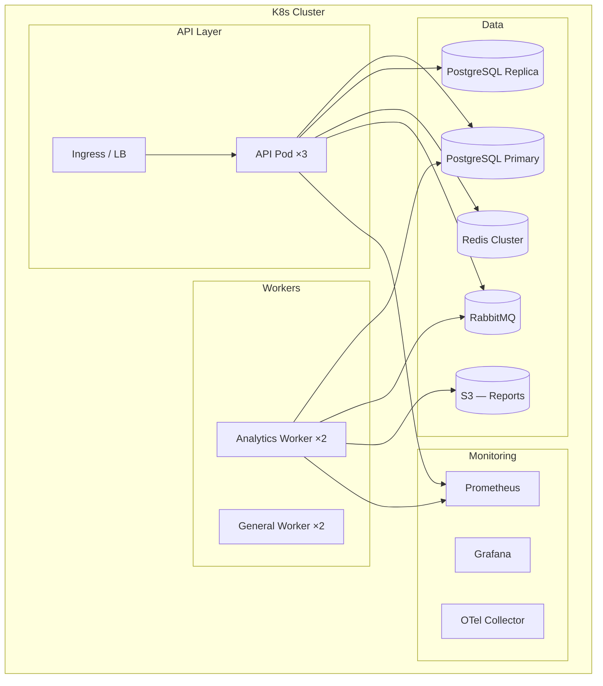

# 20 — Production Deployment Guide

**Version 4.0** | Phase 9 | AI Lead Intelligence Platform

---

## Table of Contents

1. [Overview](#1-overview)
2. [Prerequisites](#2-prerequisites)
3. [Infrastructure Requirements](#3-infrastructure-requirements)
4. [Deployment Steps](#4-deployment-steps)
5. [Database Setup](#5-database-setup)
6. [Worker Configuration](#6-worker-configuration)
7. [Monitoring Setup](#7-monitoring-setup)
8. [Post-Deployment Validation](#8-post-deployment-validation)
9. [Rollback Procedure](#9-rollback-procedure)
10. [Capacity Planning](#10-capacity-planning)

---

## 1. Overview

This guide covers production deployment of the Phase 9 Analytics Platform. It extends the Phase 8 deployment guide (`docs/phase8/20-production-deployment-guide.md`) and Phase 11 operations documentation.

**Deployment model:** Kubernetes (primary) or Docker Compose (staging/small prod)

---

## 2. Prerequisites

| Requirement | Version | Notes |
|-------------|---------|-------|
| PostgreSQL | 16+ | Primary + read replica |
| Redis | 7.x | Cluster mode for HA |
| RabbitMQ | 3.12+ | Quorum queues |
| Python | 3.12+ | API + workers |
| Node.js | 20 LTS | Frontend build |
| statsmodels | 0.14+ | ARIMA forecasting |
| Prophet | 1.1+ | Pipeline forecasting |
| scikit-learn | 1.4+ | Anomaly detection |

### 2.1 Python Dependencies (v4 additions)

```
# backend/requirements-analytics.txt
statsmodels>=0.14.0
prophet>=1.1.5
scikit-learn>=1.4.0
pandas>=2.2.0
```

---

## 3. Infrastructure Requirements

### 3.1 Production Topology



### 3.2 Resource Sizing

| Component | Min (Small) | Recommended (Medium) | Large (Enterprise) |
|-----------|------------|----------------------|-------------------|
| API pods | 2 × 1 CPU, 1 GB | 3 × 2 CPU, 2 GB | 5 × 4 CPU, 4 GB |
| Analytics workers | 1 × 2 CPU, 2 GB | 2 × 4 CPU, 4 GB | 4 × 4 CPU, 8 GB |
| PostgreSQL | 4 CPU, 16 GB, 200 GB | 8 CPU, 32 GB, 500 GB | 16 CPU, 64 GB, 1 TB |
| PG replica | 1 × 4 CPU, 16 GB | 1 × 8 CPU, 32 GB | 2 × 8 CPU, 32 GB |
| Redis | 1 × 1 GB | 3-node cluster × 2 GB | 3-node cluster × 4 GB |

**Sizing assumptions (Medium):** 50 tenants, 500 concurrent dashboard users, 10M fact rows.

---

## 4. Deployment Steps

### 4.1 Pre-Deployment Checklist

- [ ] Database backup completed
- [ ] Migration tested in staging
- [ ] Feature flags configured
- [ ] Monitoring dashboards imported
- [ ] Alert rules seeded
- [ ] Celery beat schedule updated
- [ ] S3 bucket for report exports created
- [ ] SSL certificates valid

### 4.2 Deployment Sequence

```powershell
# Step 1: Database migration
kubectl exec -it deploy/api -- alembic upgrade head

# Step 2: Seed analytics dimensions
kubectl exec -it deploy/api -- python -m scripts.seed.analytics_dimensions

# Step 3: Deploy API with v4 code
kubectl apply -f infra/k8s/api-deployment.yaml
kubectl rollout status deployment/api

# Step 4: Deploy analytics workers
kubectl apply -f infra/k8s/analytics-worker-deployment.yaml
kubectl rollout status deployment/analytics-worker

# Step 5: Deploy frontend with analytics v4
kubectl apply -f infra/k8s/frontend-deployment.yaml
kubectl rollout status deployment/frontend

# Step 6: Enable feature flag (staged rollout)
# Start with internal org, then beta tenants, then all
curl -X POST https://api.example.com/api/v1/admin/feature-flags `
  -d '{ "key": "analytics_platform_v4", "is_enabled": true, "organization_id": "internal-org-uuid" }'

# Step 7: Run initial ETL
curl -X POST https://api.example.com/api/v1/analytics/warehouse/refresh `
  -H "Authorization: Bearer $ADMIN_TOKEN" `
  -d '{ "scope": "full" }'

# Step 8: Seed dashboards and alerts
kubectl exec -it deploy/api -- python -m scripts.seed.executive_dashboards
kubectl exec -it deploy/api -- python -m scripts.seed.alert_templates

# Step 9: Validate (see section 8)
```

### 4.3 Staged Rollout

| Stage | Scope | Duration | Gate |
|-------|-------|----------|------|
| 1 — Internal | Platform team org | 3 days | No P0 bugs |
| 2 — Beta | 5 volunteer tenants | 7 days | p95 < 500ms, ETL lag < 30 min |
| 3 — GA | All tenants | — | Beta feedback addressed |

---

## 5. Database Setup

### 5.1 Migration

```bash
# Verify migration
alembic current  # Should show 015_phase9_analytics

# Verify schema
psql -c "\dt analytics.*"  # Should list all tables from doc 11
```

### 5.2 PostgreSQL Configuration

```ini
# postgresql.conf optimizations for analytics workload
shared_buffers = 4GB
effective_cache_size = 12GB
work_mem = 256MB
maintenance_work_mem = 1GB
random_page_cost = 1.1          # SSD
effective_io_concurrency = 200  # SSD
max_parallel_workers_per_gather = 4
max_parallel_workers = 8
```

### 5.3 Read Replica Setup

```sql
-- On primary: create replication slot
SELECT pg_create_physical_replication_slot('analytics_replica');

-- Analytics queries route to replica via:
-- ANALYTICS_READ_REPLICA_URL env var
```

### 5.4 Date Dimension Seed

```python
# scripts/seed/analytics_dimensions.py
# Populates analytics.dim_date from 2020-01-01 to 2035-12-31
# ~5,800 rows, runs in < 1 second
```

---

## 6. Worker Configuration

### 6.1 Analytics Worker Deployment

```yaml
# infra/k8s/analytics-worker-deployment.yaml
apiVersion: apps/v1
kind: Deployment
metadata:
  name: analytics-worker
spec:
  replicas: 2
  template:
    spec:
      containers:
        - name: analytics-worker
          image: ai-lead-intelligence/api:latest
          command: ["celery", "-A", "backend.workers.app", "worker",
                    "--queues=analytics", "--concurrency=4",
                    "--max-tasks-per-child=100"]
          resources:
            requests: { cpu: "2", memory: "2Gi" }
            limits: { cpu: "4", memory: "4Gi" }
          env:
            - name: CELERY_QUEUE
              value: "analytics"
            - name: ANALYTICS_READ_REPLICA_URL
              valueFrom:
                secretKeyRef: { name: db-secrets, key: read-replica-url }
```

### 6.2 Celery Beat Entries

Add to existing beat schedule (see doc 19, section 4.3).

### 6.3 Queue Configuration

```python
# RabbitMQ queue declaration
CELERY_TASK_QUEUES = {
    "analytics": {
        "exchange": "analytics",
        "routing_key": "analytics",
        "queue_arguments": {
            "x-max-priority": 10,
            "x-message-ttl": 3600000,  # 1 hour
        },
    },
}
```

---

## 7. Monitoring Setup

### 7.1 Import Grafana Dashboard

```powershell
# Import analytics dashboard
curl -X POST http://localhost:3001/api/dashboards/db `
  -H "Content-Type: application/json" `
  -d @infra/monitoring/grafana/dashboards/analytics.json
```

### 7.2 Prometheus Scrape Config

```yaml
# Additional scrape targets for analytics
scrape_configs:
  - job_name: "analytics-worker"
    static_configs:
      - targets: ["analytics-worker:9090"]
```

### 7.3 Alert Rules (Ops)

```yaml
# infra/monitoring/prometheus/analytics-alerts.yml
groups:
  - name: analytics
    rules:
      - alert: AnalyticsETLLagHigh
        expr: analytics_etl_lag_seconds > 3600
        for: 10m
        labels: { severity: warning }
        annotations:
          summary: "Analytics ETL lag > 1 hour"

      - alert: AnalyticsQueryLatencyHigh
        expr: histogram_quantile(0.95, analytics_query_duration_seconds) > 2
        for: 5m
        labels: { severity: warning }
        annotations:
          summary: "Analytics p95 query latency > 2s"

      - alert: AnalyticsCacheHitRateLow
        expr: rate(analytics_cache_hits_total[5m]) / (rate(analytics_cache_hits_total[5m]) + rate(analytics_cache_misses_total[5m])) < 0.7
        for: 15m
        labels: { severity: info }
        annotations:
          summary: "Analytics cache hit rate < 70%"
```

### 7.4 Synthetic Monitoring

```python
# scripts/monitoring/synthetic_analytics.py
# Runs every 5 minutes via cron
async def check_analytics_health():
    checks = [
        ("dashboard", "GET /analytics/dashboard", 200, 2.0),
        ("full", "GET /analytics/full", 200, 3.0),
        ("warehouse", "GET /analytics/warehouse/status", 200, 1.0),
    ]
    for name, endpoint, expected_status, max_latency in checks:
        response, latency = await timed_request(endpoint)
        assert response.status == expected_status
        assert latency < max_latency
```

---

## 8. Post-Deployment Validation

### 8.1 Smoke Tests

```powershell
$TOKEN = $env:ADMIN_TOKEN
$BASE = "https://api.example.com/api/v1"

# v3 backward compatibility
curl "$BASE/analytics/dashboard" -H "Authorization: Bearer $TOKEN"
curl "$BASE/analytics/full" -H "Authorization: Bearer $TOKEN"

# v4 new endpoints
curl "$BASE/analytics/dashboards/executive" -H "Authorization: Bearer $TOKEN"
curl "$BASE/analytics/warehouse/status" -H "Authorization: Bearer $TOKEN"
curl "$BASE/analytics/insights" -H "Authorization: Bearer $TOKEN"
curl "$BASE/analytics/forecasts" -H "Authorization: Bearer $TOKEN"
curl "$BASE/analytics/alerts/rules" -H "Authorization: Bearer $TOKEN"
```

### 8.2 Validation Checklist

| Check | Expected | Command |
|-------|----------|---------|
| v3 dashboard returns data | 200, non-zero counts | `GET /analytics/dashboard` |
| v3 full bundle complete | All 9 sections present | `GET /analytics/full` |
| Executive dashboard loads | KPIs + panels | `GET /dashboards/executive` |
| ETL pipelines idle | lag < 30 min | `GET /warehouse/status` |
| Materialized views fresh | < 30 min old | `GET /warehouse/status` |
| Cache keys populated | Keys in Redis | `redis-cli KEYS "analytics:*"` |
| Forecasts generated | At least 1 forecast | `GET /forecasts` |
| Default alerts active | 8 templates | `GET /alerts/rules` |
| Grafana dashboard | Panels rendering | Browser check |
| Report generation | PDF completes < 60s | `POST /reports/{id}/run` |

### 8.3 Performance Validation

| Test | Target | Tool |
|------|--------|------|
| Dashboard p95 | < 300ms (cached) | Synthetic monitor |
| Full bundle p95 | < 800ms | Synthetic monitor |
| 100 concurrent users | p95 < 500ms | Locust load test |
| ETL incremental | < 15s per org | Celery task timing |
| Report 10K rows | < 30s | Manual test |

---

## 9. Rollback Procedure

### 9.1 Feature Flag Rollback (Instant)

```powershell
# Disable v4 for all orgs (instant, no downtime)
curl -X POST https://api.example.com/api/v1/admin/feature-flags `
  -d '{ "key": "analytics_platform_v4", "is_enabled": false }'
# v3 endpoints continue working unaffected
```

### 9.2 Code Rollback

```powershell
# Rollback API deployment
kubectl rollout undo deployment/api
kubectl rollout undo deployment/analytics-worker
kubectl rollout undo deployment/frontend
```

### 9.3 Database Rollback

```powershell
# Only if migration causes issues (destructive)
alembic downgrade 014_phase8_workflow_engine
# WARNING: Drops analytics schema and all data
```

### 9.4 Rollback Decision Matrix

| Issue | Action | Downtime |
|-------|--------|----------|
| v4 dashboard bug | Disable feature flag | None |
| ETL data corruption | Disable flag + truncate facts + re-ETL | None |
| Performance degradation | Scale workers + disable flag | None |
| Migration failure | Downgrade migration | ~5 min |
| Security vulnerability | Disable flag + code rollback | ~2 min |

---

## 10. Capacity Planning

### 10.1 Growth Projections

| Metric | Current (50 tenants) | 6 months (150 tenants) | 12 months (500 tenants) |
|--------|---------------------|----------------------|------------------------|
| Fact rows (daily) | 50K | 150K | 500K |
| Dashboard queries/min | 200 | 600 | 2,000 |
| ETL duration | 5 min | 15 min | 45 min |
| Redis memory | 500 MB | 1.5 GB | 4 GB |
| PG storage (analytics) | 5 GB | 15 GB | 50 GB |
| Report exports/month | 500 | 2,000 | 10,000 |

### 10.2 Scaling Triggers

| Resource | Scale Up Trigger | Action |
|----------|-----------------|--------|
| API pods | p95 > 500ms for 10 min | +1 pod |
| Analytics workers | ETL lag > 30 min | +1 worker |
| PG primary | CPU > 80% sustained | Upgrade instance |
| PG replica | Read latency > 100ms | Add replica |
| Redis | Memory > 80% | Increase memory / add node |
| S3 | Storage > 80% quota | Lifecycle policy for old exports |

### 10.3 Cost Optimization

| Strategy | Savings | Trade-off |
|----------|---------|-----------|
| Aggressive caching (longer TTLs) | -30% DB load | Slightly staler data |
| MV-only queries (skip OLTP fallback) | -50% query time | Requires fresh ETL |
| Report export lifecycle (30-day S3 expiry) | -60% S3 cost | Re-generate old reports |
| Off-peak ETL scheduling | -20% DB peak load | 15 min data lag acceptable |
| Right-size workers (scale to zero off-peak) | -40% worker cost | Slower ETL during off-hours |