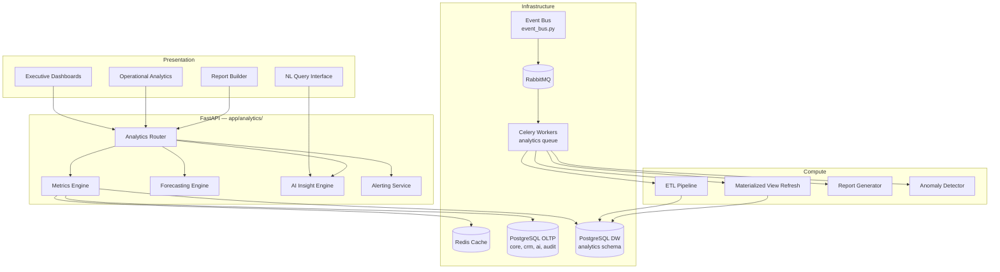

# Phase 9 — Enterprise Analytics, BI & Decision Support Platform

**Version 4.0** | AI Lead Intelligence Platform

Phase 9 elevates the Phase 3/5 **operational analytics** (`backend/app/analytics/`) and Phase 8 **workflow analytics** into a full **Enterprise BI & Decision Support Platform** — not a simple reporting layer. It supports four first-class analytics modes:

| Mode | Purpose |
|------|---------|
| **Operational** | Real-time KPIs, funnel metrics, lead velocity, credit usage |
| **Strategic** | Executive dashboards, cohort analysis, revenue forecasting |
| **Self-Service** | Drag-and-drop report builder, saved views, ad-hoc exploration |
| **Intelligent** | AI-generated insights, anomaly detection, natural-language queries |

See [01-analytics-platform-architecture.md](./01-analytics-platform-architecture.md) for the full platform model.

## Design Principles

| Principle | Implementation |
|-----------|----------------|
| **Event-driven** | Domain events via `backend/infrastructure/messaging/event_bus.py` + RabbitMQ |
| **Multi-tenant** | Row-level `organization_id` on all `analytics` schema tables |
| **API-first** | REST at `/api/v1/analytics/*` with OpenAPI 3.1 |
| **Warehouse + OLTP** | Star schema in `analytics` schema; live queries against OLTP with materialized views |
| **Cached by default** | Redis TTL cache (5 min dashboard, 1 hr aggregates) via `backend/app/common/cache.py` |
| **Async compute** | Celery workers on `analytics` queue for ETL, forecasts, report generation |
| **Safe by default** | RBAC (`analytics:*`), row-level security, PII masking in exports |
| **Observable** | Prometheus metrics, OpenTelemetry traces, query performance logging |

## Quick Start (Windows / PowerShell)

```powershell
# Start platform stack (API, worker, postgres, redis, rabbitmq)
cd C:\path\to\AI-Lead-intelligence-
.\scripts\start-free-stack.ps1

# Enable analytics platform feature flag (per org or global)
# POST /api/v1/admin/feature-flags  { "key": "analytics_platform_v4", "is_enabled": true }

# Fetch executive dashboard (existing v3 endpoints — extended in v4)
curl http://localhost:8000/api/v1/analytics/dashboard `
  -H "Authorization: Bearer $TOKEN"

# Fetch full analytics bundle
curl http://localhost:8000/api/v1/analytics/full `
  -H "Authorization: Bearer $TOKEN"

# Trigger warehouse refresh (v4)
curl -X POST http://localhost:8000/api/v1/analytics/warehouse/refresh `
  -H "Authorization: Bearer $TOKEN" `
  -d '{ "scope": "incremental" }'
```

### Service URLs (Analytics-Related)

| Service | URL | Role |
|---------|-----|------|
| Analytics API | http://localhost:8000/api/v1/analytics | KPIs, dashboards, reports, insights |
| Analytics UI | http://localhost:3000/analytics | Executive & operational dashboards |
| Report Builder | http://localhost:3000/analytics/reports | Self-service report designer |
| Grafana Analytics | http://localhost:3001/d/analytics | Platform ops metrics |
| Celery Flower (optional) | http://localhost:5555 | `analytics` queue inspection |

## Architecture Overview



## Documentation Index

| # | Topic | Document |
|---|-------|----------|
| 1 | Analytics Platform Architecture | [01-analytics-platform-architecture.md](./01-analytics-platform-architecture.md) |
| 2 | Data Warehouse Design | [02-data-warehouse-design.md](./02-data-warehouse-design.md) |
| 3 | Metrics Engine Design | [03-metrics-engine-design.md](./03-metrics-engine-design.md) |
| 4 | KPI Framework | [04-kpi-framework.md](./04-kpi-framework.md) |
| 5 | Dashboard Specifications | [05-dashboard-specifications.md](./05-dashboard-specifications.md) |
| 6 | Report Builder Design | [06-report-builder-design.md](./06-report-builder-design.md) |
| 7 | Visualization Library | [07-visualization-library.md](./07-visualization-library.md) |
| 8 | Forecasting Engine Design | [08-forecasting-engine-design.md](./08-forecasting-engine-design.md) |
| 9 | AI Insight Engine | [09-ai-insight-engine.md](./09-ai-insight-engine.md) |
| 10 | Alerting System | [10-alerting-system.md](./10-alerting-system.md) |
| 11 | Analytics Database Schema | [11-analytics-database-schema.md](./11-analytics-database-schema.md) |
| 12 | API Specification | [12-api-specification.md](./12-api-specification.md) |
| 13 | Security Architecture | [13-security-architecture.md](./13-security-architecture.md) |
| 14 | Performance Optimization | [14-performance-optimization.md](./14-performance-optimization.md) |
| 15 | Testing Strategy | [15-testing-strategy.md](./15-testing-strategy.md) |
| 16 | Sample Executive Dashboards | [16-sample-executive-dashboards.md](./16-sample-executive-dashboards.md) |
| 17 | Operational Analytics Guide | [17-operational-analytics-guide.md](./17-operational-analytics-guide.md) |
| 18 | Self-Service Analytics Guide | [18-self-service-analytics-guide.md](./18-self-service-analytics-guide.md) |
| 19 | Administrator Guide | [19-administrator-guide.md](./19-administrator-guide.md) |
| 20 | Production Deployment Guide | [20-production-deployment-guide.md](./20-production-deployment-guide.md) |

## Key Repository Paths

| Component | Path |
|-----------|------|
| Analytics module (v3 base) | `backend/app/analytics/` |
| Analytics router | `backend/app/analytics/router.py` |
| Analytics service | `backend/app/analytics/service.py` |
| Analytics schemas | `backend/app/analytics/schemas.py` |
| Metrics engine (v4) | `backend/app/analytics/engine/metrics.py` |
| Forecasting engine (v4) | `backend/app/analytics/engine/forecasting.py` |
| AI insight engine (v4) | `backend/app/analytics/engine/insights.py` |
| Alerting service (v4) | `backend/app/analytics/alerts/service.py` |
| ETL workers | `backend/workers/tasks/analytics.py` |
| Event bus | `backend/infrastructure/messaging/event_bus.py` |
| DB schema constant | `backend/app/common/db_schemas.py` → `DBSchema.ANALYTICS` |
| Permissions | `backend/app/core/permissions.py` → `analytics:read`, `analytics:write`, `analytics:admin` |
| Frontend dashboards | `frontend/src/features/analytics/` |
| Report builder UI | `frontend/src/features/analytics/reports/` |
| Migrations | `backend/migrations/versions/015_phase9_analytics_platform.py` |
| Prometheus metrics | `backend/infrastructure/observability/metrics.py` |
| Grafana dashboards | `infra/monitoring/grafana/dashboards/analytics.json` |
| Workflow analytics (Phase 8) | `docs/phase8/12-analytics-dashboard.md` |

## Relationship to Prior Phases

| Phase | Focus | Phase 9 Extends |
|-------|-------|-----------------|
| Phase 3 | Backend architecture, basic analytics endpoints | Full BI platform, warehouse, metrics engine |
| Phase 5 | Discovery, workers, observability | ETL pipelines, platform observability dashboards |
| Phase 8 | Workflow platform, workflow analytics | Unified analytics hub, cross-domain KPIs |
| Phase 11 | Operations, K8s, monitoring | Production deployment, capacity planning |

## Prerequisites

- [Docker Desktop](https://www.docker.com/products/docker-desktop/) with PostgreSQL 16+, Redis, RabbitMQ
- [Node.js 20 LTS](https://nodejs.org/) for analytics UI and report builder
- [Python 3.12+](https://www.python.org/) with `statsmodels`, `scikit-learn` for forecasting
- Manager role or higher for `analytics:read`; Admin for `analytics:admin`

## Implementation Phases

| Sprint | Deliverable | Docs |
|--------|-------------|------|
| 9.1 | Analytics schema migration + ETL foundation | 02, 11 |
| 9.2 | Metrics engine + KPI framework | 03, 04 |
| 9.3 | Dashboard UI + visualization library | 05, 07, 16 |
| 9.4 | Report builder + self-service | 06, 18 |
| 9.5 | Forecasting + AI insights | 08, 09 |
| 9.6 | Alerting system + workflow analytics integration | 10, 17 |
| 9.7 | Security hardening + performance optimization | 13, 14 |
| 9.8 | Testing + production deployment | 15, 19, 20 |